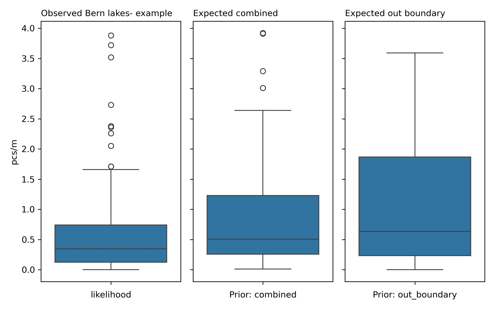

# Bern canton

**Summary and analysis of observations of trash density**: objects related to recreation, personal items, unclassified, infrastructure, food and drink, packaging non food, plastic pieces, waste water, agriculture, tobacco and micro plastics (< 5mm) found in lakes. <i>Report number: Bern canton lake 2020-01-01 2021-05-31</i>

 <i>Proof of concept: llm assissted reporting</i>

## Executive Summary

This report encompasses data from 13 cities within Bern canton, focusing on the Aare survey area. The cities included are Spiez, Vinelz, Thun, Erlach, Gals, Bönigen, Ligerz, Lüscherz, Biel/Bienne, Nidau, Brienz (BE), Beatenberg, and Unterseen. The report identifies three lakes: Thunersee, Bielersee, and Brienzersee. The sampling period spans from January 26, 2020, to April 8, 2021, during which 74 samples were collected. The average pcs/m was 3.09 with a median of 2.15, a maximum of 14.80 pcs/m, and a standard deviation of 2.85. A total of 8,423 objects were identified. The five most common objects were cigarette filters (83.78% fail rate, 18.56% of total), fragmented plastics (94.59%, 15.23%), industrial sheeting (86.49%, 7.85%), food wrappers (82.43%, 6.71%), and expanded polystyrene (72.97%, 5.48%).

Sampling stratification is the process of organizing survey samples based on characteristics of the environment, such as buildings, wetlands, forests, and other land-use features within a defined buffer zone. The sampled locations were classified as mixed land use, as neither urban nor rural criteria were met. The sampling stratification table helps assess how land-use conditions influence trash density. The highest pcs/m value (5.35) was observed in areas where buildings occupied 40-60% of the buffer zone, with 21.6% of samples collected in this range. Undefined land-use areas with a 40-60% buffer showed the highest pcs/m value of 4.90, with 8.1% of samples collected.

In the regression analysis, the Bagging Theil-Sen Regressor had the highest R² of 0.50 and an MSE of 0.21. This suggests moderate reliability in predictions, as the R² value indicates that less than 50% of the variability in the data is explained by the model. The permutation feature importance ranked streets as the most important feature (0.99), followed by recreation (0.18), forest (0.11), and public services (0.07). The model feature importance ranked streets highest (0.53), followed by public services (0.22), forest (0.16), and recreation (0.15).

Grid approximation is a numerical technique used to estimate the distribution of litter density based on observed data, structured using an inference table that applies Bayes' theorem. Two priors were defined: combined prior grid approximation (similarity threshold 0.69) and out-boundary grid approximation (similarity threshold 0.69). The combined prior's average pcs/m was 1.43, and the out-boundary prior's average was 1.52, both lower than the observed average of 3.09 pcs/m. Given these results, a decrease in observed litter density is expected.
## Sample results

The report encompasses data from 13 cities within the Bern canton, specifically focusing on the survey area named Aare. The cities included in the analysis are Spiez, Vinelz, Thun, Erlach, Gals, Bönigen, Ligerz, Lüscherz, Biel/Bienne, Nidau, Brienz (BE), Beatenberg, and Unterseen. In total, there are three lakes named Thunersee, Bielersee, and Brienzersee identified in the report.

The sampling period spans from January 26, 2020, to April 8, 2021. During this time, a total of 74 samples were collected, resulting in an average of 3.09 pcs/m (objects per meter), a median of 2.15 pcs/m, and a maximum of 14.80 pcs/m. The standard deviation of the samples was 2.85, and the total number of objects identified in the survey amounted to 8,423.

The five most common objects identified, along with their respective fail rates, percent of total, pcs/m, and total quantity, are as follows:
1. Cigarette filters - Fail Rate: 83.78%, Percent of Total: 18.56%, pcs/m: 0.48, Total Quantity: 1563
2. Fragmented plastics - Fail Rate: 94.59%, Percent of Total: 15.23%, pcs/m: 0.54, Total Quantity: 1283
3. Industrial sheeting - Fail Rate: 86.49%, Percent of Total: 7.85%, pcs/m: 0.27, Total Quantity: 661
4. Food wrappers; candy, snacks - Fail Rate: 82.43%, Percent of Total: 6.71%, pcs/m: 0.22, Total Quantity: 565
5. Expanded polystyrene - Fail Rate: 72.97%, Percent of Total: 5.48%, pcs/m: 0.14, Total Quantity: 462

The material composition of the identified objects shows that 1% are chemicals, 5% are glass, 2% are metal, 2% are paper, and 86% are plastic.

:::{dropdown} Sample results frequently asked questions
### Frequently asked questions

**What were the ten most common items found?**  
The ten most common items found are as follows:
1. Cigarette filters - Fail Rate: 83.78%, Percent of Total: 18.56%
2. Fragmented plastics - Fail Rate: 94.59%, Percent of Total: 15.23%
3. Industrial sheeting - Fail Rate: 86.49%, Percent of Total: 7.85%
4. Food wrappers; candy, snacks - Fail Rate: 82.43%, Percent of Total: 6.71%
5. Expanded polystyrene - Fail Rate: 72.97%, Percent of Total: 5.48%
6. Glass drink bottles, pieces - Fail Rate: 71.62%, Percent of Total: 3.79%
7. Packaging films nonfood or unknown - Fail Rate: 52.70%, Percent of Total: 2.96%
8. Foam packaging/insulation/polyurethane - Fail Rate: 89.19%, Percent of Total: 2.70%
9. Plastic caps, lid rings - Fail Rate: 64.86%, Percent of Total: 2.56%
10. Industrial pellets (nurdles) - Fail Rate: 36.49%, Percent of Total: 2.21%
(Fail Rate is defined as the proportion of samples where at least one of the objects was found, expressed as a percentage.)

**Are these objects found on European beaches? If so, is there any data on how many per 100 m of beach?**  
Yes, many of these objects are commonly found on European beaches. According to the OSPAR results from 2021, the average density of litter on European beaches is reported to be around 1,500 pieces per 100 meters. For more detailed information, please refer to the OSPAR website: [OSPAR Regional Action Plan](https://www.ospar.org/documents?v=7172).

**What are possible sources of these specific objects?**  
Possible sources of these specific objects include urban waste, recreational activities, industrial processes, and consumer behavior. For example, cigarette filters often originate from recreational areas, while plastic fragments result from the degradation of larger plastic items through environmental exposure. Food wrappers and packaging materials commonly come from picnics, beach outings, and food vendors.

**Which three cities had the highest average pcs/m? Which three had the lowest?**  
The three cities with the highest average pcs/m are:
1. Ligerz - 9.10 pcs/m
2. Biel/Bienne - 5.61 pcs/m
3. Brienz (BE) - 4.49 pcs/m

The three cities with the lowest average pcs/m are:
1. Lüscherz - 0.75 pcs/m
2. Spiez - 0.72 pcs/m
3. Erlach - 1.83 pcs/m
:::

::::{grid} 1
:margin 0
:padding: 0

:::{grid-item-card}
:padding: 0
:img-background: bernlakes/situation_map.jpg

:::

::::

::::{grid}

:::{grid-item}

<table id="T_537eb">
  <thead>
    <tr>
      <th class="blank level0" >&nbsp;</th>
      <th id="T_537eb_level0_col0" class="col_heading level0 col0" >pcs/m</th>
      <th id="T_537eb_level0_col1" class="col_heading level0 col1" >buildings</th>
      <th id="T_537eb_level0_col2" class="col_heading level0 col2" >forest</th>
      <th id="T_537eb_level0_col3" class="col_heading level0 col3" >undefined</th>
      <th id="T_537eb_level0_col4" class="col_heading level0 col4" >streets</th>
      <th id="T_537eb_level0_col5" class="col_heading level0 col5" >public-services</th>
      <th id="T_537eb_level0_col6" class="col_heading level0 col6" >recreation</th>
    </tr>
    <tr>
      <th class="index_name level0" >cluster</th>
      <th class="blank col0" >&nbsp;</th>
      <th class="blank col1" >&nbsp;</th>
      <th class="blank col2" >&nbsp;</th>
      <th class="blank col3" >&nbsp;</th>
      <th class="blank col4" >&nbsp;</th>
      <th class="blank col5" >&nbsp;</th>
      <th class="blank col6" >&nbsp;</th>
    </tr>
  </thead>
  <tbody>
    <tr>
      <th id="T_537eb_level0_row0" class="row_heading level0 row0" >0</th>
      <td id="T_537eb_row0_col0" class="data row0 col0" >9,10</td>
      <td id="T_537eb_row0_col1" class="data row0 col1" >0,14</td>
      <td id="T_537eb_row0_col2" class="data row0 col2" >0,31</td>
      <td id="T_537eb_row0_col3" class="data row0 col3" >0,30</td>
      <td id="T_537eb_row0_col4" class="data row0 col4" >0,27</td>
      <td id="T_537eb_row0_col5" class="data row0 col5" >0,19</td>
      <td id="T_537eb_row0_col6" class="data row0 col6" >0,01</td>
    </tr>
    <tr>
      <th id="T_537eb_level0_row1" class="row_heading level0 row1" >1</th>
      <td id="T_537eb_row1_col0" class="data row1 col0" >3,62</td>
      <td id="T_537eb_row1_col1" class="data row1 col1" >0,31</td>
      <td id="T_537eb_row1_col2" class="data row1 col2" >0,11</td>
      <td id="T_537eb_row1_col3" class="data row1 col3" >0,54</td>
      <td id="T_537eb_row1_col4" class="data row1 col4" >0,50</td>
      <td id="T_537eb_row1_col5" class="data row1 col5" >0,06</td>
      <td id="T_537eb_row1_col6" class="data row1 col6" >0,03</td>
    </tr>
    <tr>
      <th id="T_537eb_level0_row2" class="row_heading level0 row2" >2</th>
      <td id="T_537eb_row2_col0" class="data row2 col0" >2,05</td>
      <td id="T_537eb_row2_col1" class="data row2 col1" >0,68</td>
      <td id="T_537eb_row2_col2" class="data row2 col2" >0,15</td>
      <td id="T_537eb_row2_col3" class="data row2 col3" >0,15</td>
      <td id="T_537eb_row2_col4" class="data row2 col4" >0,25</td>
      <td id="T_537eb_row2_col5" class="data row2 col5" >0,04</td>
      <td id="T_537eb_row2_col6" class="data row2 col6" >0,00</td>
    </tr>
    <tr>
      <th id="T_537eb_level0_row3" class="row_heading level0 row3" >3</th>
      <td id="T_537eb_row3_col0" class="data row3 col0" >1,64</td>
      <td id="T_537eb_row3_col1" class="data row3 col1" >0,17</td>
      <td id="T_537eb_row3_col2" class="data row3 col2" >0,56</td>
      <td id="T_537eb_row3_col3" class="data row3 col3" >0,13</td>
      <td id="T_537eb_row3_col4" class="data row3 col4" >0,10</td>
      <td id="T_537eb_row3_col5" class="data row3 col5" >0,04</td>
      <td id="T_537eb_row3_col6" class="data row3 col6" >0,00</td>
    </tr>
  </tbody>
</table>

:::

::::
## Sampling stratification

Sampling stratification refers to the process of organizing and categorizing survey samples based on specific characteristics of the surrounding environment, in this case, the land-use features within a defined buffer zone. In the context of this survey, land-use features such as buildings, wetlands, forests, public services, recreation areas, undefined areas, streets, vineyards, and orchards were analyzed to understand their relationship to trash density in the surveyed locations. The sampling stratification table allows researchers to assess how different land-use conditions influence the amount of trash found, providing insights into environmental quality and potential pollution sources.

In reviewing the sampling stratification and trash density table, the highest pieces of trash per meter (pcs/m) values for buildings, forest, and undefined categories were identified. For buildings, the highest average pcs/m value was 5.35, occurring in areas where buildings occupied 40-60% of the buffer zone, with 21.6% of the samples collected in this range. For the undefined category, the highest average pcs/m value was 4.90, with 8.1% of the samples collected in areas where the buffer zone was 40-60% undefined. These values indicate that higher trash densities can be correlated with specific land-use characteristics, particularly in areas where buildings occupy a significant proportion of the buffer zone.

::::{grid}

:::{grid-item}

<table id="T_7c0d6">
  <caption>
Each survey location is surrounded by a buffer zone of radius = 1 500 meters. The buffer zone is comprised of land-use features, each land use feature occupies a proportion of the buffer zone (0 - 100%). The land-use-profile is measured by considering the proportion of the buffer dedicated to each of land use feature that is present in the buffer zone. Each location has the same size buffer zone. What changes is how the land use features are distributed within the buffer zone, Which means we assume that locations that have a similar distribution of features in the buffer zone should have similar survey results. The sampling stratification tells us under what conditions the surveys were collected and what proportions of the samples were taken according to the different conditions.
</caption>
  <thead>
    <tr>
      <th class="blank level0" >&nbsp;</th>
      <th id="T_7c0d6_level0_col0" class="col_heading level0 col0" colspan="9">Proportion of samples collected</th>
    </tr>
    <tr>
      <th class="blank level1" >&nbsp;</th>
      <th id="T_7c0d6_level1_col0" class="col_heading level1 col0" >buildings</th>
      <th id="T_7c0d6_level1_col1" class="col_heading level1 col1" >wetlands</th>
      <th id="T_7c0d6_level1_col2" class="col_heading level1 col2" >forest</th>
      <th id="T_7c0d6_level1_col3" class="col_heading level1 col3" >public-services</th>
      <th id="T_7c0d6_level1_col4" class="col_heading level1 col4" >recreation</th>
      <th id="T_7c0d6_level1_col5" class="col_heading level1 col5" >undefined</th>
      <th id="T_7c0d6_level1_col6" class="col_heading level1 col6" >streets</th>
      <th id="T_7c0d6_level1_col7" class="col_heading level1 col7" >vineyards</th>
      <th id="T_7c0d6_level1_col8" class="col_heading level1 col8" >orchards</th>
    </tr>
    <tr>
      <th class="index_name level0" >proportion of buffer</th>
      <th class="blank col0" >&nbsp;</th>
      <th class="blank col1" >&nbsp;</th>
      <th class="blank col2" >&nbsp;</th>
      <th class="blank col3" >&nbsp;</th>
      <th class="blank col4" >&nbsp;</th>
      <th class="blank col5" >&nbsp;</th>
      <th class="blank col6" >&nbsp;</th>
      <th class="blank col7" >&nbsp;</th>
      <th class="blank col8" >&nbsp;</th>
    </tr>
  </thead>
  <tbody>
    <tr>
      <th id="T_7c0d6_level0_row0" class="row_heading level0 row0" >0-20%</th>
      <td id="T_7c0d6_row0_col0" class="data row0 col0" >31.1%</td>
      <td id="T_7c0d6_row0_col1" class="data row0 col1" >100.0%</td>
      <td id="T_7c0d6_row0_col2" class="data row0 col2" >24.3%</td>
      <td id="T_7c0d6_row0_col3" class="data row0 col3" >100.0%</td>
      <td id="T_7c0d6_row0_col4" class="data row0 col4" >100.0%</td>
      <td id="T_7c0d6_row0_col5" class="data row0 col5" >35.1%</td>
      <td id="T_7c0d6_row0_col6" class="data row0 col6" >44.6%</td>
      <td id="T_7c0d6_row0_col7" class="data row0 col7" >100.0%</td>
      <td id="T_7c0d6_row0_col8" class="data row0 col8" >100.0%</td>
    </tr>
    <tr>
      <th id="T_7c0d6_level0_row1" class="row_heading level0 row1" >20-40%</th>
      <td id="T_7c0d6_row1_col0" class="data row1 col0" >37.8%</td>
      <td id="T_7c0d6_row1_col1" class="data row1 col1" >none</td>
      <td id="T_7c0d6_row1_col2" class="data row1 col2" >66.2%</td>
      <td id="T_7c0d6_row1_col3" class="data row1 col3" >none</td>
      <td id="T_7c0d6_row1_col4" class="data row1 col4" >none</td>
      <td id="T_7c0d6_row1_col5" class="data row1 col5" >8.1%</td>
      <td id="T_7c0d6_row1_col6" class="data row1 col6" >8.1%</td>
      <td id="T_7c0d6_row1_col7" class="data row1 col7" >none</td>
      <td id="T_7c0d6_row1_col8" class="data row1 col8" >none</td>
    </tr>
    <tr>
      <th id="T_7c0d6_level0_row2" class="row_heading level0 row2" >40-60%</th>
      <td id="T_7c0d6_row2_col0" class="data row2 col0" >21.6%</td>
      <td id="T_7c0d6_row2_col1" class="data row2 col1" >none</td>
      <td id="T_7c0d6_row2_col2" class="data row2 col2" >9.5%</td>
      <td id="T_7c0d6_row2_col3" class="data row2 col3" >none</td>
      <td id="T_7c0d6_row2_col4" class="data row2 col4" >none</td>
      <td id="T_7c0d6_row2_col5" class="data row2 col5" >56.8%</td>
      <td id="T_7c0d6_row2_col6" class="data row2 col6" >18.9%</td>
      <td id="T_7c0d6_row2_col7" class="data row2 col7" >none</td>
      <td id="T_7c0d6_row2_col8" class="data row2 col8" >none</td>
    </tr>
    <tr>
      <th id="T_7c0d6_level0_row3" class="row_heading level0 row3" >60-80%</th>
      <td id="T_7c0d6_row3_col0" class="data row3 col0" >6.8%</td>
      <td id="T_7c0d6_row3_col1" class="data row3 col1" >none</td>
      <td id="T_7c0d6_row3_col2" class="data row3 col2" >none</td>
      <td id="T_7c0d6_row3_col3" class="data row3 col3" >none</td>
      <td id="T_7c0d6_row3_col4" class="data row3 col4" >none</td>
      <td id="T_7c0d6_row3_col5" class="data row3 col5" >none</td>
      <td id="T_7c0d6_row3_col6" class="data row3 col6" >20.3%</td>
      <td id="T_7c0d6_row3_col7" class="data row3 col7" >none</td>
      <td id="T_7c0d6_row3_col8" class="data row3 col8" >none</td>
    </tr>
    <tr>
      <th id="T_7c0d6_level0_row4" class="row_heading level0 row4" >80-100%</th>
      <td id="T_7c0d6_row4_col0" class="data row4 col0" >2.7%</td>
      <td id="T_7c0d6_row4_col1" class="data row4 col1" >none</td>
      <td id="T_7c0d6_row4_col2" class="data row4 col2" >none</td>
      <td id="T_7c0d6_row4_col3" class="data row4 col3" >none</td>
      <td id="T_7c0d6_row4_col4" class="data row4 col4" >none</td>
      <td id="T_7c0d6_row4_col5" class="data row4 col5" >none</td>
      <td id="T_7c0d6_row4_col6" class="data row4 col6" >8.1%</td>
      <td id="T_7c0d6_row4_col7" class="data row4 col7" >none</td>
      <td id="T_7c0d6_row4_col8" class="data row4 col8" >none</td>
    </tr>
  </tbody>
</table>

:::

::::

::::{grid}

:::{grid-item}

<table id="T_f8d66">
  <caption>
The land use profile allows us to group locations according to the topography. Here we consdider how the observed litter density changes based on the land use feature and the proportion of the buffer-zone that the feature occupies</caption>
  <thead>
    <tr>
      <th class="blank level0" >&nbsp;</th>
      <th id="T_f8d66_level0_col0" class="col_heading level0 col0" colspan="9">Pieces of trash per meter</th>
    </tr>
    <tr>
      <th class="blank level1" >&nbsp;</th>
      <th id="T_f8d66_level1_col0" class="col_heading level1 col0" >buildings</th>
      <th id="T_f8d66_level1_col1" class="col_heading level1 col1" >wetlands</th>
      <th id="T_f8d66_level1_col2" class="col_heading level1 col2" >forest</th>
      <th id="T_f8d66_level1_col3" class="col_heading level1 col3" >public-services</th>
      <th id="T_f8d66_level1_col4" class="col_heading level1 col4" >recreation</th>
      <th id="T_f8d66_level1_col5" class="col_heading level1 col5" >undefined</th>
      <th id="T_f8d66_level1_col6" class="col_heading level1 col6" >streets</th>
      <th id="T_f8d66_level1_col7" class="col_heading level1 col7" >vineyards</th>
      <th id="T_f8d66_level1_col8" class="col_heading level1 col8" >orchards</th>
    </tr>
    <tr>
      <th class="index_name level0" >proportion of buffer</th>
      <th class="blank col0" >&nbsp;</th>
      <th class="blank col1" >&nbsp;</th>
      <th class="blank col2" >&nbsp;</th>
      <th class="blank col3" >&nbsp;</th>
      <th class="blank col4" >&nbsp;</th>
      <th class="blank col5" >&nbsp;</th>
      <th class="blank col6" >&nbsp;</th>
      <th class="blank col7" >&nbsp;</th>
      <th class="blank col8" >&nbsp;</th>
    </tr>
  </thead>
  <tbody>
    <tr>
      <th id="T_f8d66_level0_row0" class="row_heading level0 row0" >0-20%</th>
      <td id="T_f8d66_row0_col0" class="data row0 col0" >2,52</td>
      <td id="T_f8d66_row0_col1" class="data row0 col1" >3,09</td>
      <td id="T_f8d66_row0_col2" class="data row0 col2" >3,51</td>
      <td id="T_f8d66_row0_col3" class="data row0 col3" >3,09</td>
      <td id="T_f8d66_row0_col4" class="data row0 col4" >3,09</td>
      <td id="T_f8d66_row0_col5" class="data row0 col5" >3,75</td>
      <td id="T_f8d66_row0_col6" class="data row0 col6" >1,28</td>
      <td id="T_f8d66_row0_col7" class="data row0 col7" >3,09</td>
      <td id="T_f8d66_row0_col8" class="data row0 col8" >3,09</td>
    </tr>
    <tr>
      <th id="T_f8d66_level0_row1" class="row_heading level0 row1" >20-40%</th>
      <td id="T_f8d66_row1_col0" class="data row1 col0" >2,52</td>
      <td id="T_f8d66_row1_col1" class="data row1 col1" >none</td>
      <td id="T_f8d66_row1_col2" class="data row1 col2" >3,20</td>
      <td id="T_f8d66_row1_col3" class="data row1 col3" >none</td>
      <td id="T_f8d66_row1_col4" class="data row1 col4" >none</td>
      <td id="T_f8d66_row1_col5" class="data row1 col5" >4,90</td>
      <td id="T_f8d66_row1_col6" class="data row1 col6" >3,92</td>
      <td id="T_f8d66_row1_col7" class="data row1 col7" >none</td>
      <td id="T_f8d66_row1_col8" class="data row1 col8" >none</td>
    </tr>
    <tr>
      <th id="T_f8d66_level0_row2" class="row_heading level0 row2" >40-60%</th>
      <td id="T_f8d66_row2_col0" class="data row2 col0" >5,35</td>
      <td id="T_f8d66_row2_col1" class="data row2 col1" >none</td>
      <td id="T_f8d66_row2_col2" class="data row2 col2" >1,23</td>
      <td id="T_f8d66_row2_col3" class="data row2 col3" >none</td>
      <td id="T_f8d66_row2_col4" class="data row2 col4" >none</td>
      <td id="T_f8d66_row2_col5" class="data row2 col5" >2,42</td>
      <td id="T_f8d66_row2_col6" class="data row2 col6" >4,03</td>
      <td id="T_f8d66_row2_col7" class="data row2 col7" >none</td>
      <td id="T_f8d66_row2_col8" class="data row2 col8" >none</td>
    </tr>
    <tr>
      <th id="T_f8d66_level0_row3" class="row_heading level0 row3" >60-80%</th>
      <td id="T_f8d66_row3_col0" class="data row3 col0" >2,38</td>
      <td id="T_f8d66_row3_col1" class="data row3 col1" >none</td>
      <td id="T_f8d66_row3_col2" class="data row3 col2" >none</td>
      <td id="T_f8d66_row3_col3" class="data row3 col3" >none</td>
      <td id="T_f8d66_row3_col4" class="data row3 col4" >none</td>
      <td id="T_f8d66_row3_col5" class="data row3 col5" >none</td>
      <td id="T_f8d66_row3_col6" class="data row3 col6" >5,58</td>
      <td id="T_f8d66_row3_col7" class="data row3 col7" >none</td>
      <td id="T_f8d66_row3_col8" class="data row3 col8" >none</td>
    </tr>
    <tr>
      <th id="T_f8d66_level0_row4" class="row_heading level0 row4" >80-100%</th>
      <td id="T_f8d66_row4_col0" class="data row4 col0" >1,24</td>
      <td id="T_f8d66_row4_col1" class="data row4 col1" >none</td>
      <td id="T_f8d66_row4_col2" class="data row4 col2" >none</td>
      <td id="T_f8d66_row4_col3" class="data row4 col3" >none</td>
      <td id="T_f8d66_row4_col4" class="data row4 col4" >none</td>
      <td id="T_f8d66_row4_col5" class="data row4 col5" >none</td>
      <td id="T_f8d66_row4_col6" class="data row4 col6" >3,81</td>
      <td id="T_f8d66_row4_col7" class="data row4 col7" >none</td>
      <td id="T_f8d66_row4_col8" class="data row4 col8" >none</td>
    </tr>
  </tbody>
</table>

:::

::::
:::{dropdown} Sampling stratification frequently asked questions
### Frequently asked questions

**1. What does the sampling stratification table tell us?**

The sampling stratification table provides crucial insights into the relationship between land-use features and trash density. For example, in areas where buildings occupy 40-60% of the buffer zone, 21.6% of the samples were taken, and the average pieces of trash per meter was 5.35. This indicates that higher trash density is present when buildings are more prevalent. Additionally, in areas where the undefined land-use occupies the same percentage (40-60%), 56.8% of the samples were collected, with an average pcs/m of 2.42. These examples illustrate how specific land-use conditions can contribute to varying levels of trash density, highlighting the importance of the sampling stratification table in understanding environmental impacts.

**2. How can the information in the sampling stratification and trash density table help identify areas of concern?**

The information contained within the sampling stratification and trash density table is instrumental in pinpointing areas that may require intervention or further study. By correlating the density of trash with specific land-use features, researchers can identify which environments are most affected by litter. For instance, higher trash density values in areas where buildings occupy a significant portion of the buffer zone signal that urban development may be contributing to pollution. This data can guide local authorities in developing targeted waste management strategies, enhancing public awareness campaigns, and implementing environmental protection measures tailored to the specific needs of various land-use types.

**3. Under what land-use conditions would a surveyor expect to find the most trash?**

Surveyors would expect to find the most trash in areas where buildings occupy a significant proportion of the buffer. For instance, the sampling stratification and trash density table show that in locations where buildings occupy 40-60% of the buffer, the average trash density is 5.35 pcs/m, with 21.6% of samples collected in this range. Additionally, in areas characterized by undefined land-use where the buffer zone also occupies 40-60%, the average pcs/m is 2.42, with 56.8% of the samples taken. These results indicate that land-use conditions involving a higher percentage of buildings and undefined areas correlate with increased trash density.

**4. Given the results in the sampling stratification table, were these surveys collected in mostly urban environments or forested?**

The surveys were not collected predominantly in either urban or forested environments. To classify the surveyed locations, we sum the proportions of samples for buildings and forests from the relevant rows. For the buildings category, the sum for the rows 60-80% (0.068) and 80-100% (0.027) results in a total of 0.095, which is less than 50%. For the forest category, since there are no samples in the rows 60-80% and 80-100%, the total is 0. Therefore, neither the urban nor rural criteria are met, indicating that the surveyed locations are classified as mixed. The highest proportion of samples was taken in areas with undefined land-use (56.8%), followed by buildings (21.6%).
:::

## Linear and ensemble methods

Cluster analysis, particularly K-means clustering, is a statistical method used to group data points into clusters based on their similarities. In this technique, the algorithm partitions the data into K distinct clusters where each data point belongs to the cluster with the nearest mean. The goal is to minimize the variance within each cluster while maximizing the variance between clusters.

The cluster that had the highest average density of objects per meter of beach (pcs/m) is Cluster 0, with a density of 9.10 pcs/m. The composition of this cluster in terms of land use is as follows: buildings account for 0.14 (14%) of the buffer, forest accounts for 0.31 (31%), and undefined land use accounts for 0.30 (30%).

Linear regression is a statistical method used to model the relationship between a dependent variable and one or more independent variables by fitting a linear equation to the observed data. The basic assumptions of linear regression include linearity, independence of errors, homoscedasticity (constant variance of errors), and normal distribution of errors.

Ensemble regression, on the other hand, combines predictions from multiple regression models to improve overall performance. This includes techniques such as bagging and boosting. The basic assumptions for ensemble methods are similar to those of linear regression, but they also rely on the idea that the combination of diverse models can reduce variance and bias.

In the regression analysis conducted, the model that had the highest R² was the Bagging Theil-Sen Regressor, with an R² of 0.50 and a mean squared error (MSE) of 0.21. Given the R² and MSE of the best model, we can conclude that predictions may have a moderate level of reliability, but there is still considerable room for improvement since the R² value is below 0.5, indicating that less than 50% of the variability is explained by the model.

:::{dropdown} Linear methods frequently asked questions
### Frequently asked questions

**What were the r² and MSE of each test?**  
The results from the regression analysis are as follows:

|    | Model                        |       R² |      MSE |
|---:|:-----------------------------|---------:|---------:|
|  0 | Linear Regression            | 0.40     | 0.26     |
|  1 | Random Forest Regression     | 0.10     | 0.38     |
|  2 | Gradient Boosting Regression | 0.37     | 0.27     |
|  3 | Theil-Sen Regressor          | 0.45     | 0.24     |
|  4 | Bagging: Theil-Sen Regressor | 0.50     | 0.21     |
|  5 | Voting                       | 0.37     | 0.27     |

**Given the r² and MSE of the different methods employed, how reliable do you think predictions would be based on these models?**  
Based on the R² and MSE values, the predictions from these models exhibit varying degrees of reliability. The Bagging Theil-Sen Regressor, which yielded the highest R² of 0.50 and the lowest MSE of 0.21, suggests that predictions from this model could be moderately reliable. However, the other models show lower R² values, indicating that they explain less of the variability in the data, which translates to less reliable predictions overall.

**Can any conclusions be drawn from these results?**  
Yes, conclusions can be drawn in that while some regression models demonstrate a better fit to the data, none of the models achieve a strong explanatory power (as evidenced by R² values below 0.5). This suggests that further refinement and potentially additional features or different modeling techniques may be needed to improve predictive accuracy.

**According to the cluster analysis, what is the cluster that has the greatest average pcs/m? What is the distribution of land use values within the cluster?**  
The cluster that has the greatest average pcs/m is Cluster 0, with 9.10 pcs/m. The distribution of land use values within this cluster is as follows: buildings occupy 14% of the buffer, forest occupies 31%, and undefined land use occupies 30%.
:::

## Forecasts and methods

A grid approximation is a numerical technique used to estimate the distribution of a specific parameter, such as litter density, across a defined area based on observed data. It involves creating a discrete grid of points within a continuous parameter space, allowing researchers to assess the likelihood of observing varying levels of litter density based on prior knowledge and current observations. This process can be structured using an inference table which includes columns for prior information, likelihood from current data, the product of prior and likelihood, and the posterior distribution that reflects updated beliefs after considering the observed data.

An inference table is a structured representation of data that facilitates the application of Bayes' theorem, which relates prior knowledge to observed evidence. The prior refers to the initial belief or estimate about a parameter before considering new data, while the posterior is the updated belief after incorporating the evidence from the likelihood. In the context of the report, the two priors specified are:

1. **Combined prior grid approximation**: Similarity threshold is 0.69.
2. **Out boundary grid approximation**: Similarity threshold is also 0.69.

For the observed results, the average pcs/m is 3.09. The average from the combined prior is 1.43 pcs/m, which shows a difference of 1.66 pcs/m. The average from the out-boundary prior is 1.52 pcs/m, indicating a difference of 1.57 pcs/m. Given the standard deviations of 1.42 and 1.65 pcs/m for the combined and out-boundary priors respectively, a decrease in observed litter density is expected, as the posterior distributions are lower than the observed results.

When considering the likelihood of noticing a change based on sample sizes, if an individual takes one sample, the probability of observing an increase or decrease from the observed average is low, given that it would be one isolated data point. However, if two samples are taken, the likelihood of detecting an increase or decrease becomes slightly more probable because the average from two samples would provide a more reliable estimate. 

::::{grid} 1
:margin: 0

:::{grid-item}
:padding: 0

:::

::::

:::{dropdown} Grid approximation frequently asked questions
### Frequently asked questions

**1. Why is grid approximation a reasonable modeling technique given the data?**  
Grid approximation is reasonable for modeling this data because the observed distribution of pcs/m shows a mean of 3.09 and a median of 2.15, indicating that the data may not be normally distributed due to the significant difference between the mean and median. If the data were normally distributed, predictions would be more straightforward, as they would rely on the properties of the normal distribution. Given the skewness in this data, predictions based on grid approximations may account for non-normal characteristics, leading to more accurate forecasts in real-world applications.

**2. Do you have an example of other fields or domains that use grid approximation or Bayesian methods?**  
Yes, grid approximation and Bayesian methods are commonly used in fields such as ecology for species distribution modeling, in finance for risk assessment, and in machine learning for probabilistic graphical models.

**3. If the data is normally distributed, would the predictions from the grid approximation and the predictions from the normal distribution be different? If so, in what way?**  
If the data is normally distributed, predictions from the grid approximation may align more closely with those from a normal distribution model, as both would provide insights based on central tendency and variability. However, grid approximation can handle non-normal distributions better by allowing for localized variations and skewness that might not be captured by a normal distribution.

**4. What is the difference between grid approximation and linear or ensemble regression?**  
The primary difference lies in their approach to modeling relationships. Grid approximation focuses on estimating distributions across a parameter space based on prior and likelihood data, while linear regression models a direct relationship between independent and dependent variables, and ensemble regression combines multiple models to improve prediction accuracy. Grid approximations can incorporate uncertainty and variability more directly than regression models.

**5. With which posterior do we expect to find most? The least?**  
The combined prior grid approximation, with an expected average of 1.43 pcs/m, suggests that this posterior is likely to yield the most frequent results, while the out-boundary prior grid approximation, with an expected average of 1.52 pcs/m, would yield slightly less frequent results.

**6. If the in-boundary grid approximation predicts an increase or decrease, what does that say about the other samples from within the boundary?**  
If the in-boundary grid approximation predicts an increase, it indicates that elevated values were likely observed in other locations within the boundary compared to the likelihood. Conversely, a predicted decrease suggests that the other samples within the boundary show lower litter densities relative to the likelihood.

**7. If the out-boundary grid approximation predicts an increase or decrease, what does that say about the other samples from outside of the boundary?**  
If the out-boundary grid approximation predicts an increase, it implies that locations outside the region had elevated litter densities compared to the likelihood. A prediction of decrease would suggest that litter densities observed outside the boundary are lower than those considered in the likelihood.

**8. How different are the expected results from the observed results? Should an increase or decrease be expected?**  
The expected results from the combined prior average 1.43 pcs/m and the out-boundary average 1.52 pcs/m are significantly lower than the observed average of 3.09 pcs/m. Consequently, a decrease is expected in future observations, as both posterior distributions suggest lower litter densities than what has been observed.
:::

## Consolidated results : city, survey area

::::{grid}

:::{grid-item}

<table id="T_28c4d">
  <caption>Sample totals : city, average, quantity, number of samples</caption>
  <thead>
    <tr>
      <th id="T_28c4d_level0_col0" class="col_heading level0 col0" >city</th>
      <th id="T_28c4d_level0_col1" class="col_heading level0 col1" >quantity</th>
      <th id="T_28c4d_level0_col2" class="col_heading level0 col2" >pcs/m</th>
    </tr>
  </thead>
  <tbody>
    <tr>
      <td id="T_28c4d_row0_col0" class="data row0 col0" >Beatenberg</td>
      <td id="T_28c4d_row0_col1" class="data row0 col1" >104</td>
      <td id="T_28c4d_row0_col2" class="data row0 col2" >2,43</td>
    </tr>
    <tr>
      <td id="T_28c4d_row1_col0" class="data row1 col0" >Biel/Bienne</td>
      <td id="T_28c4d_row1_col1" class="data row1 col1" >3'209</td>
      <td id="T_28c4d_row1_col2" class="data row1 col2" >5,61</td>
    </tr>
    <tr>
      <td id="T_28c4d_row2_col0" class="data row2 col0" >Brienz (BE)</td>
      <td id="T_28c4d_row2_col1" class="data row2 col1" >696</td>
      <td id="T_28c4d_row2_col2" class="data row2 col2" >4,49</td>
    </tr>
    <tr>
      <td id="T_28c4d_row3_col0" class="data row3 col0" >Bönigen</td>
      <td id="T_28c4d_row3_col1" class="data row3 col1" >277</td>
      <td id="T_28c4d_row3_col2" class="data row3 col2" >3,18</td>
    </tr>
    <tr>
      <td id="T_28c4d_row4_col0" class="data row4 col0" >Erlach</td>
      <td id="T_28c4d_row4_col1" class="data row4 col1" >101</td>
      <td id="T_28c4d_row4_col2" class="data row4 col2" >1,83</td>
    </tr>
    <tr>
      <td id="T_28c4d_row5_col0" class="data row5 col0" >Gals</td>
      <td id="T_28c4d_row5_col1" class="data row5 col1" >48</td>
      <td id="T_28c4d_row5_col2" class="data row5 col2" >1,28</td>
    </tr>
    <tr>
      <td id="T_28c4d_row6_col0" class="data row6 col0" >Ligerz</td>
      <td id="T_28c4d_row6_col1" class="data row6 col1" >143</td>
      <td id="T_28c4d_row6_col2" class="data row6 col2" >9,10</td>
    </tr>
    <tr>
      <td id="T_28c4d_row7_col0" class="data row7 col0" >Lüscherz</td>
      <td id="T_28c4d_row7_col1" class="data row7 col1" >202</td>
      <td id="T_28c4d_row7_col2" class="data row7 col2" >0,75</td>
    </tr>
    <tr>
      <td id="T_28c4d_row8_col0" class="data row8 col0" >Nidau</td>
      <td id="T_28c4d_row8_col1" class="data row8 col1" >63</td>
      <td id="T_28c4d_row8_col2" class="data row8 col2" >2,52</td>
    </tr>
    <tr>
      <td id="T_28c4d_row9_col0" class="data row9 col0" >Spiez</td>
      <td id="T_28c4d_row9_col1" class="data row9 col1" >530</td>
      <td id="T_28c4d_row9_col2" class="data row9 col2" >0,72</td>
    </tr>
    <tr>
      <td id="T_28c4d_row10_col0" class="data row10 col0" >Thun</td>
      <td id="T_28c4d_row10_col1" class="data row10 col1" >276</td>
      <td id="T_28c4d_row10_col2" class="data row10 col2" >1,40</td>
    </tr>
    <tr>
      <td id="T_28c4d_row11_col0" class="data row11 col0" >Unterseen</td>
      <td id="T_28c4d_row11_col1" class="data row11 col1" >1'879</td>
      <td id="T_28c4d_row11_col2" class="data row11 col2" >1,89</td>
    </tr>
    <tr>
      <td id="T_28c4d_row12_col0" class="data row12 col0" >Vinelz</td>
      <td id="T_28c4d_row12_col1" class="data row12 col1" >895</td>
      <td id="T_28c4d_row12_col2" class="data row12 col2" >4,50</td>
    </tr>
  </tbody>
</table>

:::

::::

::::{grid}

:::{grid-item}

<table id="T_5ab00">
  <caption>Sample totals : parent_boundary, average, quantity, number of samples</caption>
  <thead>
    <tr>
      <th id="T_5ab00_level0_col0" class="col_heading level0 col0" >parent_boundary</th>
      <th id="T_5ab00_level0_col1" class="col_heading level0 col1" >quantity</th>
      <th id="T_5ab00_level0_col2" class="col_heading level0 col2" >pcs/m</th>
    </tr>
  </thead>
  <tbody>
    <tr>
      <td id="T_5ab00_row0_col0" class="data row0 col0" >aare</td>
      <td id="T_5ab00_row0_col1" class="data row0 col1" >8'423</td>
      <td id="T_5ab00_row0_col2" class="data row0 col2" >3,09</td>
    </tr>
  </tbody>
</table>

:::

::::

## Inventory

<table id="T_76bdc">
  <thead>
    <tr>
      <th id="T_76bdc_level0_col0" class="col_heading level0 col0" >quantity</th>
      <th id="T_76bdc_level0_col1" class="col_heading level0 col1" >pcs/m</th>
      <th id="T_76bdc_level0_col2" class="col_heading level0 col2" >% of total</th>
      <th id="T_76bdc_level0_col3" class="col_heading level0 col3" >sample_id</th>
      <th id="T_76bdc_level0_col4" class="col_heading level0 col4" >fail rate</th>
      <th id="T_76bdc_level0_col5" class="col_heading level0 col5" >object</th>
    </tr>
  </thead>
  <tbody>
    <tr>
      <td id="T_76bdc_row0_col0" class="data row0 col0" >1'563</td>
      <td id="T_76bdc_row0_col1" class="data row0 col1" >0,48</td>
      <td id="T_76bdc_row0_col2" class="data row0 col2" >0,19</td>
      <td id="T_76bdc_row0_col3" class="data row0 col3" >74</td>
      <td id="T_76bdc_row0_col4" class="data row0 col4" >0,84</td>
      <td id="T_76bdc_row0_col5" class="data row0 col5" >Cigarette filters</td>
    </tr>
    <tr>
      <td id="T_76bdc_row1_col0" class="data row1 col0" >1'283</td>
      <td id="T_76bdc_row1_col1" class="data row1 col1" >0,54</td>
      <td id="T_76bdc_row1_col2" class="data row1 col2" >0,15</td>
      <td id="T_76bdc_row1_col3" class="data row1 col3" >74</td>
      <td id="T_76bdc_row1_col4" class="data row1 col4" >0,95</td>
      <td id="T_76bdc_row1_col5" class="data row1 col5" >Fragmented plastics</td>
    </tr>
    <tr>
      <td id="T_76bdc_row2_col0" class="data row2 col0" >661</td>
      <td id="T_76bdc_row2_col1" class="data row2 col1" >0,27</td>
      <td id="T_76bdc_row2_col2" class="data row2 col2" >0,08</td>
      <td id="T_76bdc_row2_col3" class="data row2 col3" >74</td>
      <td id="T_76bdc_row2_col4" class="data row2 col4" >0,86</td>
      <td id="T_76bdc_row2_col5" class="data row2 col5" >Industrial sheeting</td>
    </tr>
    <tr>
      <td id="T_76bdc_row3_col0" class="data row3 col0" >565</td>
      <td id="T_76bdc_row3_col1" class="data row3 col1" >0,22</td>
      <td id="T_76bdc_row3_col2" class="data row3 col2" >0,07</td>
      <td id="T_76bdc_row3_col3" class="data row3 col3" >74</td>
      <td id="T_76bdc_row3_col4" class="data row3 col4" >0,82</td>
      <td id="T_76bdc_row3_col5" class="data row3 col5" >Food wrappers; candy, snacks</td>
    </tr>
    <tr>
      <td id="T_76bdc_row4_col0" class="data row4 col0" >462</td>
      <td id="T_76bdc_row4_col1" class="data row4 col1" >0,14</td>
      <td id="T_76bdc_row4_col2" class="data row4 col2" >0,05</td>
      <td id="T_76bdc_row4_col3" class="data row4 col3" >74</td>
      <td id="T_76bdc_row4_col4" class="data row4 col4" >0,73</td>
      <td id="T_76bdc_row4_col5" class="data row4 col5" >Expanded polystyrene</td>
    </tr>
    <tr>
      <td id="T_76bdc_row5_col0" class="data row5 col0" >319</td>
      <td id="T_76bdc_row5_col1" class="data row5 col1" >0,14</td>
      <td id="T_76bdc_row5_col2" class="data row5 col2" >0,04</td>
      <td id="T_76bdc_row5_col3" class="data row5 col3" >74</td>
      <td id="T_76bdc_row5_col4" class="data row5 col4" >0,72</td>
      <td id="T_76bdc_row5_col5" class="data row5 col5" >Glass drink bottles, pieces</td>
    </tr>
    <tr>
      <td id="T_76bdc_row6_col0" class="data row6 col0" >249</td>
      <td id="T_76bdc_row6_col1" class="data row6 col1" >0,10</td>
      <td id="T_76bdc_row6_col2" class="data row6 col2" >0,03</td>
      <td id="T_76bdc_row6_col3" class="data row6 col3" >74</td>
      <td id="T_76bdc_row6_col4" class="data row6 col4" >0,53</td>
      <td id="T_76bdc_row6_col5" class="data row6 col5" >Packaging films nonfood or unknown</td>
    </tr>
    <tr>
      <td id="T_76bdc_row7_col0" class="data row7 col0" >227</td>
      <td id="T_76bdc_row7_col1" class="data row7 col1" >0,04</td>
      <td id="T_76bdc_row7_col2" class="data row7 col2" >0,03</td>
      <td id="T_76bdc_row7_col3" class="data row7 col3" >74</td>
      <td id="T_76bdc_row7_col4" class="data row7 col4" >0,89</td>
      <td id="T_76bdc_row7_col5" class="data row7 col5" >Foam packaging/insulation/polyurethane</td>
    </tr>
    <tr>
      <td id="T_76bdc_row8_col0" class="data row8 col0" >216</td>
      <td id="T_76bdc_row8_col1" class="data row8 col1" >0,07</td>
      <td id="T_76bdc_row8_col2" class="data row8 col2" >0,03</td>
      <td id="T_76bdc_row8_col3" class="data row8 col3" >74</td>
      <td id="T_76bdc_row8_col4" class="data row8 col4" >0,65</td>
      <td id="T_76bdc_row8_col5" class="data row8 col5" >plastic caps, lid rings: G21, G22, G23, G24</td>
    </tr>
    <tr>
      <td id="T_76bdc_row9_col0" class="data row9 col0" >186</td>
      <td id="T_76bdc_row9_col1" class="data row9 col1" >0,06</td>
      <td id="T_76bdc_row9_col2" class="data row9 col2" >0,02</td>
      <td id="T_76bdc_row9_col3" class="data row9 col3" >74</td>
      <td id="T_76bdc_row9_col4" class="data row9 col4" >0,36</td>
      <td id="T_76bdc_row9_col5" class="data row9 col5" >Industrial pellets (nurdles)</td>
    </tr>
    <tr>
      <td id="T_76bdc_row10_col0" class="data row10 col0" >159</td>
      <td id="T_76bdc_row10_col1" class="data row10 col1" >0,07</td>
      <td id="T_76bdc_row10_col2" class="data row10 col2" >0,02</td>
      <td id="T_76bdc_row10_col3" class="data row10 col3" >74</td>
      <td id="T_76bdc_row10_col4" class="data row10 col4" >0,61</td>
      <td id="T_76bdc_row10_col5" class="data row10 col5" >Plastic construction waste</td>
    </tr>
    <tr>
      <td id="T_76bdc_row11_col0" class="data row11 col0" >115</td>
      <td id="T_76bdc_row11_col1" class="data row11 col1" >0,04</td>
      <td id="T_76bdc_row11_col2" class="data row11 col2" >0,01</td>
      <td id="T_76bdc_row11_col3" class="data row11 col3" >74</td>
      <td id="T_76bdc_row11_col4" class="data row11 col4" >0,35</td>
      <td id="T_76bdc_row11_col5" class="data row11 col5" >Styrofoam < 5mm</td>
    </tr>
    <tr>
      <td id="T_76bdc_row12_col0" class="data row12 col0" >113</td>
      <td id="T_76bdc_row12_col1" class="data row12 col1" >0,05</td>
      <td id="T_76bdc_row12_col2" class="data row12 col2" >0,01</td>
      <td id="T_76bdc_row12_col3" class="data row12 col3" >74</td>
      <td id="T_76bdc_row12_col4" class="data row12 col4" >0,53</td>
      <td id="T_76bdc_row12_col5" class="data row12 col5" >Fireworks; rocket caps, exploded parts & packaging</td>
    </tr>
    <tr>
      <td id="T_76bdc_row13_col0" class="data row13 col0" >107</td>
      <td id="T_76bdc_row13_col1" class="data row13 col1" >0,04</td>
      <td id="T_76bdc_row13_col2" class="data row13 col2" >0,01</td>
      <td id="T_76bdc_row13_col3" class="data row13 col3" >74</td>
      <td id="T_76bdc_row13_col4" class="data row13 col4" >0,53</td>
      <td id="T_76bdc_row13_col5" class="data row13 col5" >Cotton bud/swab sticks</td>
    </tr>
    <tr>
      <td id="T_76bdc_row14_col0" class="data row14 col0" >106</td>
      <td id="T_76bdc_row14_col1" class="data row14 col1" >0,05</td>
      <td id="T_76bdc_row14_col2" class="data row14 col2" >0,01</td>
      <td id="T_76bdc_row14_col3" class="data row14 col3" >74</td>
      <td id="T_76bdc_row14_col4" class="data row14 col4" >0,51</td>
      <td id="T_76bdc_row14_col5" class="data row14 col5" >Tobacco; plastic packaging, containers</td>
    </tr>
    <tr>
      <td id="T_76bdc_row15_col0" class="data row15 col0" >103</td>
      <td id="T_76bdc_row15_col1" class="data row15 col1" >0,04</td>
      <td id="T_76bdc_row15_col2" class="data row15 col2" >0,01</td>
      <td id="T_76bdc_row15_col3" class="data row15 col3" >74</td>
      <td id="T_76bdc_row15_col4" class="data row15 col4" >0,31</td>
      <td id="T_76bdc_row15_col5" class="data row15 col5" >Paraffin wax</td>
    </tr>
    <tr>
      <td id="T_76bdc_row16_col0" class="data row16 col0" >97</td>
      <td id="T_76bdc_row16_col1" class="data row16 col1" >0,03</td>
      <td id="T_76bdc_row16_col2" class="data row16 col2" >0,01</td>
      <td id="T_76bdc_row16_col3" class="data row16 col3" >74</td>
      <td id="T_76bdc_row16_col4" class="data row16 col4" >0,19</td>
      <td id="T_76bdc_row16_col5" class="data row16 col5" >Foamed EVA (flexible plastic) for crafts & watersports</td>
    </tr>
    <tr>
      <td id="T_76bdc_row17_col0" class="data row17 col0" >89</td>
      <td id="T_76bdc_row17_col1" class="data row17 col1" >0,03</td>
      <td id="T_76bdc_row17_col2" class="data row17 col2" >0,01</td>
      <td id="T_76bdc_row17_col3" class="data row17 col3" >74</td>
      <td id="T_76bdc_row17_col4" class="data row17 col4" >0,50</td>
      <td id="T_76bdc_row17_col5" class="data row17 col5" >Foil wrappers, aluminum foil</td>
    </tr>
    <tr>
      <td id="T_76bdc_row18_col0" class="data row18 col0" >84</td>
      <td id="T_76bdc_row18_col1" class="data row18 col1" >0,02</td>
      <td id="T_76bdc_row18_col2" class="data row18 col2" >0,01</td>
      <td id="T_76bdc_row18_col3" class="data row18 col3" >74</td>
      <td id="T_76bdc_row18_col4" class="data row18 col4" >0,27</td>
      <td id="T_76bdc_row18_col5" class="data row18 col5" >Paper fragments</td>
    </tr>
    <tr>
      <td id="T_76bdc_row19_col0" class="data row19 col0" >82</td>
      <td id="T_76bdc_row19_col1" class="data row19 col1" >0,03</td>
      <td id="T_76bdc_row19_col2" class="data row19 col2" >0,01</td>
      <td id="T_76bdc_row19_col3" class="data row19 col3" >74</td>
      <td id="T_76bdc_row19_col4" class="data row19 col4" >0,38</td>
      <td id="T_76bdc_row19_col5" class="data row19 col5" >Plastic fragments angular <5mm</td>
    </tr>
    <tr>
      <td id="T_76bdc_row20_col0" class="data row20 col0" >53</td>
      <td id="T_76bdc_row20_col1" class="data row20 col1" >0,02</td>
      <td id="T_76bdc_row20_col2" class="data row20 col2" >0,01</td>
      <td id="T_76bdc_row20_col3" class="data row20 col3" >74</td>
      <td id="T_76bdc_row20_col4" class="data row20 col4" >0,36</td>
      <td id="T_76bdc_row20_col5" class="data row20 col5" >Lollypop sticks</td>
    </tr>
    <tr>
      <td id="T_76bdc_row21_col0" class="data row21 col0" >53</td>
      <td id="T_76bdc_row21_col1" class="data row21 col1" >0,02</td>
      <td id="T_76bdc_row21_col2" class="data row21 col2" >0,01</td>
      <td id="T_76bdc_row21_col3" class="data row21 col3" >74</td>
      <td id="T_76bdc_row21_col4" class="data row21 col4" >0,35</td>
      <td id="T_76bdc_row21_col5" class="data row21 col5" >String < 1cm</td>
    </tr>
    <tr>
      <td id="T_76bdc_row22_col0" class="data row22 col0" >52</td>
      <td id="T_76bdc_row22_col1" class="data row22 col1" >0,02</td>
      <td id="T_76bdc_row22_col2" class="data row22 col2" >0,01</td>
      <td id="T_76bdc_row22_col3" class="data row22 col3" >74</td>
      <td id="T_76bdc_row22_col4" class="data row22 col4" >0,39</td>
      <td id="T_76bdc_row22_col5" class="data row22 col5" >Straws and stirrers</td>
    </tr>
    <tr>
      <td id="T_76bdc_row23_col0" class="data row23 col0" >48</td>
      <td id="T_76bdc_row23_col1" class="data row23 col1" >0,02</td>
      <td id="T_76bdc_row23_col2" class="data row23 col2" >0,01</td>
      <td id="T_76bdc_row23_col3" class="data row23 col3" >74</td>
      <td id="T_76bdc_row23_col4" class="data row23 col4" >0,32</td>
      <td id="T_76bdc_row23_col5" class="data row23 col5" >Labels, bar codes</td>
    </tr>
    <tr>
      <td id="T_76bdc_row24_col0" class="data row24 col0" >46</td>
      <td id="T_76bdc_row24_col1" class="data row24 col1" >0,01</td>
      <td id="T_76bdc_row24_col2" class="data row24 col2" >0,01</td>
      <td id="T_76bdc_row24_col3" class="data row24 col3" >74</td>
      <td id="T_76bdc_row24_col4" class="data row24 col4" >0,23</td>
      <td id="T_76bdc_row24_col5" class="data row24 col5" >Foamed items & pieces (non packaging/insulation) foamed sponge material</td>
    </tr>
    <tr>
      <td id="T_76bdc_row25_col0" class="data row25 col0" >46</td>
      <td id="T_76bdc_row25_col1" class="data row25 col1" >0,02</td>
      <td id="T_76bdc_row25_col2" class="data row25 col2" >0,01</td>
      <td id="T_76bdc_row25_col3" class="data row25 col3" >74</td>
      <td id="T_76bdc_row25_col4" class="data row25 col4" >0,38</td>
      <td id="T_76bdc_row25_col5" class="data row25 col5" >Metal bottle caps, lids & pull tabs from cans</td>
    </tr>
    <tr>
      <td id="T_76bdc_row26_col0" class="data row26 col0" >45</td>
      <td id="T_76bdc_row26_col1" class="data row26 col1" >0,01</td>
      <td id="T_76bdc_row26_col2" class="data row26 col2" >0,01</td>
      <td id="T_76bdc_row26_col3" class="data row26 col3" >74</td>
      <td id="T_76bdc_row26_col4" class="data row26 col4" >0,38</td>
      <td id="T_76bdc_row26_col5" class="data row26 col5" >Other medical (swabs, bandaging, adhesive plaster)</td>
    </tr>
    <tr>
      <td id="T_76bdc_row27_col0" class="data row27 col0" >44</td>
      <td id="T_76bdc_row27_col1" class="data row27 col1" >0,02</td>
      <td id="T_76bdc_row27_col2" class="data row27 col2" >0,01</td>
      <td id="T_76bdc_row27_col3" class="data row27 col3" >74</td>
      <td id="T_76bdc_row27_col4" class="data row27 col4" >0,36</td>
      <td id="T_76bdc_row27_col5" class="data row27 col5" >Food containers single use foamed or plastic</td>
    </tr>
    <tr>
      <td id="T_76bdc_row28_col0" class="data row28 col0" >40</td>
      <td id="T_76bdc_row28_col1" class="data row28 col1" >0,02</td>
      <td id="T_76bdc_row28_col2" class="data row28 col2" >0,00</td>
      <td id="T_76bdc_row28_col3" class="data row28 col3" >74</td>
      <td id="T_76bdc_row28_col4" class="data row28 col4" >0,30</td>
      <td id="T_76bdc_row28_col5" class="data row28 col5" >Cups, lids, single use foamed and hard plastic</td>
    </tr>
    <tr>
      <td id="T_76bdc_row29_col0" class="data row29 col0" >38</td>
      <td id="T_76bdc_row29_col1" class="data row29 col1" >0,02</td>
      <td id="T_76bdc_row29_col2" class="data row29 col2" >0,00</td>
      <td id="T_76bdc_row29_col3" class="data row29 col3" >74</td>
      <td id="T_76bdc_row29_col4" class="data row29 col4" >0,34</td>
      <td id="T_76bdc_row29_col5" class="data row29 col5" >Toys and party favors</td>
    </tr>
    <tr>
      <td id="T_76bdc_row30_col0" class="data row30 col0" >35</td>
      <td id="T_76bdc_row30_col1" class="data row30 col1" >0,01</td>
      <td id="T_76bdc_row30_col2" class="data row30 col2" >0,00</td>
      <td id="T_76bdc_row30_col3" class="data row30 col3" >74</td>
      <td id="T_76bdc_row30_col4" class="data row30 col4" >0,20</td>
      <td id="T_76bdc_row30_col5" class="data row30 col5" >Sheeting ag. greenhouse film</td>
    </tr>
    <tr>
      <td id="T_76bdc_row31_col0" class="data row31 col0" >34</td>
      <td id="T_76bdc_row31_col1" class="data row31 col1" >0,01</td>
      <td id="T_76bdc_row31_col2" class="data row31 col2" >0,00</td>
      <td id="T_76bdc_row31_col3" class="data row31 col3" >74</td>
      <td id="T_76bdc_row31_col4" class="data row31 col4" >0,11</td>
      <td id="T_76bdc_row31_col5" class="data row31 col5" >Construction material; bricks, pipes, cement</td>
    </tr>
    <tr>
      <td id="T_76bdc_row32_col0" class="data row32 col0" >34</td>
      <td id="T_76bdc_row32_col1" class="data row32 col1" >0,01</td>
      <td id="T_76bdc_row32_col2" class="data row32 col2" >0,00</td>
      <td id="T_76bdc_row32_col3" class="data row32 col3" >74</td>
      <td id="T_76bdc_row32_col4" class="data row32 col4" >0,04</td>
      <td id="T_76bdc_row32_col5" class="data row32 col5" >Pellet mass from injection molding</td>
    </tr>
    <tr>
      <td id="T_76bdc_row33_col0" class="data row33 col0" >33</td>
      <td id="T_76bdc_row33_col1" class="data row33 col1" >0,01</td>
      <td id="T_76bdc_row33_col2" class="data row33 col2" >0,00</td>
      <td id="T_76bdc_row33_col3" class="data row33 col3" >74</td>
      <td id="T_76bdc_row33_col4" class="data row33 col4" >0,28</td>
      <td id="T_76bdc_row33_col5" class="data row33 col5" >Tape; electrical, insulating</td>
    </tr>
    <tr>
      <td id="T_76bdc_row34_col0" class="data row34 col0" >32</td>
      <td id="T_76bdc_row34_col1" class="data row34 col1" >0,01</td>
      <td id="T_76bdc_row34_col2" class="data row34 col2" >0,00</td>
      <td id="T_76bdc_row34_col3" class="data row34 col3" >74</td>
      <td id="T_76bdc_row34_col4" class="data row34 col4" >0,23</td>
      <td id="T_76bdc_row34_col5" class="data row34 col5" >Tape, masking/duct/packing</td>
    </tr>
    <tr>
      <td id="T_76bdc_row35_col0" class="data row35 col0" >32</td>
      <td id="T_76bdc_row35_col1" class="data row35 col1" >0,01</td>
      <td id="T_76bdc_row35_col2" class="data row35 col2" >0,00</td>
      <td id="T_76bdc_row35_col3" class="data row35 col3" >74</td>
      <td id="T_76bdc_row35_col4" class="data row35 col4" >0,15</td>
      <td id="T_76bdc_row35_col5" class="data row35 col5" >Cups, food containers, wrappers (paper)</td>
    </tr>
    <tr>
      <td id="T_76bdc_row36_col0" class="data row36 col0" >29</td>
      <td id="T_76bdc_row36_col1" class="data row36 col1" >0,01</td>
      <td id="T_76bdc_row36_col2" class="data row36 col2" >0,00</td>
      <td id="T_76bdc_row36_col3" class="data row36 col3" >74</td>
      <td id="T_76bdc_row36_col4" class="data row36 col4" >0,30</td>
      <td id="T_76bdc_row36_col5" class="data row36 col5" >Straps/bands;  hard, plastic package fastener</td>
    </tr>
    <tr>
      <td id="T_76bdc_row37_col0" class="data row37 col0" >28</td>
      <td id="T_76bdc_row37_col1" class="data row37 col1" >0,01</td>
      <td id="T_76bdc_row37_col2" class="data row37 col2" >0,00</td>
      <td id="T_76bdc_row37_col3" class="data row37 col3" >74</td>
      <td id="T_76bdc_row37_col4" class="data row37 col4" >0,19</td>
      <td id="T_76bdc_row37_col5" class="data row37 col5" >Industrial scrap</td>
    </tr>
    <tr>
      <td id="T_76bdc_row38_col0" class="data row38 col0" >27</td>
      <td id="T_76bdc_row38_col1" class="data row38 col1" >0,01</td>
      <td id="T_76bdc_row38_col2" class="data row38 col2" >0,00</td>
      <td id="T_76bdc_row38_col3" class="data row38 col3" >74</td>
      <td id="T_76bdc_row38_col4" class="data row38 col4" >0,26</td>
      <td id="T_76bdc_row38_col5" class="data row38 col5" >Biomass holder</td>
    </tr>
    <tr>
      <td id="T_76bdc_row39_col0" class="data row39 col0" >26</td>
      <td id="T_76bdc_row39_col1" class="data row39 col1" >0,01</td>
      <td id="T_76bdc_row39_col2" class="data row39 col2" >0,00</td>
      <td id="T_76bdc_row39_col3" class="data row39 col3" >74</td>
      <td id="T_76bdc_row39_col4" class="data row39 col4" >0,15</td>
      <td id="T_76bdc_row39_col5" class="data row39 col5" >Cigarette boxes, tobacco related paper/cardboard</td>
    </tr>
    <tr>
      <td id="T_76bdc_row40_col0" class="data row40 col0" >26</td>
      <td id="T_76bdc_row40_col1" class="data row40 col1" >0,01</td>
      <td id="T_76bdc_row40_col2" class="data row40 col2" >0,00</td>
      <td id="T_76bdc_row40_col3" class="data row40 col3" >74</td>
      <td id="T_76bdc_row40_col4" class="data row40 col4" >0,15</td>
      <td id="T_76bdc_row40_col5" class="data row40 col5" >String trimmer line, used to cut grass, weeds, and shrubbery</td>
    </tr>
    <tr>
      <td id="T_76bdc_row41_col0" class="data row41 col0" >24</td>
      <td id="T_76bdc_row41_col1" class="data row41 col1" >0,01</td>
      <td id="T_76bdc_row41_col2" class="data row41 col2" >0,00</td>
      <td id="T_76bdc_row41_col3" class="data row41 col3" >74</td>
      <td id="T_76bdc_row41_col4" class="data row41 col4" >0,19</td>
      <td id="T_76bdc_row41_col5" class="data row41 col5" >Tissue, toilet paper, napkins, paper towels</td>
    </tr>
    <tr>
      <td id="T_76bdc_row42_col0" class="data row42 col0" >23</td>
      <td id="T_76bdc_row42_col1" class="data row42 col1" >0,01</td>
      <td id="T_76bdc_row42_col2" class="data row42 col2" >0,00</td>
      <td id="T_76bdc_row42_col3" class="data row42 col3" >74</td>
      <td id="T_76bdc_row42_col4" class="data row42 col4" >0,22</td>
      <td id="T_76bdc_row42_col5" class="data row42 col5" >Shotgun cartridges</td>
    </tr>
    <tr>
      <td id="T_76bdc_row43_col0" class="data row43 col0" >23</td>
      <td id="T_76bdc_row43_col1" class="data row43 col1" >0,01</td>
      <td id="T_76bdc_row43_col2" class="data row43 col2" >0,00</td>
      <td id="T_76bdc_row43_col3" class="data row43 col3" >74</td>
      <td id="T_76bdc_row43_col4" class="data row43 col4" >0,22</td>
      <td id="T_76bdc_row43_col5" class="data row43 col5" >Diapers - wipes</td>
    </tr>
    <tr>
      <td id="T_76bdc_row44_col0" class="data row44 col0" >22</td>
      <td id="T_76bdc_row44_col1" class="data row44 col1" >0,01</td>
      <td id="T_76bdc_row44_col2" class="data row44 col2" >0,00</td>
      <td id="T_76bdc_row44_col3" class="data row44 col3" >74</td>
      <td id="T_76bdc_row44_col4" class="data row44 col4" >0,22</td>
      <td id="T_76bdc_row44_col5" class="data row44 col5" >Hair clip,  hair ties, personal accessories plastic</td>
    </tr>
    <tr>
      <td id="T_76bdc_row45_col0" class="data row45 col0" >22</td>
      <td id="T_76bdc_row45_col1" class="data row45 col1" >0,01</td>
      <td id="T_76bdc_row45_col2" class="data row45 col2" >0,00</td>
      <td id="T_76bdc_row45_col3" class="data row45 col3" >74</td>
      <td id="T_76bdc_row45_col4" class="data row45 col4" >0,18</td>
      <td id="T_76bdc_row45_col5" class="data row45 col5" >Bags; plastic shopping/carrier/grocery and pieces</td>
    </tr>
    <tr>
      <td id="T_76bdc_row46_col0" class="data row46 col0" >22</td>
      <td id="T_76bdc_row46_col1" class="data row46 col1" >0,01</td>
      <td id="T_76bdc_row46_col2" class="data row46 col2" >0,00</td>
      <td id="T_76bdc_row46_col3" class="data row46 col3" >74</td>
      <td id="T_76bdc_row46_col4" class="data row46 col4" >0,19</td>
      <td id="T_76bdc_row46_col5" class="data row46 col5" >Corks</td>
    </tr>
    <tr>
      <td id="T_76bdc_row47_col0" class="data row47 col0" >20</td>
      <td id="T_76bdc_row47_col1" class="data row47 col1" >0,01</td>
      <td id="T_76bdc_row47_col2" class="data row47 col2" >0,00</td>
      <td id="T_76bdc_row47_col3" class="data row47 col3" >74</td>
      <td id="T_76bdc_row47_col4" class="data row47 col4" >0,14</td>
      <td id="T_76bdc_row47_col5" class="data row47 col5" >Plastic shavings from lathes, CNC machining</td>
    </tr>
    <tr>
      <td id="T_76bdc_row48_col0" class="data row48 col0" >20</td>
      <td id="T_76bdc_row48_col1" class="data row48 col1" >0,01</td>
      <td id="T_76bdc_row48_col2" class="data row48 col2" >0,00</td>
      <td id="T_76bdc_row48_col3" class="data row48 col3" >74</td>
      <td id="T_76bdc_row48_col4" class="data row48 col4" >0,09</td>
      <td id="T_76bdc_row48_col5" class="data row48 col5" >Jars, includes pieces</td>
    </tr>
    <tr>
      <td id="T_76bdc_row49_col0" class="data row49 col0" >20</td>
      <td id="T_76bdc_row49_col1" class="data row49 col1" >0,01</td>
      <td id="T_76bdc_row49_col2" class="data row49 col2" >0,00</td>
      <td id="T_76bdc_row49_col3" class="data row49 col3" >74</td>
      <td id="T_76bdc_row49_col4" class="data row49 col4" >0,16</td>
      <td id="T_76bdc_row49_col5" class="data row49 col5" >Balloons and balloon sticks</td>
    </tr>
    <tr>
      <td id="T_76bdc_row50_col0" class="data row50 col0" >19</td>
      <td id="T_76bdc_row50_col1" class="data row50 col1" >0,01</td>
      <td id="T_76bdc_row50_col2" class="data row50 col2" >0,00</td>
      <td id="T_76bdc_row50_col3" class="data row50 col3" >74</td>
      <td id="T_76bdc_row50_col4" class="data row50 col4" >0,09</td>
      <td id="T_76bdc_row50_col5" class="data row50 col5" >Glass or ceramic fragments > 2.5 cm</td>
    </tr>
    <tr>
      <td id="T_76bdc_row51_col0" class="data row51 col0" >19</td>
      <td id="T_76bdc_row51_col1" class="data row51 col1" >0,01</td>
      <td id="T_76bdc_row51_col2" class="data row51 col2" >0,00</td>
      <td id="T_76bdc_row51_col3" class="data row51 col3" >74</td>
      <td id="T_76bdc_row51_col4" class="data row51 col4" >0,16</td>
      <td id="T_76bdc_row51_col5" class="data row51 col5" >Ribbons and bows</td>
    </tr>
    <tr>
      <td id="T_76bdc_row52_col0" class="data row52 col0" >19</td>
      <td id="T_76bdc_row52_col1" class="data row52 col1" >0,01</td>
      <td id="T_76bdc_row52_col2" class="data row52 col2" >0,00</td>
      <td id="T_76bdc_row52_col3" class="data row52 col3" >74</td>
      <td id="T_76bdc_row52_col4" class="data row52 col4" >0,22</td>
      <td id="T_76bdc_row52_col5" class="data row52 col5" >Medical; containers/tubes/ packaging</td>
    </tr>
    <tr>
      <td id="T_76bdc_row53_col0" class="data row53 col0" >19</td>
      <td id="T_76bdc_row53_col1" class="data row53 col1" >0,01</td>
      <td id="T_76bdc_row53_col2" class="data row53 col2" >0,00</td>
      <td id="T_76bdc_row53_col3" class="data row53 col3" >74</td>
      <td id="T_76bdc_row53_col4" class="data row53 col4" >0,19</td>
      <td id="T_76bdc_row53_col5" class="data row53 col5" >Wire and mesh</td>
    </tr>
    <tr>
      <td id="T_76bdc_row54_col0" class="data row54 col0" >18</td>
      <td id="T_76bdc_row54_col1" class="data row54 col1" >0,01</td>
      <td id="T_76bdc_row54_col2" class="data row54 col2" >0,00</td>
      <td id="T_76bdc_row54_col3" class="data row54 col3" >74</td>
      <td id="T_76bdc_row54_col4" class="data row54 col4" >0,11</td>
      <td id="T_76bdc_row54_col5" class="data row54 col5" >Clothing, towels & rags</td>
    </tr>
    <tr>
      <td id="T_76bdc_row55_col0" class="data row55 col0" >17</td>
      <td id="T_76bdc_row55_col1" class="data row55 col1" >0,01</td>
      <td id="T_76bdc_row55_col2" class="data row55 col2" >0,00</td>
      <td id="T_76bdc_row55_col3" class="data row55 col3" >74</td>
      <td id="T_76bdc_row55_col4" class="data row55 col4" >0,20</td>
      <td id="T_76bdc_row55_col5" class="data row55 col5" >Other metal pieces < 50cm</td>
    </tr>
    <tr>
      <td id="T_76bdc_row56_col0" class="data row56 col0" >16</td>
      <td id="T_76bdc_row56_col1" class="data row56 col1" >0,01</td>
      <td id="T_76bdc_row56_col2" class="data row56 col2" >0,00</td>
      <td id="T_76bdc_row56_col3" class="data row56 col3" >74</td>
      <td id="T_76bdc_row56_col4" class="data row56 col4" >0,15</td>
      <td id="T_76bdc_row56_col5" class="data row56 col5" >Cable ties; steggel, zip, zap straps</td>
    </tr>
    <tr>
      <td id="T_76bdc_row57_col0" class="data row57 col0" >14</td>
      <td id="T_76bdc_row57_col1" class="data row57 col1" >0,01</td>
      <td id="T_76bdc_row57_col2" class="data row57 col2" >0,00</td>
      <td id="T_76bdc_row57_col3" class="data row57 col3" >74</td>
      <td id="T_76bdc_row57_col4" class="data row57 col4" >0,09</td>
      <td id="T_76bdc_row57_col5" class="data row57 col5" >Tableware ceramic or glass, cups, plates, pieces</td>
    </tr>
    <tr>
      <td id="T_76bdc_row58_col0" class="data row58 col0" >14</td>
      <td id="T_76bdc_row58_col1" class="data row58 col1" >0,00</td>
      <td id="T_76bdc_row58_col2" class="data row58 col2" >0,00</td>
      <td id="T_76bdc_row58_col3" class="data row58 col3" >74</td>
      <td id="T_76bdc_row58_col4" class="data row58 col4" >0,12</td>
      <td id="T_76bdc_row58_col5" class="data row58 col5" >Rubber bands</td>
    </tr>
    <tr>
      <td id="T_76bdc_row59_col0" class="data row59 col0" >14</td>
      <td id="T_76bdc_row59_col1" class="data row59 col1" >0,01</td>
      <td id="T_76bdc_row59_col2" class="data row59 col2" >0,00</td>
      <td id="T_76bdc_row59_col3" class="data row59 col3" >74</td>
      <td id="T_76bdc_row59_col4" class="data row59 col4" >0,16</td>
      <td id="T_76bdc_row59_col5" class="data row59 col5" >Cutlery, plates and trays</td>
    </tr>
    <tr>
      <td id="T_76bdc_row60_col0" class="data row60 col0" >14</td>
      <td id="T_76bdc_row60_col1" class="data row60 col1" >0,01</td>
      <td id="T_76bdc_row60_col2" class="data row60 col2" >0,00</td>
      <td id="T_76bdc_row60_col3" class="data row60 col3" >74</td>
      <td id="T_76bdc_row60_col4" class="data row60 col4" >0,12</td>
      <td id="T_76bdc_row60_col5" class="data row60 col5" >Small plastic bags; freezer, zip-lock etc.</td>
    </tr>
    <tr>
      <td id="T_76bdc_row61_col0" class="data row61 col0" >14</td>
      <td id="T_76bdc_row61_col1" class="data row61 col1" >0,01</td>
      <td id="T_76bdc_row61_col2" class="data row61 col2" >0,00</td>
      <td id="T_76bdc_row61_col3" class="data row61 col3" >74</td>
      <td id="T_76bdc_row61_col4" class="data row61 col4" >0,15</td>
      <td id="T_76bdc_row61_col5" class="data row61 col5" >Rope, synthetic</td>
    </tr>
    <tr>
      <td id="T_76bdc_row62_col0" class="data row62 col0" >14</td>
      <td id="T_76bdc_row62_col1" class="data row62 col1" >0,00</td>
      <td id="T_76bdc_row62_col2" class="data row62 col2" >0,00</td>
      <td id="T_76bdc_row62_col3" class="data row62 col3" >74</td>
      <td id="T_76bdc_row62_col4" class="data row62 col4" >0,09</td>
      <td id="T_76bdc_row62_col5" class="data row62 col5" >Cardboard (boxes and fragments)</td>
    </tr>
    <tr>
      <td id="T_76bdc_row63_col0" class="data row63 col0" >14</td>
      <td id="T_76bdc_row63_col1" class="data row63 col1" >0,00</td>
      <td id="T_76bdc_row63_col2" class="data row63 col2" >0,00</td>
      <td id="T_76bdc_row63_col3" class="data row63 col3" >74</td>
      <td id="T_76bdc_row63_col4" class="data row63 col4" >0,12</td>
      <td id="T_76bdc_row63_col5" class="data row63 col5" >Cans, beverage</td>
    </tr>
    <tr>
      <td id="T_76bdc_row64_col0" class="data row64 col0" >14</td>
      <td id="T_76bdc_row64_col1" class="data row64 col1" >0,00</td>
      <td id="T_76bdc_row64_col2" class="data row64 col2" >0,00</td>
      <td id="T_76bdc_row64_col3" class="data row64 col3" >74</td>
      <td id="T_76bdc_row64_col4" class="data row64 col4" >0,04</td>
      <td id="T_76bdc_row64_col5" class="data row64 col5" >Fencing agriculture, plastic</td>
    </tr>
    <tr>
      <td id="T_76bdc_row65_col0" class="data row65 col0" >14</td>
      <td id="T_76bdc_row65_col1" class="data row65 col1" >0,00</td>
      <td id="T_76bdc_row65_col2" class="data row65 col2" >0,00</td>
      <td id="T_76bdc_row65_col3" class="data row65 col3" >74</td>
      <td id="T_76bdc_row65_col4" class="data row65 col4" >0,15</td>
      <td id="T_76bdc_row65_col5" class="data row65 col5" >Ice cream sticks, toothpicks, chopsticks</td>
    </tr>
    <tr>
      <td id="T_76bdc_row66_col0" class="data row66 col0" >13</td>
      <td id="T_76bdc_row66_col1" class="data row66 col1" >0,00</td>
      <td id="T_76bdc_row66_col2" class="data row66 col2" >0,00</td>
      <td id="T_76bdc_row66_col3" class="data row66 col3" >74</td>
      <td id="T_76bdc_row66_col4" class="data row66 col4" >0,11</td>
      <td id="T_76bdc_row66_col5" class="data row66 col5" >Plastic flower pots</td>
    </tr>
    <tr>
      <td id="T_76bdc_row67_col0" class="data row67 col0" >13</td>
      <td id="T_76bdc_row67_col1" class="data row67 col1" >0,00</td>
      <td id="T_76bdc_row67_col2" class="data row67 col2" >0,00</td>
      <td id="T_76bdc_row67_col3" class="data row67 col3" >74</td>
      <td id="T_76bdc_row67_col4" class="data row67 col4" >0,09</td>
      <td id="T_76bdc_row67_col5" class="data row67 col5" >Paperclips, clothespins, plastic utility items</td>
    </tr>
    <tr>
      <td id="T_76bdc_row68_col0" class="data row68 col0" >13</td>
      <td id="T_76bdc_row68_col1" class="data row68 col1" >0,01</td>
      <td id="T_76bdc_row68_col2" class="data row68 col2" >0,00</td>
      <td id="T_76bdc_row68_col3" class="data row68 col3" >74</td>
      <td id="T_76bdc_row68_col4" class="data row68 col4" >0,15</td>
      <td id="T_76bdc_row68_col5" class="data row68 col5" >Sanitary pads /panty liners/tampons and applicators</td>
    </tr>
    <tr>
      <td id="T_76bdc_row69_col0" class="data row69 col0" >13</td>
      <td id="T_76bdc_row69_col1" class="data row69 col1" >0,00</td>
      <td id="T_76bdc_row69_col2" class="data row69 col2" >0,00</td>
      <td id="T_76bdc_row69_col3" class="data row69 col3" >74</td>
      <td id="T_76bdc_row69_col4" class="data row69 col4" >0,04</td>
      <td id="T_76bdc_row69_col5" class="data row69 col5" >Other glass/ceramic</td>
    </tr>
    <tr>
      <td id="T_76bdc_row70_col0" class="data row70 col0" >12</td>
      <td id="T_76bdc_row70_col1" class="data row70 col1" >0,01</td>
      <td id="T_76bdc_row70_col2" class="data row70 col2" >0,00</td>
      <td id="T_76bdc_row70_col3" class="data row70 col3" >74</td>
      <td id="T_76bdc_row70_col4" class="data row70 col4" >0,08</td>
      <td id="T_76bdc_row70_col5" class="data row70 col5" >Paper packaging</td>
    </tr>
    <tr>
      <td id="T_76bdc_row71_col0" class="data row71 col0" >11</td>
      <td id="T_76bdc_row71_col1" class="data row71 col1" >0,00</td>
      <td id="T_76bdc_row71_col2" class="data row71 col2" >0,00</td>
      <td id="T_76bdc_row71_col3" class="data row71 col3" >74</td>
      <td id="T_76bdc_row71_col4" class="data row71 col4" >0,11</td>
      <td id="T_76bdc_row71_col5" class="data row71 col5" >Wood (processed)</td>
    </tr>
    <tr>
      <td id="T_76bdc_row72_col0" class="data row72 col0" >11</td>
      <td id="T_76bdc_row72_col1" class="data row72 col1" >0,00</td>
      <td id="T_76bdc_row72_col2" class="data row72 col2" >0,00</td>
      <td id="T_76bdc_row72_col3" class="data row72 col3" >74</td>
      <td id="T_76bdc_row72_col4" class="data row72 col4" >0,07</td>
      <td id="T_76bdc_row72_col5" class="data row72 col5" >Processed timber</td>
    </tr>
    <tr>
      <td id="T_76bdc_row73_col0" class="data row73 col0" >10</td>
      <td id="T_76bdc_row73_col1" class="data row73 col1" >0,01</td>
      <td id="T_76bdc_row73_col2" class="data row73 col2" >0,00</td>
      <td id="T_76bdc_row73_col3" class="data row73 col3" >74</td>
      <td id="T_76bdc_row73_col4" class="data row73 col4" >0,05</td>
      <td id="T_76bdc_row73_col5" class="data row73 col5" >Rope , string or nets</td>
    </tr>
    <tr>
      <td id="T_76bdc_row74_col0" class="data row74 col0" >10</td>
      <td id="T_76bdc_row74_col1" class="data row74 col1" >0,00</td>
      <td id="T_76bdc_row74_col2" class="data row74 col2" >0,00</td>
      <td id="T_76bdc_row74_col3" class="data row74 col3" >74</td>
      <td id="T_76bdc_row74_col4" class="data row74 col4" >0,12</td>
      <td id="T_76bdc_row74_col5" class="data row74 col5" >Cigarette lighters</td>
    </tr>
    <tr>
      <td id="T_76bdc_row75_col0" class="data row75 col0" >9</td>
      <td id="T_76bdc_row75_col1" class="data row75 col1" >0,00</td>
      <td id="T_76bdc_row75_col2" class="data row75 col2" >0,00</td>
      <td id="T_76bdc_row75_col3" class="data row75 col3" >74</td>
      <td id="T_76bdc_row75_col4" class="data row75 col4" >0,11</td>
      <td id="T_76bdc_row75_col5" class="data row75 col5" >Pens, lids, mechanical pencils etc.</td>
    </tr>
    <tr>
      <td id="T_76bdc_row76_col0" class="data row76 col0" >9</td>
      <td id="T_76bdc_row76_col1" class="data row76 col1" >0,00</td>
      <td id="T_76bdc_row76_col2" class="data row76 col2" >0,00</td>
      <td id="T_76bdc_row76_col3" class="data row76 col3" >74</td>
      <td id="T_76bdc_row76_col4" class="data row76 col4" >0,08</td>
      <td id="T_76bdc_row76_col5" class="data row76 col5" >Dog feces bag</td>
    </tr>
    <tr>
      <td id="T_76bdc_row77_col0" class="data row77 col0" >9</td>
      <td id="T_76bdc_row77_col1" class="data row77 col1" >0,00</td>
      <td id="T_76bdc_row77_col2" class="data row77 col2" >0,00</td>
      <td id="T_76bdc_row77_col3" class="data row77 col3" >74</td>
      <td id="T_76bdc_row77_col4" class="data row77 col4" >0,09</td>
      <td id="T_76bdc_row77_col5" class="data row77 col5" >Fishing line monofilament (angling)</td>
    </tr>
    <tr>
      <td id="T_76bdc_row78_col0" class="data row78 col0" >8</td>
      <td id="T_76bdc_row78_col1" class="data row78 col1" >0,00</td>
      <td id="T_76bdc_row78_col2" class="data row78 col2" >0,00</td>
      <td id="T_76bdc_row78_col3" class="data row78 col3" >74</td>
      <td id="T_76bdc_row78_col4" class="data row78 col4" >0,08</td>
      <td id="T_76bdc_row78_col5" class="data row78 col5" >Terracotta balls</td>
    </tr>
    <tr>
      <td id="T_76bdc_row79_col0" class="data row79 col0" >8</td>
      <td id="T_76bdc_row79_col1" class="data row79 col1" >0,00</td>
      <td id="T_76bdc_row79_col2" class="data row79 col2" >0,00</td>
      <td id="T_76bdc_row79_col3" class="data row79 col3" >74</td>
      <td id="T_76bdc_row79_col4" class="data row79 col4" >0,11</td>
      <td id="T_76bdc_row79_col5" class="data row79 col5" >Fireworks paper tubes and fragments</td>
    </tr>
    <tr>
      <td id="T_76bdc_row80_col0" class="data row80 col0" >8</td>
      <td id="T_76bdc_row80_col1" class="data row80 col1" >0,00</td>
      <td id="T_76bdc_row80_col2" class="data row80 col2" >0,00</td>
      <td id="T_76bdc_row80_col3" class="data row80 col3" >74</td>
      <td id="T_76bdc_row80_col4" class="data row80 col4" >0,08</td>
      <td id="T_76bdc_row80_col5" class="data row80 col5" >Foamed  plastic <5mm</td>
    </tr>
    <tr>
      <td id="T_76bdc_row81_col0" class="data row81 col0" >8</td>
      <td id="T_76bdc_row81_col1" class="data row81 col1" >0,00</td>
      <td id="T_76bdc_row81_col2" class="data row81 col2" >0,00</td>
      <td id="T_76bdc_row81_col3" class="data row81 col3" >74</td>
      <td id="T_76bdc_row81_col4" class="data row81 col4" >0,07</td>
      <td id="T_76bdc_row81_col5" class="data row81 col5" >Other rubber</td>
    </tr>
    <tr>
      <td id="T_76bdc_row82_col0" class="data row82 col0" >8</td>
      <td id="T_76bdc_row82_col1" class="data row82 col1" >0,00</td>
      <td id="T_76bdc_row82_col2" class="data row82 col2" >0,00</td>
      <td id="T_76bdc_row82_col3" class="data row82 col3" >74</td>
      <td id="T_76bdc_row82_col4" class="data row82 col4" >0,04</td>
      <td id="T_76bdc_row82_col5" class="data row82 col5" >Buckets</td>
    </tr>
    <tr>
      <td id="T_76bdc_row83_col0" class="data row83 col0" >8</td>
      <td id="T_76bdc_row83_col1" class="data row83 col1" >0,00</td>
      <td id="T_76bdc_row83_col2" class="data row83 col2" >0,00</td>
      <td id="T_76bdc_row83_col3" class="data row83 col3" >74</td>
      <td id="T_76bdc_row83_col4" class="data row83 col4" >0,04</td>
      <td id="T_76bdc_row83_col5" class="data row83 col5" >Tape-caution for barrier, police, construction etc.</td>
    </tr>
    <tr>
      <td id="T_76bdc_row84_col0" class="data row84 col0" >7</td>
      <td id="T_76bdc_row84_col1" class="data row84 col1" >0,00</td>
      <td id="T_76bdc_row84_col2" class="data row84 col2" >0,00</td>
      <td id="T_76bdc_row84_col3" class="data row84 col3" >74</td>
      <td id="T_76bdc_row84_col4" class="data row84 col4" >0,07</td>
      <td id="T_76bdc_row84_col5" class="data row84 col5" >Flowers, plants plastic</td>
    </tr>
    <tr>
      <td id="T_76bdc_row85_col0" class="data row85 col0" >7</td>
      <td id="T_76bdc_row85_col1" class="data row85 col1" >0,01</td>
      <td id="T_76bdc_row85_col2" class="data row85 col2" >0,00</td>
      <td id="T_76bdc_row85_col3" class="data row85 col3" >74</td>
      <td id="T_76bdc_row85_col4" class="data row85 col4" >0,01</td>
      <td id="T_76bdc_row85_col5" class="data row85 col5" >Plastic fragments ( >1mm)</td>
    </tr>
    <tr>
      <td id="T_76bdc_row86_col0" class="data row86 col0" >7</td>
      <td id="T_76bdc_row86_col1" class="data row86 col1" >0,00</td>
      <td id="T_76bdc_row86_col2" class="data row86 col2" >0,00</td>
      <td id="T_76bdc_row86_col3" class="data row86 col3" >74</td>
      <td id="T_76bdc_row86_col4" class="data row86 col4" >0,08</td>
      <td id="T_76bdc_row86_col5" class="data row86 col5" >Bags, cases for accessories; glasses, electronics, incl. straps, pieces, plstc. nylon etc.</td>
    </tr>
    <tr>
      <td id="T_76bdc_row87_col0" class="data row87 col0" >7</td>
      <td id="T_76bdc_row87_col1" class="data row87 col1" >0,00</td>
      <td id="T_76bdc_row87_col2" class="data row87 col2" >0,00</td>
      <td id="T_76bdc_row87_col3" class="data row87 col3" >74</td>
      <td id="T_76bdc_row87_col4" class="data row87 col4" >0,04</td>
      <td id="T_76bdc_row87_col5" class="data row87 col5" >Small industrial spheres <5mm</td>
    </tr>
    <tr>
      <td id="T_76bdc_row88_col0" class="data row88 col0" >7</td>
      <td id="T_76bdc_row88_col1" class="data row88 col1" >0,00</td>
      <td id="T_76bdc_row88_col2" class="data row88 col2" >0,00</td>
      <td id="T_76bdc_row88_col3" class="data row88 col3" >74</td>
      <td id="T_76bdc_row88_col4" class="data row88 col4" >0,08</td>
      <td id="T_76bdc_row88_col5" class="data row88 col5" >Cables, metal wire(s) often inside rubber or plastic tubes</td>
    </tr>
    <tr>
      <td id="T_76bdc_row89_col0" class="data row89 col0" >6</td>
      <td id="T_76bdc_row89_col1" class="data row89 col1" >0,00</td>
      <td id="T_76bdc_row89_col2" class="data row89 col2" >0,00</td>
      <td id="T_76bdc_row89_col3" class="data row89 col3" >74</td>
      <td id="T_76bdc_row89_col4" class="data row89 col4" >0,07</td>
      <td id="T_76bdc_row89_col5" class="data row89 col5" >Mask medical, synthetic</td>
    </tr>
    <tr>
      <td id="T_76bdc_row90_col0" class="data row90 col0" >6</td>
      <td id="T_76bdc_row90_col1" class="data row90 col1" >0,00</td>
      <td id="T_76bdc_row90_col2" class="data row90 col2" >0,00</td>
      <td id="T_76bdc_row90_col3" class="data row90 col3" >74</td>
      <td id="T_76bdc_row90_col4" class="data row90 col4" >0,05</td>
      <td id="T_76bdc_row90_col5" class="data row90 col5" >Drink bottles < = 0.5L</td>
    </tr>
    <tr>
      <td id="T_76bdc_row91_col0" class="data row91 col0" >6</td>
      <td id="T_76bdc_row91_col1" class="data row91 col1" >0,00</td>
      <td id="T_76bdc_row91_col2" class="data row91 col2" >0,00</td>
      <td id="T_76bdc_row91_col3" class="data row91 col3" >74</td>
      <td id="T_76bdc_row91_col4" class="data row91 col4" >0,05</td>
      <td id="T_76bdc_row91_col5" class="data row91 col5" >Cans, food</td>
    </tr>
    <tr>
      <td id="T_76bdc_row92_col0" class="data row92 col0" >6</td>
      <td id="T_76bdc_row92_col1" class="data row92 col1" >0,00</td>
      <td id="T_76bdc_row92_col2" class="data row92 col2" >0,00</td>
      <td id="T_76bdc_row92_col3" class="data row92 col3" >74</td>
      <td id="T_76bdc_row92_col4" class="data row92 col4" >0,07</td>
      <td id="T_76bdc_row92_col5" class="data row92 col5" >Other paper items</td>
    </tr>
    <tr>
      <td id="T_76bdc_row93_col0" class="data row93 col0" >6</td>
      <td id="T_76bdc_row93_col1" class="data row93 col1" >0,00</td>
      <td id="T_76bdc_row93_col2" class="data row93 col2" >0,00</td>
      <td id="T_76bdc_row93_col3" class="data row93 col3" >74</td>
      <td id="T_76bdc_row93_col4" class="data row93 col4" >0,04</td>
      <td id="T_76bdc_row93_col5" class="data row93 col5" >Bags</td>
    </tr>
    <tr>
      <td id="T_76bdc_row94_col0" class="data row94 col0" >6</td>
      <td id="T_76bdc_row94_col1" class="data row94 col1" >0,00</td>
      <td id="T_76bdc_row94_col2" class="data row94 col2" >0,00</td>
      <td id="T_76bdc_row94_col3" class="data row94 col3" >74</td>
      <td id="T_76bdc_row94_col4" class="data row94 col4" >0,05</td>
      <td id="T_76bdc_row94_col5" class="data row94 col5" >Rope > 1cm</td>
    </tr>
    <tr>
      <td id="T_76bdc_row95_col0" class="data row95 col0" >6</td>
      <td id="T_76bdc_row95_col1" class="data row95 col1" >0,00</td>
      <td id="T_76bdc_row95_col2" class="data row95 col2" >0,00</td>
      <td id="T_76bdc_row95_col3" class="data row95 col3" >74</td>
      <td id="T_76bdc_row95_col4" class="data row95 col4" >0,05</td>
      <td id="T_76bdc_row95_col5" class="data row95 col5" >Other plastic or foam products</td>
    </tr>
    <tr>
      <td id="T_76bdc_row96_col0" class="data row96 col0" >5</td>
      <td id="T_76bdc_row96_col1" class="data row96 col1" >0,00</td>
      <td id="T_76bdc_row96_col2" class="data row96 col2" >0,00</td>
      <td id="T_76bdc_row96_col3" class="data row96 col3" >74</td>
      <td id="T_76bdc_row96_col4" class="data row96 col4" >0,07</td>
      <td id="T_76bdc_row96_col5" class="data row96 col5" >Ceramic tile and pieces</td>
    </tr>
    <tr>
      <td id="T_76bdc_row97_col0" class="data row97 col0" >5</td>
      <td id="T_76bdc_row97_col1" class="data row97 col1" >0,00</td>
      <td id="T_76bdc_row97_col2" class="data row97 col2" >0,00</td>
      <td id="T_76bdc_row97_col3" class="data row97 col3" >74</td>
      <td id="T_76bdc_row97_col4" class="data row97 col4" >0,07</td>
      <td id="T_76bdc_row97_col5" class="data row97 col5" >Caps and lids</td>
    </tr>
    <tr>
      <td id="T_76bdc_row98_col0" class="data row98 col0" >5</td>
      <td id="T_76bdc_row98_col1" class="data row98 col1" >0,00</td>
      <td id="T_76bdc_row98_col2" class="data row98 col2" >0,00</td>
      <td id="T_76bdc_row98_col3" class="data row98 col3" >74</td>
      <td id="T_76bdc_row98_col4" class="data row98 col4" >0,04</td>
      <td id="T_76bdc_row98_col5" class="data row98 col5" >Carpet</td>
    </tr>
    <tr>
      <td id="T_76bdc_row99_col0" class="data row99 col0" >5</td>
      <td id="T_76bdc_row99_col1" class="data row99 col1" >0,00</td>
      <td id="T_76bdc_row99_col2" class="data row99 col2" >0,00</td>
      <td id="T_76bdc_row99_col3" class="data row99 col3" >74</td>
      <td id="T_76bdc_row99_col4" class="data row99 col4" >0,07</td>
      <td id="T_76bdc_row99_col5" class="data row99 col5" >Condoms incl. packaging</td>
    </tr>
    <tr>
      <td id="T_76bdc_row100_col0" class="data row100 col0" >5</td>
      <td id="T_76bdc_row100_col1" class="data row100 col1" >0,00</td>
      <td id="T_76bdc_row100_col2" class="data row100 col2" >0,00</td>
      <td id="T_76bdc_row100_col3" class="data row100 col3" >74</td>
      <td id="T_76bdc_row100_col4" class="data row100 col4" >0,07</td>
      <td id="T_76bdc_row100_col5" class="data row100 col5" >Fiberglass fragments</td>
    </tr>
    <tr>
      <td id="T_76bdc_row101_col0" class="data row101 col0" >4</td>
      <td id="T_76bdc_row101_col1" class="data row101 col1" >0,00</td>
      <td id="T_76bdc_row101_col2" class="data row101 col2" >0,00</td>
      <td id="T_76bdc_row101_col3" class="data row101 col3" >74</td>
      <td id="T_76bdc_row101_col4" class="data row101 col4" >0,05</td>
      <td id="T_76bdc_row101_col5" class="data row101 col5" >Plastic fragments rounded <5mm</td>
    </tr>
    <tr>
      <td id="T_76bdc_row102_col0" class="data row102 col0" >4</td>
      <td id="T_76bdc_row102_col1" class="data row102 col1" >0,00</td>
      <td id="T_76bdc_row102_col2" class="data row102 col2" >0,00</td>
      <td id="T_76bdc_row102_col3" class="data row102 col3" >74</td>
      <td id="T_76bdc_row102_col4" class="data row102 col4" >0,01</td>
      <td id="T_76bdc_row102_col5" class="data row102 col5" >Granules <5mm</td>
    </tr>
    <tr>
      <td id="T_76bdc_row103_col0" class="data row103 col0" >4</td>
      <td id="T_76bdc_row103_col1" class="data row103 col1" >0,00</td>
      <td id="T_76bdc_row103_col2" class="data row103 col2" >0,00</td>
      <td id="T_76bdc_row103_col3" class="data row103 col3" >74</td>
      <td id="T_76bdc_row103_col4" class="data row103 col4" >0,03</td>
      <td id="T_76bdc_row103_col5" class="data row103 col5" >Packets: desiccant/ moisture absorbers, plastic case filled with silica</td>
    </tr>
    <tr>
      <td id="T_76bdc_row104_col0" class="data row104 col0" >4</td>
      <td id="T_76bdc_row104_col1" class="data row104 col1" >0,00</td>
      <td id="T_76bdc_row104_col2" class="data row104 col2" >0,00</td>
      <td id="T_76bdc_row104_col3" class="data row104 col3" >74</td>
      <td id="T_76bdc_row104_col4" class="data row104 col4" >0,05</td>
      <td id="T_76bdc_row104_col5" class="data row104 col5" >Pacifier</td>
    </tr>
    <tr>
      <td id="T_76bdc_row105_col0" class="data row105 col0" >4</td>
      <td id="T_76bdc_row105_col1" class="data row105 col1" >0,00</td>
      <td id="T_76bdc_row105_col2" class="data row105 col2" >0,00</td>
      <td id="T_76bdc_row105_col3" class="data row105 col3" >74</td>
      <td id="T_76bdc_row105_col4" class="data row105 col4" >0,05</td>
      <td id="T_76bdc_row105_col5" class="data row105 col5" >Sails and canvas</td>
    </tr>
    <tr>
      <td id="T_76bdc_row106_col0" class="data row106 col0" >4</td>
      <td id="T_76bdc_row106_col1" class="data row106 col1" >0,00</td>
      <td id="T_76bdc_row106_col2" class="data row106 col2" >0,00</td>
      <td id="T_76bdc_row106_col3" class="data row106 col3" >74</td>
      <td id="T_76bdc_row106_col4" class="data row106 col4" >0,05</td>
      <td id="T_76bdc_row106_col5" class="data row106 col5" >Clothes, footware, headware, gloves</td>
    </tr>
    <tr>
      <td id="T_76bdc_row107_col0" class="data row107 col0" >4</td>
      <td id="T_76bdc_row107_col1" class="data row107 col1" >0,00</td>
      <td id="T_76bdc_row107_col2" class="data row107 col2" >0,00</td>
      <td id="T_76bdc_row107_col3" class="data row107 col3" >74</td>
      <td id="T_76bdc_row107_col4" class="data row107 col4" >0,03</td>
      <td id="T_76bdc_row107_col5" class="data row107 col5" >Matches or fireworks</td>
    </tr>
    <tr>
      <td id="T_76bdc_row108_col0" class="data row108 col0" >4</td>
      <td id="T_76bdc_row108_col1" class="data row108 col1" >0,00</td>
      <td id="T_76bdc_row108_col2" class="data row108 col2" >0,00</td>
      <td id="T_76bdc_row108_col3" class="data row108 col3" >74</td>
      <td id="T_76bdc_row108_col4" class="data row108 col4" >0,03</td>
      <td id="T_76bdc_row108_col5" class="data row108 col5" >Fenders</td>
    </tr>
    <tr>
      <td id="T_76bdc_row109_col0" class="data row109 col0" >4</td>
      <td id="T_76bdc_row109_col1" class="data row109 col1" >0,00</td>
      <td id="T_76bdc_row109_col2" class="data row109 col2" >0,00</td>
      <td id="T_76bdc_row109_col3" class="data row109 col3" >74</td>
      <td id="T_76bdc_row109_col4" class="data row109 col4" >0,05</td>
      <td id="T_76bdc_row109_col5" class="data row109 col5" >Mesh bags</td>
    </tr>
    <tr>
      <td id="T_76bdc_row110_col0" class="data row110 col0" >3</td>
      <td id="T_76bdc_row110_col1" class="data row110 col1" >0,00</td>
      <td id="T_76bdc_row110_col2" class="data row110 col2" >0,00</td>
      <td id="T_76bdc_row110_col3" class="data row110 col3" >74</td>
      <td id="T_76bdc_row110_col4" class="data row110 col4" >0,04</td>
      <td id="T_76bdc_row110_col5" class="data row110 col5" >Coverings; plastic packaging, sheeting for protecting large cargo items</td>
    </tr>
    <tr>
      <td id="T_76bdc_row111_col0" class="data row111 col0" >3</td>
      <td id="T_76bdc_row111_col1" class="data row111 col1" >0,00</td>
      <td id="T_76bdc_row111_col2" class="data row111 col2" >0,00</td>
      <td id="T_76bdc_row111_col3" class="data row111 col3" >74</td>
      <td id="T_76bdc_row111_col4" class="data row111 col4" >0,01</td>
      <td id="T_76bdc_row111_col5" class="data row111 col5" >Paper, cardboard</td>
    </tr>
    <tr>
      <td id="T_76bdc_row112_col0" class="data row112 col0" >3</td>
      <td id="T_76bdc_row112_col1" class="data row112 col1" >0,00</td>
      <td id="T_76bdc_row112_col2" class="data row112 col2" >0,00</td>
      <td id="T_76bdc_row112_col3" class="data row112 col3" >74</td>
      <td id="T_76bdc_row112_col4" class="data row112 col4" >0,03</td>
      <td id="T_76bdc_row112_col5" class="data row112 col5" >Fishing; hooks, weights, lures, sinkers etc.</td>
    </tr>
    <tr>
      <td id="T_76bdc_row113_col0" class="data row113 col0" >3</td>
      <td id="T_76bdc_row113_col1" class="data row113 col1" >0,00</td>
      <td id="T_76bdc_row113_col2" class="data row113 col2" >0,00</td>
      <td id="T_76bdc_row113_col3" class="data row113 col3" >74</td>
      <td id="T_76bdc_row113_col4" class="data row113 col4" >0,04</td>
      <td id="T_76bdc_row113_col5" class="data row113 col5" >Foam earplugs</td>
    </tr>
    <tr>
      <td id="T_76bdc_row114_col0" class="data row114 col0" >3</td>
      <td id="T_76bdc_row114_col1" class="data row114 col1" >0,00</td>
      <td id="T_76bdc_row114_col2" class="data row114 col2" >0,00</td>
      <td id="T_76bdc_row114_col3" class="data row114 col3" >74</td>
      <td id="T_76bdc_row114_col4" class="data row114 col4" >0,04</td>
      <td id="T_76bdc_row114_col5" class="data row114 col5" >Safety pins, paper clips, small metal utility items</td>
    </tr>
    <tr>
      <td id="T_76bdc_row115_col0" class="data row115 col0" >3</td>
      <td id="T_76bdc_row115_col1" class="data row115 col1" >0,00</td>
      <td id="T_76bdc_row115_col2" class="data row115 col2" >0,00</td>
      <td id="T_76bdc_row115_col3" class="data row115 col3" >74</td>
      <td id="T_76bdc_row115_col4" class="data row115 col4" >0,01</td>
      <td id="T_76bdc_row115_col5" class="data row115 col5" >Sheetlike user plastic (>1mm)</td>
    </tr>
    <tr>
      <td id="T_76bdc_row116_col0" class="data row116 col0" >3</td>
      <td id="T_76bdc_row116_col1" class="data row116 col1" >0,00</td>
      <td id="T_76bdc_row116_col2" class="data row116 col2" >0,00</td>
      <td id="T_76bdc_row116_col3" class="data row116 col3" >74</td>
      <td id="T_76bdc_row116_col4" class="data row116 col4" >0,01</td>
      <td id="T_76bdc_row116_col5" class="data row116 col5" >Bottles and containers, plastic non food/drink</td>
    </tr>
    <tr>
      <td id="T_76bdc_row117_col0" class="data row117 col0" >3</td>
      <td id="T_76bdc_row117_col1" class="data row117 col1" >0,00</td>
      <td id="T_76bdc_row117_col2" class="data row117 col2" >0,00</td>
      <td id="T_76bdc_row117_col3" class="data row117 col3" >74</td>
      <td id="T_76bdc_row117_col4" class="data row117 col4" >0,04</td>
      <td id="T_76bdc_row117_col5" class="data row117 col5" >Cosmetics, non-beach use personal care containers</td>
    </tr>
    <tr>
      <td id="T_76bdc_row118_col0" class="data row118 col0" >2</td>
      <td id="T_76bdc_row118_col1" class="data row118 col1" >0,00</td>
      <td id="T_76bdc_row118_col2" class="data row118 col2" >0,00</td>
      <td id="T_76bdc_row118_col3" class="data row118 col3" >74</td>
      <td id="T_76bdc_row118_col4" class="data row118 col4" >0,03</td>
      <td id="T_76bdc_row118_col5" class="data row118 col5" >Tags fishing or industry (security tags, seals)</td>
    </tr>
    <tr>
      <td id="T_76bdc_row119_col0" class="data row119 col0" >2</td>
      <td id="T_76bdc_row119_col1" class="data row119 col1" >0,00</td>
      <td id="T_76bdc_row119_col2" class="data row119 col2" >0,00</td>
      <td id="T_76bdc_row119_col3" class="data row119 col3" >74</td>
      <td id="T_76bdc_row119_col4" class="data row119 col4" >0,03</td>
      <td id="T_76bdc_row119_col5" class="data row119 col5" >Shoes sandals</td>
    </tr>
    <tr>
      <td id="T_76bdc_row120_col0" class="data row120 col0" >2</td>
      <td id="T_76bdc_row120_col1" class="data row120 col1" >0,00</td>
      <td id="T_76bdc_row120_col2" class="data row120 col2" >0,00</td>
      <td id="T_76bdc_row120_col3" class="data row120 col3" >74</td>
      <td id="T_76bdc_row120_col4" class="data row120 col4" >0,03</td>
      <td id="T_76bdc_row120_col5" class="data row120 col5" >Toothpicks, dental floss plastic</td>
    </tr>
    <tr>
      <td id="T_76bdc_row121_col0" class="data row121 col0" >2</td>
      <td id="T_76bdc_row121_col1" class="data row121 col1" >0,00</td>
      <td id="T_76bdc_row121_col2" class="data row121 col2" >0,00</td>
      <td id="T_76bdc_row121_col3" class="data row121 col3" >74</td>
      <td id="T_76bdc_row121_col4" class="data row121 col4" >0,01</td>
      <td id="T_76bdc_row121_col5" class="data row121 col5" >Other cans < 4 L</td>
    </tr>
    <tr>
      <td id="T_76bdc_row122_col0" class="data row122 col0" >2</td>
      <td id="T_76bdc_row122_col1" class="data row122 col1" >0,00</td>
      <td id="T_76bdc_row122_col2" class="data row122 col2" >0,00</td>
      <td id="T_76bdc_row122_col3" class="data row122 col3" >74</td>
      <td id="T_76bdc_row122_col4" class="data row122 col4" >0,03</td>
      <td id="T_76bdc_row122_col5" class="data row122 col5" >Other textiles</td>
    </tr>
    <tr>
      <td id="T_76bdc_row123_col0" class="data row123 col0" >2</td>
      <td id="T_76bdc_row123_col1" class="data row123 col1" >0,00</td>
      <td id="T_76bdc_row123_col2" class="data row123 col2" >0,00</td>
      <td id="T_76bdc_row123_col3" class="data row123 col3" >74</td>
      <td id="T_76bdc_row123_col4" class="data row123 col4" >0,03</td>
      <td id="T_76bdc_row123_col5" class="data row123 col5" >Other metal</td>
    </tr>
    <tr>
      <td id="T_76bdc_row124_col0" class="data row124 col0" >2</td>
      <td id="T_76bdc_row124_col1" class="data row124 col1" >0,00</td>
      <td id="T_76bdc_row124_col2" class="data row124 col2" >0,00</td>
      <td id="T_76bdc_row124_col3" class="data row124 col3" >74</td>
      <td id="T_76bdc_row124_col4" class="data row124 col4" >0,03</td>
      <td id="T_76bdc_row124_col5" class="data row124 col5" >Electronics and pieces; sensors, headsets etc.</td>
    </tr>
    <tr>
      <td id="T_76bdc_row125_col0" class="data row125 col0" >2</td>
      <td id="T_76bdc_row125_col1" class="data row125 col1" >0,00</td>
      <td id="T_76bdc_row125_col2" class="data row125 col2" >0,00</td>
      <td id="T_76bdc_row125_col3" class="data row125 col3" >74</td>
      <td id="T_76bdc_row125_col4" class="data row125 col4" >0,03</td>
      <td id="T_76bdc_row125_col5" class="data row125 col5" >Light bulbs</td>
    </tr>
    <tr>
      <td id="T_76bdc_row126_col0" class="data row126 col0" >2</td>
      <td id="T_76bdc_row126_col1" class="data row126 col1" >0,00</td>
      <td id="T_76bdc_row126_col2" class="data row126 col2" >0,00</td>
      <td id="T_76bdc_row126_col3" class="data row126 col3" >74</td>
      <td id="T_76bdc_row126_col4" class="data row126 col4" >0,03</td>
      <td id="T_76bdc_row126_col5" class="data row126 col5" >Chewing gum, often contains plastics</td>
    </tr>
    <tr>
      <td id="T_76bdc_row127_col0" class="data row127 col0" >2</td>
      <td id="T_76bdc_row127_col1" class="data row127 col1" >0,00</td>
      <td id="T_76bdc_row127_col2" class="data row127 col2" >0,00</td>
      <td id="T_76bdc_row127_col3" class="data row127 col3" >74</td>
      <td id="T_76bdc_row127_col4" class="data row127 col4" >0,03</td>
      <td id="T_76bdc_row127_col5" class="data row127 col5" >Inner tubes and rubber sheets</td>
    </tr>
    <tr>
      <td id="T_76bdc_row128_col0" class="data row128 col0" >2</td>
      <td id="T_76bdc_row128_col1" class="data row128 col1" >0,00</td>
      <td id="T_76bdc_row128_col2" class="data row128 col2" >0,00</td>
      <td id="T_76bdc_row128_col3" class="data row128 col3" >74</td>
      <td id="T_76bdc_row128_col4" class="data row128 col4" >0,03</td>
      <td id="T_76bdc_row128_col5" class="data row128 col5" >Bags/sacks heavy duty plastic for 25 Kg or more; animal feed, fertilizers, garden trash etc.</td>
    </tr>
    <tr>
      <td id="T_76bdc_row129_col0" class="data row129 col0" >2</td>
      <td id="T_76bdc_row129_col1" class="data row129 col1" >0,00</td>
      <td id="T_76bdc_row129_col2" class="data row129 col2" >0,00</td>
      <td id="T_76bdc_row129_col3" class="data row129 col3" >74</td>
      <td id="T_76bdc_row129_col4" class="data row129 col4" >0,03</td>
      <td id="T_76bdc_row129_col5" class="data row129 col5" >Aerosol spray cans</td>
    </tr>
    <tr>
      <td id="T_76bdc_row130_col0" class="data row130 col0" >1</td>
      <td id="T_76bdc_row130_col1" class="data row130 col1" >0,00</td>
      <td id="T_76bdc_row130_col2" class="data row130 col2" >0,00</td>
      <td id="T_76bdc_row130_col3" class="data row130 col3" >74</td>
      <td id="T_76bdc_row130_col4" class="data row130 col4" >0,01</td>
      <td id="T_76bdc_row130_col5" class="data row130 col5" >Cosmetics for the beach, e.g. sunblock</td>
    </tr>
    <tr>
      <td id="T_76bdc_row131_col0" class="data row131 col0" >1</td>
      <td id="T_76bdc_row131_col1" class="data row131 col1" >0,00</td>
      <td id="T_76bdc_row131_col2" class="data row131 col2" >0,00</td>
      <td id="T_76bdc_row131_col3" class="data row131 col3" >74</td>
      <td id="T_76bdc_row131_col4" class="data row131 col4" >0,01</td>
      <td id="T_76bdc_row131_col5" class="data row131 col5" >Other wood < 50cm</td>
    </tr>
    <tr>
      <td id="T_76bdc_row132_col0" class="data row132 col0" >1</td>
      <td id="T_76bdc_row132_col1" class="data row132 col1" >0,00</td>
      <td id="T_76bdc_row132_col2" class="data row132 col2" >0,00</td>
      <td id="T_76bdc_row132_col3" class="data row132 col3" >74</td>
      <td id="T_76bdc_row132_col4" class="data row132 col4" >0,01</td>
      <td id="T_76bdc_row132_col5" class="data row132 col5" >Plastic fragments subrounded <5mm</td>
    </tr>
    <tr>
      <td id="T_76bdc_row133_col0" class="data row133 col0" >1</td>
      <td id="T_76bdc_row133_col1" class="data row133 col1" >0,00</td>
      <td id="T_76bdc_row133_col2" class="data row133 col2" >0,00</td>
      <td id="T_76bdc_row133_col3" class="data row133 col3" >74</td>
      <td id="T_76bdc_row133_col4" class="data row133 col4" >0,01</td>
      <td id="T_76bdc_row133_col5" class="data row133 col5" >Toilet fresheners</td>
    </tr>
    <tr>
      <td id="T_76bdc_row134_col0" class="data row134 col0" >1</td>
      <td id="T_76bdc_row134_col1" class="data row134 col1" >0,00</td>
      <td id="T_76bdc_row134_col2" class="data row134 col2" >0,00</td>
      <td id="T_76bdc_row134_col3" class="data row134 col3" >74</td>
      <td id="T_76bdc_row134_col4" class="data row134 col4" >0,01</td>
      <td id="T_76bdc_row134_col5" class="data row134 col5" >Other wood > 50cm</td>
    </tr>
    <tr>
      <td id="T_76bdc_row135_col0" class="data row135 col0" >1</td>
      <td id="T_76bdc_row135_col1" class="data row135 col1" >0,00</td>
      <td id="T_76bdc_row135_col2" class="data row135 col2" >0,00</td>
      <td id="T_76bdc_row135_col3" class="data row135 col3" >74</td>
      <td id="T_76bdc_row135_col4" class="data row135 col4" >0,01</td>
      <td id="T_76bdc_row135_col5" class="data row135 col5" >Paper</td>
    </tr>
    <tr>
      <td id="T_76bdc_row136_col0" class="data row136 col0" >1</td>
      <td id="T_76bdc_row136_col1" class="data row136 col1" >0,00</td>
      <td id="T_76bdc_row136_col2" class="data row136 col2" >0,00</td>
      <td id="T_76bdc_row136_col3" class="data row136 col3" >74</td>
      <td id="T_76bdc_row136_col4" class="data row136 col4" >0,01</td>
      <td id="T_76bdc_row136_col5" class="data row136 col5" >Milk cartons, tetrapack</td>
    </tr>
    <tr>
      <td id="T_76bdc_row137_col0" class="data row137 col0" >1</td>
      <td id="T_76bdc_row137_col1" class="data row137 col1" >0,00</td>
      <td id="T_76bdc_row137_col2" class="data row137 col2" >0,00</td>
      <td id="T_76bdc_row137_col3" class="data row137 col3" >74</td>
      <td id="T_76bdc_row137_col4" class="data row137 col4" >0,01</td>
      <td id="T_76bdc_row137_col5" class="data row137 col5" >Drink bottles  > 0.5L</td>
    </tr>
    <tr>
      <td id="T_76bdc_row138_col0" class="data row138 col0" >1</td>
      <td id="T_76bdc_row138_col1" class="data row138 col1" >0,00</td>
      <td id="T_76bdc_row138_col2" class="data row138 col2" >0,00</td>
      <td id="T_76bdc_row138_col3" class="data row138 col3" >74</td>
      <td id="T_76bdc_row138_col4" class="data row138 col4" >0,01</td>
      <td id="T_76bdc_row138_col5" class="data row138 col5" >Glove industrial/professional</td>
    </tr>
    <tr>
      <td id="T_76bdc_row139_col0" class="data row139 col0" >1</td>
      <td id="T_76bdc_row139_col1" class="data row139 col1" >0,00</td>
      <td id="T_76bdc_row139_col2" class="data row139 col2" >0,00</td>
      <td id="T_76bdc_row139_col3" class="data row139 col3" >74</td>
      <td id="T_76bdc_row139_col4" class="data row139 col4" >0,01</td>
      <td id="T_76bdc_row139_col5" class="data row139 col5" >Spheruloid pellets < 5mm</td>
    </tr>
    <tr>
      <td id="T_76bdc_row140_col0" class="data row140 col0" >1</td>
      <td id="T_76bdc_row140_col1" class="data row140 col1" >0,00</td>
      <td id="T_76bdc_row140_col2" class="data row140 col2" >0,00</td>
      <td id="T_76bdc_row140_col3" class="data row140 col3" >74</td>
      <td id="T_76bdc_row140_col4" class="data row140 col4" >0,01</td>
      <td id="T_76bdc_row140_col5" class="data row140 col5" >Shoes and sandals</td>
    </tr>
    <tr>
      <td id="T_76bdc_row141_col0" class="data row141 col0" >1</td>
      <td id="T_76bdc_row141_col1" class="data row141 col1" >0,00</td>
      <td id="T_76bdc_row141_col2" class="data row141 col2" >0,00</td>
      <td id="T_76bdc_row141_col3" class="data row141 col3" >74</td>
      <td id="T_76bdc_row141_col4" class="data row141 col4" >0,01</td>
      <td id="T_76bdc_row141_col5" class="data row141 col5" >Nets and pieces < 50cm</td>
    </tr>
    <tr>
      <td id="T_76bdc_row142_col0" class="data row142 col0" >1</td>
      <td id="T_76bdc_row142_col1" class="data row142 col1" >0,00</td>
      <td id="T_76bdc_row142_col2" class="data row142 col2" >0,00</td>
      <td id="T_76bdc_row142_col3" class="data row142 col3" >74</td>
      <td id="T_76bdc_row142_col4" class="data row142 col4" >0,01</td>
      <td id="T_76bdc_row142_col5" class="data row142 col5" >Oil/tar</td>
    </tr>
    <tr>
      <td id="T_76bdc_row143_col0" class="data row143 col0" >1</td>
      <td id="T_76bdc_row143_col1" class="data row143 col1" >0,00</td>
      <td id="T_76bdc_row143_col2" class="data row143 col2" >0,00</td>
      <td id="T_76bdc_row143_col3" class="data row143 col3" >74</td>
      <td id="T_76bdc_row143_col4" class="data row143 col4" >0,01</td>
      <td id="T_76bdc_row143_col5" class="data row143 col5" >Combs, brushes and sunglasses</td>
    </tr>
    <tr>
      <td id="T_76bdc_row144_col0" class="data row144 col0" >1</td>
      <td id="T_76bdc_row144_col1" class="data row144 col1" >0,00</td>
      <td id="T_76bdc_row144_col2" class="data row144 col2" >0,00</td>
      <td id="T_76bdc_row144_col3" class="data row144 col3" >74</td>
      <td id="T_76bdc_row144_col4" class="data row144 col4" >0,01</td>
      <td id="T_76bdc_row144_col5" class="data row144 col5" >Films  <5mm</td>
    </tr>
    <tr>
      <td id="T_76bdc_row145_col0" class="data row145 col0" >1</td>
      <td id="T_76bdc_row145_col1" class="data row145 col1" >0,00</td>
      <td id="T_76bdc_row145_col2" class="data row145 col2" >0,00</td>
      <td id="T_76bdc_row145_col3" class="data row145 col3" >74</td>
      <td id="T_76bdc_row145_col4" class="data row145 col4" >0,01</td>
      <td id="T_76bdc_row145_col5" class="data row145 col5" >Nails, screws, bolts etc.</td>
    </tr>
    <tr>
      <td id="T_76bdc_row146_col0" class="data row146 col0" >1</td>
      <td id="T_76bdc_row146_col1" class="data row146 col1" >0,00</td>
      <td id="T_76bdc_row146_col2" class="data row146 col2" >0,00</td>
      <td id="T_76bdc_row146_col3" class="data row146 col3" >74</td>
      <td id="T_76bdc_row146_col4" class="data row146 col4" >0,01</td>
      <td id="T_76bdc_row146_col5" class="data row146 col5" >Nets and pieces</td>
    </tr>
    <tr>
      <td id="T_76bdc_row147_col0" class="data row147 col0" >1</td>
      <td id="T_76bdc_row147_col1" class="data row147 col1" >0,00</td>
      <td id="T_76bdc_row147_col2" class="data row147 col2" >0,00</td>
      <td id="T_76bdc_row147_col3" class="data row147 col3" >74</td>
      <td id="T_76bdc_row147_col4" class="data row147 col4" >0,01</td>
      <td id="T_76bdc_row147_col5" class="data row147 col5" >Pencils and pieces</td>
    </tr>
    <tr>
      <td id="T_76bdc_row148_col0" class="data row148 col0" >1</td>
      <td id="T_76bdc_row148_col1" class="data row148 col1" >0,00</td>
      <td id="T_76bdc_row148_col2" class="data row148 col2" >0,00</td>
      <td id="T_76bdc_row148_col3" class="data row148 col3" >74</td>
      <td id="T_76bdc_row148_col4" class="data row148 col4" >0,01</td>
      <td id="T_76bdc_row148_col5" class="data row148 col5" >Generic plastic bags</td>
    </tr>
    <tr>
      <td id="T_76bdc_row149_col0" class="data row149 col0" >1</td>
      <td id="T_76bdc_row149_col1" class="data row149 col1" >0,00</td>
      <td id="T_76bdc_row149_col2" class="data row149 col2" >0,00</td>
      <td id="T_76bdc_row149_col3" class="data row149 col3" >74</td>
      <td id="T_76bdc_row149_col4" class="data row149 col4" >0,01</td>
      <td id="T_76bdc_row149_col5" class="data row149 col5" >Paint cans</td>
    </tr>
  </tbody>
</table>

