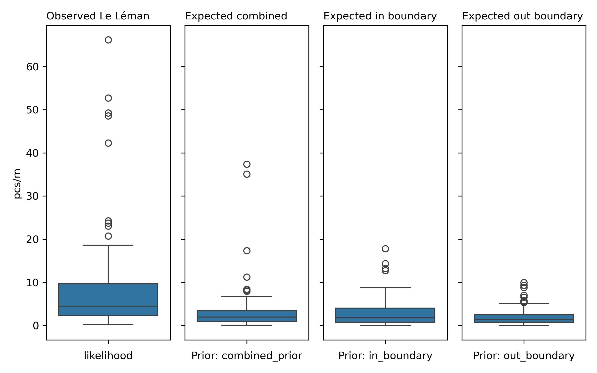

# Le Léman

**Summary and analysis of observations of trash density**: objects related to recreation, personal items, unclassified, infrastructure, food and drink, packaging non food, plastic pieces, waste water, agriculture, tobacco and micro plastics (< 5mm) found in lakes. <i>Report number: Le Léman None lake 2020-01-01 2021-05-31</i>

 <i>Proof of concept: llm assissted reporting</i>

## Executive Summary

This report encompasses data from 13 cities around Lake Geneva (Lac Leman), covering the period from April 28, 2020, to May 12, 2021. A total of 98 samples were gathered from the survey area of Rhone. The average litter density was 8.66 pcs/m with a maximum of 66.17 pcs/m, and a standard deviation of 11.61. During the survey, 27,447 objects were identified, with 90% being plastic, followed by glass (3%), metal (2%), and paper (1%). The most frequently found items were fragmented plastics, expanded polystyrene, cigarette filters, food wrappers, and plastic caps/lid rings, with fail rates ranging from 83.67% to 96.94%.

Sampling stratification, a method to ensure adequate representation of different population segments, was used to analyze trash density in relation to land-use features within a 1,500 meters buffer zone around each survey location. The survey predominantly took place in urban areas, as evidenced by buildings occupying more than 60% of the buffer zone in 79.6% of the samples, whereas forests occupied this proportion in no samples. The highest trash densities were observed in areas where buildings occupied 20-40% of the buffer (19.42 pcs/m) and streets occupied 60-80% of the buffer (21.01 pcs/m).

Regression analysis was conducted using various models, with the Bagging: Linear Regression model achieving the highest r² of 0.26 and an MSE of 1.55. This indicates a modest predictive power, explaining approximately 25.9% of the variance in the target variable. The most influential features, based on feature importance, were forest (coefficient 1.48), buildings (coefficient 1.31), and public services (coefficient 0.35). Predictions based on these models are moderately reliable but not highly accurate.

Grid approximation, a technique used to estimate the distribution of litter density based on prior observations, was employed with three different priors: combined, in-boundary, and out-boundary. The posterior averages for these priors were 3.06, 2.93, and 2.23 pcs/m respectively, all lower than the observed average of 8.66 pcs/m. This suggests an expected decrease in litter density in future observations compared to the current data, with the observed average significantly higher than any posterior average.
## Sample results

The report includes data from 13 cities: La Tour-de-Peilz, Genève, Montreux, Tolochenaz, Bourg-en-Lavaux, Saint-Gingolph, Allaman, Gland, Saint-Sulpice (VD), Préverenges, Vevey, Versoix, and Lausanne. There is one lake, named Lac-Leman, included in the report. The sampling period extended from April 28, 2020, to May 12, 2021, within the survey area of Rhone.

A total of 98 samples were collected, yielding an average of 8.66 pcs/m (objects per meter) with a maximum of 66.17 pcs/m. The standard deviation was 11.61, and a total of 27,447 objects were identified during the survey. The material composition revealed that 90% of the identified objects were plastic, followed by glass at 3%, metal at 2%, and paper at 1%.

:::{dropdown} Sample results frequently asked questions
### Frequently asked questions

**What were the five most common items found?**  
The five most common items found were:  
1. Fragmented plastics - fail rate 96.94% (15.35% of total)  
2. Expanded polystyrene - fail rate 83.67% (13.07% of total)  
3. Cigarette filters - fail rate 94.90% (11.35% of total)  
4. Food wrappers (candy, snacks) - fail rate 95.92% (6.12% of total)  
5. Plastic caps, lid rings - fail rate 88.78% (4.42% of total)  

The fail rate indicates the proportion of samples where at least one of the objects was found.

**Are these objects found on European beaches? If so, is there any data on how many per 100 m of beach?**  
Yes, many of these objects are commonly found on European beaches. According to OSPAR results from 2022, an average of approximately 600 items of litter were recorded per 100 meters of beach.

**What are possible sources of these specific objects?**  
Possible sources of these specific objects include recreational activities (such as picnicking and smoking), general consumer use (plastic packaging, food wrappers), and waste management issues (single-use plastics not being disposed of properly).

**Which three cities had the highest average pcs/m? Which three had the lowest?**  
The three cities with the highest average pcs/m were:  
1. Saint-Gingolph - 23.64 pcs/m  
2. Saint-Sulpice (VD) - 18.43 pcs/m  
3. Lausanne - 19.41 pcs/m  

The three cities with the lowest average pcs/m were:  
1. Gland - 1.43 pcs/m  
2. Genève - 3.30 pcs/m  
3. Tolochenaz - 3.56 pcs/m
:::

::::{grid} 1
:margin 0
:padding: 0

:::{grid-item-card}
:padding: 0
:img-background: lelemanall/situation_map.jpg

:::

::::

::::{grid}

:::{grid-item}

<table id="T_34c0e">
  <thead>
    <tr>
      <th class="blank level0" >&nbsp;</th>
      <th id="T_34c0e_level0_col0" class="col_heading level0 col0" >pcs/m</th>
      <th id="T_34c0e_level0_col1" class="col_heading level0 col1" >buildings</th>
      <th id="T_34c0e_level0_col2" class="col_heading level0 col2" >forest</th>
      <th id="T_34c0e_level0_col3" class="col_heading level0 col3" >undefined</th>
      <th id="T_34c0e_level0_col4" class="col_heading level0 col4" >streets</th>
      <th id="T_34c0e_level0_col5" class="col_heading level0 col5" >public-services</th>
      <th id="T_34c0e_level0_col6" class="col_heading level0 col6" >recreation</th>
    </tr>
    <tr>
      <th class="index_name level0" >cluster</th>
      <th class="blank col0" >&nbsp;</th>
      <th class="blank col1" >&nbsp;</th>
      <th class="blank col2" >&nbsp;</th>
      <th class="blank col3" >&nbsp;</th>
      <th class="blank col4" >&nbsp;</th>
      <th class="blank col5" >&nbsp;</th>
      <th class="blank col6" >&nbsp;</th>
    </tr>
  </thead>
  <tbody>
    <tr>
      <th id="T_34c0e_level0_row0" class="row_heading level0 row0" >0</th>
      <td id="T_34c0e_row0_col0" class="data row0 col0" >5,76</td>
      <td id="T_34c0e_row0_col1" class="data row0 col1" >0,36</td>
      <td id="T_34c0e_row0_col2" class="data row0 col2" >0,04</td>
      <td id="T_34c0e_row0_col3" class="data row0 col3" >0,39</td>
      <td id="T_34c0e_row0_col4" class="data row0 col4" >0,18</td>
      <td id="T_34c0e_row0_col5" class="data row0 col5" >0,13</td>
      <td id="T_34c0e_row0_col6" class="data row0 col6" >-0,00</td>
    </tr>
    <tr>
      <th id="T_34c0e_level0_row1" class="row_heading level0 row1" >1</th>
      <td id="T_34c0e_row1_col0" class="data row1 col0" >7,02</td>
      <td id="T_34c0e_row1_col1" class="data row1 col1" >1,00</td>
      <td id="T_34c0e_row1_col2" class="data row1 col2" >0,00</td>
      <td id="T_34c0e_row1_col3" class="data row1 col3" >0,00</td>
      <td id="T_34c0e_row1_col4" class="data row1 col4" >0,00</td>
      <td id="T_34c0e_row1_col5" class="data row1 col5" >0,08</td>
      <td id="T_34c0e_row1_col6" class="data row1 col6" >0,02</td>
    </tr>
    <tr>
      <th id="T_34c0e_level0_row2" class="row_heading level0 row2" >2</th>
      <td id="T_34c0e_row2_col0" class="data row2 col0" >5,02</td>
      <td id="T_34c0e_row2_col1" class="data row2 col1" >0,20</td>
      <td id="T_34c0e_row2_col2" class="data row2 col2" >0,07</td>
      <td id="T_34c0e_row2_col3" class="data row2 col3" >0,24</td>
      <td id="T_34c0e_row2_col4" class="data row2 col4" >0,46</td>
      <td id="T_34c0e_row2_col5" class="data row2 col5" >0,47</td>
      <td id="T_34c0e_row2_col6" class="data row2 col6" >0,00</td>
    </tr>
    <tr>
      <th id="T_34c0e_level0_row3" class="row_heading level0 row3" >3</th>
      <td id="T_34c0e_row3_col0" class="data row3 col0" >20,22</td>
      <td id="T_34c0e_row3_col1" class="data row3 col1" >0,27</td>
      <td id="T_34c0e_row3_col2" class="data row3 col2" >0,50</td>
      <td id="T_34c0e_row3_col3" class="data row3 col3" >0,23</td>
      <td id="T_34c0e_row3_col4" class="data row3 col4" >0,01</td>
      <td id="T_34c0e_row3_col5" class="data row3 col5" >0,01</td>
      <td id="T_34c0e_row3_col6" class="data row3 col6" >0,03</td>
    </tr>
  </tbody>
</table>

:::

::::
## Sampling stratification

Sampling stratification refers to the process of dividing a population into subgroups or strata to ensure that different segments of the population are adequately represented in the sample. In this survey, sampling stratification was applied to assess the density of trash in relation to various land-use features surrounding the survey locations, which are defined by a buffer zone of 1,500 meters. The land-use categories include buildings, wetlands, forest, public services, recreation, undefined, streets, vineyards, and orchards. Each category occupies a different proportion of the buffer zone, which allows for an analysis of how trash density varies based on the land-use features present.

Land use pertains to the various ways in which land is utilized, as represented in the survey report. The categories listed in the sampling stratification table indicate the different land uses surrounding the survey locations, which are crucial for understanding the environmental context of the survey results. 

In terms of sample proportions, the survey reveals that buildings occupied more than 60% of the buffer zone in 79.6% of the samples, which is derived from the sum of the proportions for the rows 60-80% and 80-100% in the buildings column (19.4% + 60.2%). Conversely, forest occupied more than 60% of the buffer zone in no samples, as indicated by the absence of values in the relevant rows for the forest column. This suggests that the area surveyed cannot be classified as rural because no significant proportion of the buffer zone was occupied by forests.

The two highest pieces of trash per meter (pcs/m) values in the sampling stratification and trash density table are found in the buildings category (19.42 pcs/m when buildings occupy 20-40% of the buffer) and in the streets category (21.01 pcs/m when streets occupy 60-80% of the buffer). These values reflect the density of trash present in relation to the specific land use and the proportion of the buffer zone they occupy.

::::{grid}

:::{grid-item}

<table id="T_d076c">
  <caption>
Each survey location is surounded by a buffer zone of radius = 1 500 meters. The buffer zone is comprised of land-use features, each land use feature occupies a proportion of the buffer zone (0 - 100%). The land-use-profile is measured by considering the proportion of the buffer dedicated to each of land use feature that is present in the buffer zone. Each location has the same size buffer zone. What changes is how the land use features are distributed within the buffer zone, Which means we assume that locations that have a similar distribution of features in the buffer zone should have similar survey results. The sampling stratification tells us under what conditions the surveys were collected and what proportions of the samples were taken according to the different conditions.
</caption>
  <thead>
    <tr>
      <th class="blank level0" >&nbsp;</th>
      <th id="T_d076c_level0_col0" class="col_heading level0 col0" colspan="9">Proportion of samples collected</th>
    </tr>
    <tr>
      <th class="blank level1" >&nbsp;</th>
      <th id="T_d076c_level1_col0" class="col_heading level1 col0" >buildings</th>
      <th id="T_d076c_level1_col1" class="col_heading level1 col1" >wetlands</th>
      <th id="T_d076c_level1_col2" class="col_heading level1 col2" >forest</th>
      <th id="T_d076c_level1_col3" class="col_heading level1 col3" >public-services</th>
      <th id="T_d076c_level1_col4" class="col_heading level1 col4" >recreation</th>
      <th id="T_d076c_level1_col5" class="col_heading level1 col5" >undefined</th>
      <th id="T_d076c_level1_col6" class="col_heading level1 col6" >streets</th>
      <th id="T_d076c_level1_col7" class="col_heading level1 col7" >vineyards</th>
      <th id="T_d076c_level1_col8" class="col_heading level1 col8" >orchards</th>
    </tr>
    <tr>
      <th class="index_name level0" >proportion of buffer</th>
      <th class="blank col0" >&nbsp;</th>
      <th class="blank col1" >&nbsp;</th>
      <th class="blank col2" >&nbsp;</th>
      <th class="blank col3" >&nbsp;</th>
      <th class="blank col4" >&nbsp;</th>
      <th class="blank col5" >&nbsp;</th>
      <th class="blank col6" >&nbsp;</th>
      <th class="blank col7" >&nbsp;</th>
      <th class="blank col8" >&nbsp;</th>
    </tr>
  </thead>
  <tbody>
    <tr>
      <th id="T_d076c_level0_row0" class="row_heading level0 row0" >0-20%</th>
      <td id="T_d076c_row0_col0" class="data row0 col0" >5.1%</td>
      <td id="T_d076c_row0_col1" class="data row0 col1" >100.0%</td>
      <td id="T_d076c_row0_col2" class="data row0 col2" >86.7%</td>
      <td id="T_d076c_row0_col3" class="data row0 col3" >80.6%</td>
      <td id="T_d076c_row0_col4" class="data row0 col4" >100.0%</td>
      <td id="T_d076c_row0_col5" class="data row0 col5" >79.6%</td>
      <td id="T_d076c_row0_col6" class="data row0 col6" >19.4%</td>
      <td id="T_d076c_row0_col7" class="data row0 col7" >98.0%</td>
      <td id="T_d076c_row0_col8" class="data row0 col8" >100.0%</td>
    </tr>
    <tr>
      <th id="T_d076c_level0_row1" class="row_heading level0 row1" >20-40%</th>
      <td id="T_d076c_row1_col0" class="data row1 col0" >14.3%</td>
      <td id="T_d076c_row1_col1" class="data row1 col1" >none</td>
      <td id="T_d076c_row1_col2" class="data row1 col2" >2.0%</td>
      <td id="T_d076c_row1_col3" class="data row1 col3" >17.3%</td>
      <td id="T_d076c_row1_col4" class="data row1 col4" >none</td>
      <td id="T_d076c_row1_col5" class="data row1 col5" >15.3%</td>
      <td id="T_d076c_row1_col6" class="data row1 col6" >19.4%</td>
      <td id="T_d076c_row1_col7" class="data row1 col7" >none</td>
      <td id="T_d076c_row1_col8" class="data row1 col8" >none</td>
    </tr>
    <tr>
      <th id="T_d076c_level0_row2" class="row_heading level0 row2" >40-60%</th>
      <td id="T_d076c_row2_col0" class="data row2 col0" >1.0%</td>
      <td id="T_d076c_row2_col1" class="data row2 col1" >none</td>
      <td id="T_d076c_row2_col2" class="data row2 col2" >11.2%</td>
      <td id="T_d076c_row2_col3" class="data row2 col3" >2.0%</td>
      <td id="T_d076c_row2_col4" class="data row2 col4" >none</td>
      <td id="T_d076c_row2_col5" class="data row2 col5" >5.1%</td>
      <td id="T_d076c_row2_col6" class="data row2 col6" >36.7%</td>
      <td id="T_d076c_row2_col7" class="data row2 col7" >2.0%</td>
      <td id="T_d076c_row2_col8" class="data row2 col8" >none</td>
    </tr>
    <tr>
      <th id="T_d076c_level0_row3" class="row_heading level0 row3" >60-80%</th>
      <td id="T_d076c_row3_col0" class="data row3 col0" >19.4%</td>
      <td id="T_d076c_row3_col1" class="data row3 col1" >none</td>
      <td id="T_d076c_row3_col2" class="data row3 col2" >none</td>
      <td id="T_d076c_row3_col3" class="data row3 col3" >none</td>
      <td id="T_d076c_row3_col4" class="data row3 col4" >none</td>
      <td id="T_d076c_row3_col5" class="data row3 col5" >none</td>
      <td id="T_d076c_row3_col6" class="data row3 col6" >10.2%</td>
      <td id="T_d076c_row3_col7" class="data row3 col7" >none</td>
      <td id="T_d076c_row3_col8" class="data row3 col8" >none</td>
    </tr>
    <tr>
      <th id="T_d076c_level0_row4" class="row_heading level0 row4" >80-100%</th>
      <td id="T_d076c_row4_col0" class="data row4 col0" >60.2%</td>
      <td id="T_d076c_row4_col1" class="data row4 col1" >none</td>
      <td id="T_d076c_row4_col2" class="data row4 col2" >none</td>
      <td id="T_d076c_row4_col3" class="data row4 col3" >none</td>
      <td id="T_d076c_row4_col4" class="data row4 col4" >none</td>
      <td id="T_d076c_row4_col5" class="data row4 col5" >none</td>
      <td id="T_d076c_row4_col6" class="data row4 col6" >14.3%</td>
      <td id="T_d076c_row4_col7" class="data row4 col7" >none</td>
      <td id="T_d076c_row4_col8" class="data row4 col8" >none</td>
    </tr>
  </tbody>
</table>

:::

::::

::::{grid}

:::{grid-item}

<table id="T_e19ac">
  <caption>
The land use profile allows us to group locations according to the topography. Here we consdider how the observed litter density changes based on the land use feature and the proportion of the buffer-zone that the feature occupies</caption>
  <thead>
    <tr>
      <th class="blank level0" >&nbsp;</th>
      <th id="T_e19ac_level0_col0" class="col_heading level0 col0" colspan="9">Pieces of trash per meter</th>
    </tr>
    <tr>
      <th class="blank level1" >&nbsp;</th>
      <th id="T_e19ac_level1_col0" class="col_heading level1 col0" >buildings</th>
      <th id="T_e19ac_level1_col1" class="col_heading level1 col1" >wetlands</th>
      <th id="T_e19ac_level1_col2" class="col_heading level1 col2" >forest</th>
      <th id="T_e19ac_level1_col3" class="col_heading level1 col3" >public-services</th>
      <th id="T_e19ac_level1_col4" class="col_heading level1 col4" >recreation</th>
      <th id="T_e19ac_level1_col5" class="col_heading level1 col5" >undefined</th>
      <th id="T_e19ac_level1_col6" class="col_heading level1 col6" >streets</th>
      <th id="T_e19ac_level1_col7" class="col_heading level1 col7" >vineyards</th>
      <th id="T_e19ac_level1_col8" class="col_heading level1 col8" >orchards</th>
    </tr>
    <tr>
      <th class="index_name level0" >proportion of buffer</th>
      <th class="blank col0" >&nbsp;</th>
      <th class="blank col1" >&nbsp;</th>
      <th class="blank col2" >&nbsp;</th>
      <th class="blank col3" >&nbsp;</th>
      <th class="blank col4" >&nbsp;</th>
      <th class="blank col5" >&nbsp;</th>
      <th class="blank col6" >&nbsp;</th>
      <th class="blank col7" >&nbsp;</th>
      <th class="blank col8" >&nbsp;</th>
    </tr>
  </thead>
  <tbody>
    <tr>
      <th id="T_e19ac_level0_row0" class="row_heading level0 row0" >0-20%</th>
      <td id="T_e19ac_row0_col0" class="data row0 col0" >4.908000</td>
      <td id="T_e19ac_row0_col1" class="data row0 col1" >8.662449</td>
      <td id="T_e19ac_row0_col2" class="data row0 col2" >6.894118</td>
      <td id="T_e19ac_row0_col3" class="data row0 col3" >7.249747</td>
      <td id="T_e19ac_row0_col4" class="data row0 col4" >8.662449</td>
      <td id="T_e19ac_row0_col5" class="data row0 col5" >7.015128</td>
      <td id="T_e19ac_row0_col6" class="data row0 col6" >15.890526</td>
      <td id="T_e19ac_row0_col7" class="data row0 col7" >8.738438</td>
      <td id="T_e19ac_row0_col8" class="data row0 col8" >8.662449</td>
    </tr>
    <tr>
      <th id="T_e19ac_level0_row1" class="row_heading level0 row1" >20-40%</th>
      <td id="T_e19ac_row1_col0" class="data row1 col0" >19.417857</td>
      <td id="T_e19ac_row1_col1" class="data row1 col1" >none</td>
      <td id="T_e19ac_row1_col2" class="data row1 col2" >1.430000</td>
      <td id="T_e19ac_row1_col3" class="data row1 col3" >15.656471</td>
      <td id="T_e19ac_row1_col4" class="data row1 col4" >none</td>
      <td id="T_e19ac_row1_col5" class="data row1 col5" >18.480000</td>
      <td id="T_e19ac_row1_col6" class="data row1 col6" >3.782632</td>
      <td id="T_e19ac_row1_col7" class="data row1 col7" >none</td>
      <td id="T_e19ac_row1_col8" class="data row1 col8" >none</td>
    </tr>
    <tr>
      <th id="T_e19ac_level0_row2" class="row_heading level0 row2" >40-60%</th>
      <td id="T_e19ac_row2_col0" class="data row2 col0" >5.350000</td>
      <td id="T_e19ac_row2_col1" class="data row2 col1" >none</td>
      <td id="T_e19ac_row2_col2" class="data row2 col2" >23.641818</td>
      <td id="T_e19ac_row2_col3" class="data row2 col3" >5.015000</td>
      <td id="T_e19ac_row2_col4" class="data row2 col4" >none</td>
      <td id="T_e19ac_row2_col5" class="data row2 col5" >4.908000</td>
      <td id="T_e19ac_row2_col6" class="data row2 col6" >6.353333</td>
      <td id="T_e19ac_row2_col7" class="data row2 col7" >5.015000</td>
      <td id="T_e19ac_row2_col8" class="data row2 col8" >none</td>
    </tr>
    <tr>
      <th id="T_e19ac_level0_row3" class="row_heading level0 row3" >60-80%</th>
      <td id="T_e19ac_row3_col0" class="data row3 col0" >5.936842</td>
      <td id="T_e19ac_row3_col1" class="data row3 col1" >none</td>
      <td id="T_e19ac_row3_col2" class="data row3 col2" >none</td>
      <td id="T_e19ac_row3_col3" class="data row3 col3" >none</td>
      <td id="T_e19ac_row3_col4" class="data row3 col4" >none</td>
      <td id="T_e19ac_row3_col5" class="data row3 col5" >none</td>
      <td id="T_e19ac_row3_col6" class="data row3 col6" >21.008000</td>
      <td id="T_e19ac_row3_col7" class="data row3 col7" >none</td>
      <td id="T_e19ac_row3_col8" class="data row3 col8" >none</td>
    </tr>
    <tr>
      <th id="T_e19ac_level0_row4" class="row_heading level0 row4" >80-100%</th>
      <td id="T_e19ac_row4_col0" class="data row4 col0" >7.362373</td>
      <td id="T_e19ac_row4_col1" class="data row4 col1" >none</td>
      <td id="T_e19ac_row4_col2" class="data row4 col2" >none</td>
      <td id="T_e19ac_row4_col3" class="data row4 col3" >none</td>
      <td id="T_e19ac_row4_col4" class="data row4 col4" >none</td>
      <td id="T_e19ac_row4_col5" class="data row4 col5" >none</td>
      <td id="T_e19ac_row4_col6" class="data row4 col6" >2.595000</td>
      <td id="T_e19ac_row4_col7" class="data row4 col7" >none</td>
      <td id="T_e19ac_row4_col8" class="data row4 col8" >none</td>
    </tr>
  </tbody>
</table>

:::

::::
:::{dropdown} Sampling stratification frequently asked questions
### Frequently asked questions

**What does the sampling stratification table tell us?**  
The sampling stratification table provides insights into the relationship between the density of trash and the different land-use features surrounding the survey locations. For example, in areas where buildings occupy 20-40% of the buffer, the average density of trash was 19.42 pcs/m, indicating a significant presence of litter. In contrast, areas where streets occupy 60-80% of the buffer showed a higher density at 21.01 pcs/m. These values highlight the impact of specific land-use features on trash density.

**How can the information in the sampling stratification and trash density table help identify areas of concern?**  
The information in the sampling stratification and trash density table can help identify areas of concern by revealing which land-use features correlate with higher trash density. For instance, high densities of trash in urban areas, particularly where buildings or streets dominate, may indicate inadequate waste management practices or higher recreational use leading to littering. Identifying these areas can facilitate targeted cleanup efforts and inform local policies aimed at reducing litter.

**Under what land-use conditions would a surveyor expect to find the most trash?**  
A surveyor would expect to find the most trash in areas where buildings and streets occupy a significant proportion of the buffer zone. For example, in locations where buildings occupy 20-40% of the buffer, the average density is 19.42 pcs/m. Additionally, in areas where streets occupy 60-80% of the buffer, the density is even higher at 21.01 pcs/m. These conditions suggest that urbanized areas with limited green space may contribute to greater litter accumulation.

**Given the results in the sampling stratification table, were these surveys collected in mostly urban environments or forested?**  
The surveys do not meet the criteria for being classified as predominantly urban or rural. The proportion of samples where buildings occupied greater than 60% of the buffer is 79.6%, while the proportion of samples where forest occupied greater than 60% of the buffer is 0%. The highest proportion of samples is associated with buildings, indicating that the area is predominantly urban with limited forested land.
:::

## Linear and ensemble methods

Cluster analysis (k-means) divides a dataset into distinct groups (clusters) based on feature similarity. K-means clustering aims to minimize the variance within each cluster. Linear regression is a method to model the relationship between a dependent variable and one or more independent variables by fitting a linear equation to observed data. Ensemble regression combines multiple models to improve prediction accuracy, including techniques like Random Forest, Gradient Boosting, Bagging, and Voting.

The basic assumptions of linear regression include linearity, independence, homoscedasticity, and normality of residuals. Ensemble regression methods assume that combining multiple models can reduce variance and improve predictive performance, making fewer assumptions about the underlying data distribution.

The model with the highest r² was Bagging: Linear Regression with an r² of 0.26 and an MSE of 1.55. Given this model, conclusions indicate that while some predictive power exists, the relatively low r² suggests only a modest proportion of the variance in the target variable is explained by the model. Predictions would be moderately reliable but not highly accurate.

If the regression analysis is considered reliable, the features with the greatest influence on the target variable, based on feature importance, include forest (coefficient 1.48), buildings (coefficient 1.31), and public services (coefficient 0.35).

:::{dropdown} Linear methods frequently asked questions
### Frequently asked questions

**What were the r² and MSE of each test?**

The r² and MSE values for each model were as follows:

| Model                        |    R² |   MSE |
|------------------------------|-------|-------|
| Linear Regression            |  0.24 |  1.60 |
| Random Forest Regression     |  0.19 |  1.69 |
| Gradient Boosting Regression |  0.09 |  1.90 |
| Theil-Sen Regressor          |  0.13 |  1.82 |
| Bagging: Linear Regression   |  0.26 |  1.55 |
| Voting                       |  0.19 |  1.71 |

**Given the r² and MSE of the different methods employed, how reliable do you think predictions would be based on these models?**

The predictions based on these models would be moderately reliable. The highest r² of 0.26 suggests that the model explains only a modest portion of the variance in the target variable. The MSE values indicate a degree of error in predictions, with the best model (Bagging: Linear Regression) having an MSE of 1.55.

**Can any conclusions be drawn from these results?**

Conclusions that can be drawn are that the Bagging: Linear Regression model provides the best fit among the tested models, explaining approximately 25.9% of the variance in the target variable. However, the model's predictive power is modest, indicating that other unobserved factors might be influencing the target variable.

**According to the cluster analysis, what is the cluster that has the greatest average pcs/m? What is the distribution of land use values within the cluster?**

Cluster 3 has the greatest average pcs/m, with a value of 20.22 objects per meter of the beach. The distribution of land use values within Cluster 3 is:
- Buildings: 26.8%
- Wetlands: 0%
- Forest: 50.4%
- Public Services: 1.2%
- Recreation: 3.1%
- Undefined: 22.8%
- Streets: 1.06%
- Vineyards: 0%
- Orchards: 0%
:::

## Forecasts and methods

Grid approximation is a numerical technique used to estimate the distribution of a parameter, such as litter density, based on previously observed data under similar conditions. The method in this report employs conditional probability to evaluate what can be expected given prior observations, utilizing land use features and buffer zone proportions. The grid approximation involves discretizing the parameter space, evaluating the statistical function at grid points, and normalizing the results to create a valid probability distribution. In Bayesian statistics, a prior distribution represents the initial beliefs about a parameter before observing data, while the posterior distribution reflects updated beliefs after incorporating the likelihood of the observed data.

In this report, three priors were used:

1. **Combined prior grid approximation**: Similarity threshold 0.77
2. **In-boundary grid approximation**: Similarity threshold not explicitly stated, but limited to samples within the boundary.
3. **Out-boundary grid approximation**: Similarity threshold 0.74

The differences between the priors lie in the geographic boundaries from which the samples are drawn. The combined prior considers samples from both inside and outside the boundary, while the in-boundary prior only considers samples within the specified geographic area, and the out-boundary prior includes only samples from outside the geographic area.

Comparing the different posterior distributions to the observed results:

- Observed average pcs/m: 8.66
- Combined prior average pcs/m: 3.06
- In-boundary prior average pcs/m: 2.93
- Out-boundary prior average pcs/m: 2.23

All posterior averages are lower than the observed average, indicating a decrease is expected. Given the standard deviation of the observed data (11.61 pcs/m), a person taking one sample would likely notice a difference since the observed average is significantly higher than any of the posterior averages.

::::{grid} 1
:margin: 0

:::{grid-item}
:padding: 0

:::

::::

:::{dropdown} Grid approximation frequently asked questions
### Frequently asked questions

**1. Why is grid approximation a reasonable modeling technique given the data?**  
The observed data, with a mean of 8.66 pcs/m and a median of 4.51 pcs/m, suggests a right-skewed distribution, as the mean is greater than the median. This indicates that the data may not be normally distributed. If the data were normally distributed, predictions would be more reliable and centered around the mean, but the skew suggests that the presence of outliers may influence the predictions. 

**2. Do you have an example of other fields or domains that use a grid approximation or Bayesian methods?**  
Grid approximation and Bayesian methods are commonly used in fields such as ecology for species distribution modeling, finance for risk assessment, and machine learning for probabilistic modeling.

**3. If the data is normally distributed would the predictions from the grid approximation and the predictions from the normal distribution be different? If so in what way?**  
Yes, if the data is normally distributed, predictions from a grid approximation may yield different estimates compared to predictions based on normal distribution assumptions, particularly in terms of confidence intervals and the behavior of the tails of the distribution.

**4. What is the difference between grid approximation and linear or ensemble regression?**  
Grid approximation is a Bayesian method focused on estimating probability distributions, while linear and ensemble regression are primarily focused on predicting outcomes based on independent variables. Grid approximation considers prior beliefs and evidence, while regression typically assumes a linear relationship between variables.

**5. With which posterior do we expect to find most? The least?**  
The most expected posterior is the combined prior grid approximation with an average of 3.06 pcs/m. The least expected is the out-boundary grid approximation, which has an average of 2.23 pcs/m.

**6. If the in-boundary grid approximation predicts an increase or decrease, what does that say about the other samples from within the boundary?**  
If the in-boundary prior predicts an increase, it suggests that elevated values were likely observed in other locations within the boundary compared to the likelihood samples.

**7. If the out-boundary grid approximation predicts an increase or decrease, what does that say about the other samples from outside of the boundary?**  
If the out-boundary prior predicts an increase, it indicates that locations outside the region likely had elevated values compared to the likelihood samples.

**8. How different are the expected results from the observed results? Should an increase or decrease be expected?**  
The expected average results from the posterior distributions are all lower than the observed average of 8.66 pcs/m. The differences are:

- Combined prior: -5.60 pcs/m
- In-boundary prior: -5.73 pcs/m
- Out-boundary prior: -6.44 pcs/m

Given the standard deviation of 11.61 pcs/m, a person taking one sample is likely to notice the decrease as the differences are substantial compared to the variability in the observed data.
:::

## Consolidated results : city, canton, parent_boundary

::::{grid}

:::{grid-item}

<table id="T_898e8">
  <caption>Sample totals : city, average, quantity, number of samples</caption>
  <thead>
    <tr>
      <th class="blank level0" >&nbsp;</th>
      <th id="T_898e8_level0_col0" class="col_heading level0 col0" >city</th>
      <th id="T_898e8_level0_col1" class="col_heading level0 col1" >quantity</th>
      <th id="T_898e8_level0_col2" class="col_heading level0 col2" >pcs/m</th>
    </tr>
  </thead>
  <tbody>
    <tr>
      <th id="T_898e8_level0_row0" class="row_heading level0 row0" >0</th>
      <td id="T_898e8_row0_col0" class="data row0 col0" >Allaman</td>
      <td id="T_898e8_row0_col1" class="data row0 col1" >631</td>
      <td id="T_898e8_row0_col2" class="data row0 col2" >7.226667</td>
    </tr>
    <tr>
      <th id="T_898e8_level0_row1" class="row_heading level0 row1" >1</th>
      <td id="T_898e8_row1_col0" class="data row1 col0" >Bourg-en-Lavaux</td>
      <td id="T_898e8_row1_col1" class="data row1 col1" >121</td>
      <td id="T_898e8_row1_col2" class="data row1 col2" >5.015000</td>
    </tr>
    <tr>
      <th id="T_898e8_level0_row2" class="row_heading level0 row2" >2</th>
      <td id="T_898e8_row2_col0" class="data row2 col0" >Genève</td>
      <td id="T_898e8_row2_col1" class="data row2 col1" >4059</td>
      <td id="T_898e8_row2_col2" class="data row2 col2" >3.300000</td>
    </tr>
    <tr>
      <th id="T_898e8_level0_row3" class="row_heading level0 row3" >3</th>
      <td id="T_898e8_row3_col0" class="data row3 col0" >Gland</td>
      <td id="T_898e8_row3_col1" class="data row3 col1" >134</td>
      <td id="T_898e8_row3_col2" class="data row3 col2" >1.430000</td>
    </tr>
    <tr>
      <th id="T_898e8_level0_row4" class="row_heading level0 row4" >4</th>
      <td id="T_898e8_row4_col0" class="data row4 col0" >La Tour-de-Peilz</td>
      <td id="T_898e8_row4_col1" class="data row4 col1" >2936</td>
      <td id="T_898e8_row4_col2" class="data row4 col2" >4.326000</td>
    </tr>
    <tr>
      <th id="T_898e8_level0_row5" class="row_heading level0 row5" >5</th>
      <td id="T_898e8_row5_col0" class="data row5 col0" >Lausanne</td>
      <td id="T_898e8_row5_col1" class="data row5 col1" >997</td>
      <td id="T_898e8_row5_col2" class="data row5 col2" >19.411429</td>
    </tr>
    <tr>
      <th id="T_898e8_level0_row6" class="row_heading level0 row6" >6</th>
      <td id="T_898e8_row6_col0" class="data row6 col0" >Montreux</td>
      <td id="T_898e8_row6_col1" class="data row6 col1" >738</td>
      <td id="T_898e8_row6_col2" class="data row6 col2" >4.210000</td>
    </tr>
    <tr>
      <th id="T_898e8_level0_row7" class="row_heading level0 row7" >7</th>
      <td id="T_898e8_row7_col0" class="data row7 col0" >Préverenges</td>
      <td id="T_898e8_row7_col1" class="data row7 col1" >3744</td>
      <td id="T_898e8_row7_col2" class="data row7 col2" >6.616154</td>
    </tr>
    <tr>
      <th id="T_898e8_level0_row8" class="row_heading level0 row8" >8</th>
      <td id="T_898e8_row8_col0" class="data row8 col0" >Saint-Gingolph</td>
      <td id="T_898e8_row8_col1" class="data row8 col1" >7560</td>
      <td id="T_898e8_row8_col2" class="data row8 col2" >23.641818</td>
    </tr>
    <tr>
      <th id="T_898e8_level0_row9" class="row_heading level0 row9" >9</th>
      <td id="T_898e8_row9_col0" class="data row9 col0" >Saint-Sulpice (VD)</td>
      <td id="T_898e8_row9_col1" class="data row9 col1" >2507</td>
      <td id="T_898e8_row9_col2" class="data row9 col2" >18.426000</td>
    </tr>
    <tr>
      <th id="T_898e8_level0_row10" class="row_heading level0 row10" >10</th>
      <td id="T_898e8_row10_col0" class="data row10 col0" >Tolochenaz</td>
      <td id="T_898e8_row10_col1" class="data row10 col1" >274</td>
      <td id="T_898e8_row10_col2" class="data row10 col2" >3.555000</td>
    </tr>
    <tr>
      <th id="T_898e8_level0_row11" class="row_heading level0 row11" >11</th>
      <td id="T_898e8_row11_col0" class="data row11 col0" >Versoix</td>
      <td id="T_898e8_row11_col1" class="data row11 col1" >583</td>
      <td id="T_898e8_row11_col2" class="data row11 col2" >3.110000</td>
    </tr>
    <tr>
      <th id="T_898e8_level0_row12" class="row_heading level0 row12" >12</th>
      <td id="T_898e8_row12_col0" class="data row12 col0" >Vevey</td>
      <td id="T_898e8_row12_col1" class="data row12 col1" >3163</td>
      <td id="T_898e8_row12_col2" class="data row12 col2" >6.389167</td>
    </tr>
  </tbody>
</table>

:::

::::

::::{grid}

:::{grid-item}

<table id="T_b4f0b">
  <caption>Sample totals : canton, average, quantity, number of samples</caption>
  <thead>
    <tr>
      <th class="blank level0" >&nbsp;</th>
      <th id="T_b4f0b_level0_col0" class="col_heading level0 col0" >canton</th>
      <th id="T_b4f0b_level0_col1" class="col_heading level0 col1" >quantity</th>
      <th id="T_b4f0b_level0_col2" class="col_heading level0 col2" >pcs/m</th>
    </tr>
  </thead>
  <tbody>
    <tr>
      <th id="T_b4f0b_level0_row0" class="row_heading level0 row0" >0</th>
      <td id="T_b4f0b_row0_col0" class="data row0 col0" >Genève</td>
      <td id="T_b4f0b_row0_col1" class="data row0 col1" >4642</td>
      <td id="T_b4f0b_row0_col2" class="data row0 col2" >3.270000</td>
    </tr>
    <tr>
      <th id="T_b4f0b_level0_row1" class="row_heading level0 row1" >1</th>
      <td id="T_b4f0b_row1_col0" class="data row1 col0" >Valais</td>
      <td id="T_b4f0b_row1_col1" class="data row1 col1" >7560</td>
      <td id="T_b4f0b_row1_col2" class="data row1 col2" >23.641818</td>
    </tr>
    <tr>
      <th id="T_b4f0b_level0_row2" class="row_heading level0 row2" >2</th>
      <td id="T_b4f0b_row2_col0" class="data row2 col0" >Vaud</td>
      <td id="T_b4f0b_row2_col1" class="data row2 col1" >15245</td>
      <td id="T_b4f0b_row2_col2" class="data row2 col2" >7.746029</td>
    </tr>
  </tbody>
</table>

:::

::::

::::{grid}

:::{grid-item}

<table id="T_2790c">
  <caption>Sample totals : parent_boundary, average, quantity, number of samples</caption>
  <thead>
    <tr>
      <th class="blank level0" >&nbsp;</th>
      <th id="T_2790c_level0_col0" class="col_heading level0 col0" >parent_boundary</th>
      <th id="T_2790c_level0_col1" class="col_heading level0 col1" >quantity</th>
      <th id="T_2790c_level0_col2" class="col_heading level0 col2" >pcs/m</th>
    </tr>
  </thead>
  <tbody>
    <tr>
      <th id="T_2790c_level0_row0" class="row_heading level0 row0" >0</th>
      <td id="T_2790c_row0_col0" class="data row0 col0" >rhone</td>
      <td id="T_2790c_row0_col1" class="data row0 col1" >27447</td>
      <td id="T_2790c_row0_col2" class="data row0 col2" >8.662449</td>
    </tr>
  </tbody>
</table>

:::

::::

## Inventory

<table id="T_14772">
  <thead>
    <tr>
      <th class="blank level0" >&nbsp;</th>
      <th id="T_14772_level0_col0" class="col_heading level0 col0" >quantity</th>
      <th id="T_14772_level0_col1" class="col_heading level0 col1" >pcs/m</th>
      <th id="T_14772_level0_col2" class="col_heading level0 col2" >% of total</th>
      <th id="T_14772_level0_col3" class="col_heading level0 col3" >sample_id</th>
      <th id="T_14772_level0_col4" class="col_heading level0 col4" >fail rate</th>
      <th id="T_14772_level0_col5" class="col_heading level0 col5" >object</th>
    </tr>
    <tr>
      <th class="index_name level0" >code</th>
      <th class="blank col0" >&nbsp;</th>
      <th class="blank col1" >&nbsp;</th>
      <th class="blank col2" >&nbsp;</th>
      <th class="blank col3" >&nbsp;</th>
      <th class="blank col4" >&nbsp;</th>
      <th class="blank col5" >&nbsp;</th>
    </tr>
  </thead>
  <tbody>
    <tr>
      <th id="T_14772_level0_row0" class="row_heading level0 row0" >Gfrags</th>
      <td id="T_14772_row0_col0" class="data row0 col0" >4212</td>
      <td id="T_14772_row0_col1" class="data row0 col1" >1.505816</td>
      <td id="T_14772_row0_col2" class="data row0 col2" >0.153459</td>
      <td id="T_14772_row0_col3" class="data row0 col3" >98</td>
      <td id="T_14772_row0_col4" class="data row0 col4" >0.969388</td>
      <td id="T_14772_row0_col5" class="data row0 col5" >Fragmented plastics</td>
    </tr>
    <tr>
      <th id="T_14772_level0_row1" class="row_heading level0 row1" >Gfoams</th>
      <td id="T_14772_row1_col0" class="data row1 col0" >3586</td>
      <td id="T_14772_row1_col1" class="data row1 col1" >1.288163</td>
      <td id="T_14772_row1_col2" class="data row1 col2" >0.130652</td>
      <td id="T_14772_row1_col3" class="data row1 col3" >98</td>
      <td id="T_14772_row1_col4" class="data row1 col4" >0.836735</td>
      <td id="T_14772_row1_col5" class="data row1 col5" >Expanded polystyrene</td>
    </tr>
    <tr>
      <th id="T_14772_level0_row2" class="row_heading level0 row2" >G27</th>
      <td id="T_14772_row2_col0" class="data row2 col0" >3116</td>
      <td id="T_14772_row2_col1" class="data row2 col1" >0.810918</td>
      <td id="T_14772_row2_col2" class="data row2 col2" >0.113528</td>
      <td id="T_14772_row2_col3" class="data row2 col3" >98</td>
      <td id="T_14772_row2_col4" class="data row2 col4" >0.948980</td>
      <td id="T_14772_row2_col5" class="data row2 col5" >Cigarette filters</td>
    </tr>
    <tr>
      <th id="T_14772_level0_row3" class="row_heading level0 row3" >G30</th>
      <td id="T_14772_row3_col0" class="data row3 col0" >1679</td>
      <td id="T_14772_row3_col1" class="data row3 col1" >0.505510</td>
      <td id="T_14772_row3_col2" class="data row3 col2" >0.061172</td>
      <td id="T_14772_row3_col3" class="data row3 col3" >98</td>
      <td id="T_14772_row3_col4" class="data row3 col4" >0.959184</td>
      <td id="T_14772_row3_col5" class="data row3 col5" >Food wrappers; candy, snacks</td>
    </tr>
    <tr>
      <th id="T_14772_level0_row4" class="row_heading level0 row4" >G112</th>
      <td id="T_14772_row4_col0" class="data row4 col0" >1387</td>
      <td id="T_14772_row4_col1" class="data row4 col1" >0.403367</td>
      <td id="T_14772_row4_col2" class="data row4 col2" >0.050534</td>
      <td id="T_14772_row4_col3" class="data row4 col3" >98</td>
      <td id="T_14772_row4_col4" class="data row4 col4" >0.469388</td>
      <td id="T_14772_row4_col5" class="data row4 col5" >Industrial pellets (nurdles)</td>
    </tr>
    <tr>
      <th id="T_14772_level0_row5" class="row_heading level0 row5" >Gcaps</th>
      <td id="T_14772_row5_col0" class="data row5 col0" >1212</td>
      <td id="T_14772_row5_col1" class="data row5 col1" >0.382959</td>
      <td id="T_14772_row5_col2" class="data row5 col2" >0.044158</td>
      <td id="T_14772_row5_col3" class="data row5 col3" >98</td>
      <td id="T_14772_row5_col4" class="data row5 col4" >0.887755</td>
      <td id="T_14772_row5_col5" class="data row5 col5" >plastic caps, lid rings: G21, G22, G23, G24</td>
    </tr>
    <tr>
      <th id="T_14772_level0_row6" class="row_heading level0 row6" >G95</th>
      <td id="T_14772_row6_col0" class="data row6 col0" >1112</td>
      <td id="T_14772_row6_col1" class="data row6 col1" >0.353673</td>
      <td id="T_14772_row6_col2" class="data row6 col2" >0.040514</td>
      <td id="T_14772_row6_col3" class="data row6 col3" >98</td>
      <td id="T_14772_row6_col4" class="data row6 col4" >0.816327</td>
      <td id="T_14772_row6_col5" class="data row6 col5" >Cotton bud/swab sticks</td>
    </tr>
    <tr>
      <th id="T_14772_level0_row7" class="row_heading level0 row7" >G74</th>
      <td id="T_14772_row7_col0" class="data row7 col0" >1097</td>
      <td id="T_14772_row7_col1" class="data row7 col1" >0.169628</td>
      <td id="T_14772_row7_col2" class="data row7 col2" >0.039968</td>
      <td id="T_14772_row7_col3" class="data row7 col3" >98</td>
      <td id="T_14772_row7_col4" class="data row7 col4" >1.295918</td>
      <td id="T_14772_row7_col5" class="data row7 col5" >Foam packaging/insulation/polyurethane</td>
    </tr>
    <tr>
      <th id="T_14772_level0_row8" class="row_heading level0 row8" >G67</th>
      <td id="T_14772_row8_col0" class="data row8 col0" >1058</td>
      <td id="T_14772_row8_col1" class="data row8 col1" >0.367653</td>
      <td id="T_14772_row8_col2" class="data row8 col2" >0.038547</td>
      <td id="T_14772_row8_col3" class="data row8 col3" >98</td>
      <td id="T_14772_row8_col4" class="data row8 col4" >0.775510</td>
      <td id="T_14772_row8_col5" class="data row8 col5" >Industrial sheeting</td>
    </tr>
    <tr>
      <th id="T_14772_level0_row9" class="row_heading level0 row9" >G117</th>
      <td id="T_14772_row9_col0" class="data row9 col0" >689</td>
      <td id="T_14772_row9_col1" class="data row9 col1" >0.227347</td>
      <td id="T_14772_row9_col2" class="data row9 col2" >0.025103</td>
      <td id="T_14772_row9_col3" class="data row9 col3" >98</td>
      <td id="T_14772_row9_col4" class="data row9 col4" >0.295918</td>
      <td id="T_14772_row9_col5" class="data row9 col5" >Styrofoam < 5mm</td>
    </tr>
    <tr>
      <th id="T_14772_level0_row10" class="row_heading level0 row10" >G89</th>
      <td id="T_14772_row10_col0" class="data row10 col0" >584</td>
      <td id="T_14772_row10_col1" class="data row10 col1" >0.174388</td>
      <td id="T_14772_row10_col2" class="data row10 col2" >0.021277</td>
      <td id="T_14772_row10_col3" class="data row10 col3" >98</td>
      <td id="T_14772_row10_col4" class="data row10 col4" >0.663265</td>
      <td id="T_14772_row10_col5" class="data row10 col5" >Plastic construction waste</td>
    </tr>
    <tr>
      <th id="T_14772_level0_row11" class="row_heading level0 row11" >G200</th>
      <td id="T_14772_row11_col0" class="data row11 col0" >510</td>
      <td id="T_14772_row11_col1" class="data row11 col1" >0.148878</td>
      <td id="T_14772_row11_col2" class="data row11 col2" >0.018581</td>
      <td id="T_14772_row11_col3" class="data row11 col3" >98</td>
      <td id="T_14772_row11_col4" class="data row11 col4" >0.581633</td>
      <td id="T_14772_row11_col5" class="data row11 col5" >Glass drink bottles, pieces</td>
    </tr>
    <tr>
      <th id="T_14772_level0_row12" class="row_heading level0 row12" >G106</th>
      <td id="T_14772_row12_col0" class="data row12 col0" >427</td>
      <td id="T_14772_row12_col1" class="data row12 col1" >0.109082</td>
      <td id="T_14772_row12_col2" class="data row12 col2" >0.015557</td>
      <td id="T_14772_row12_col3" class="data row12 col3" >98</td>
      <td id="T_14772_row12_col4" class="data row12 col4" >0.244898</td>
      <td id="T_14772_row12_col5" class="data row12 col5" >Plastic fragments angular <5mm</td>
    </tr>
    <tr>
      <th id="T_14772_level0_row13" class="row_heading level0 row13" >G70</th>
      <td id="T_14772_row13_col0" class="data row13 col0" >345</td>
      <td id="T_14772_row13_col1" class="data row13 col1" >0.105714</td>
      <td id="T_14772_row13_col2" class="data row13 col2" >0.012570</td>
      <td id="T_14772_row13_col3" class="data row13 col3" >98</td>
      <td id="T_14772_row13_col4" class="data row13 col4" >0.520408</td>
      <td id="T_14772_row13_col5" class="data row13 col5" >Shotgun cartridges</td>
    </tr>
    <tr>
      <th id="T_14772_level0_row14" class="row_heading level0 row14" >G178</th>
      <td id="T_14772_row14_col0" class="data row14 col0" >308</td>
      <td id="T_14772_row14_col1" class="data row14 col1" >0.066327</td>
      <td id="T_14772_row14_col2" class="data row14 col2" >0.011222</td>
      <td id="T_14772_row14_col3" class="data row14 col3" >98</td>
      <td id="T_14772_row14_col4" class="data row14 col4" >0.714286</td>
      <td id="T_14772_row14_col5" class="data row14 col5" >Metal bottle caps, lids & pull tabs from cans</td>
    </tr>
    <tr>
      <th id="T_14772_level0_row15" class="row_heading level0 row15" >G25</th>
      <td id="T_14772_row15_col0" class="data row15 col0" >295</td>
      <td id="T_14772_row15_col1" class="data row15 col1" >0.098878</td>
      <td id="T_14772_row15_col2" class="data row15 col2" >0.010748</td>
      <td id="T_14772_row15_col3" class="data row15 col3" >98</td>
      <td id="T_14772_row15_col4" class="data row15 col4" >0.551020</td>
      <td id="T_14772_row15_col5" class="data row15 col5" >Tobacco; plastic packaging, containers</td>
    </tr>
    <tr>
      <th id="T_14772_level0_row16" class="row_heading level0 row16" >G10</th>
      <td id="T_14772_row16_col0" class="data row16 col0" >288</td>
      <td id="T_14772_row16_col1" class="data row16 col1" >0.091735</td>
      <td id="T_14772_row16_col2" class="data row16 col2" >0.010493</td>
      <td id="T_14772_row16_col3" class="data row16 col3" >98</td>
      <td id="T_14772_row16_col4" class="data row16 col4" >0.510204</td>
      <td id="T_14772_row16_col5" class="data row16 col5" >Food containers single use foamed or plastic</td>
    </tr>
    <tr>
      <th id="T_14772_level0_row17" class="row_heading level0 row17" >G35</th>
      <td id="T_14772_row17_col0" class="data row17 col0" >278</td>
      <td id="T_14772_row17_col1" class="data row17 col1" >0.084388</td>
      <td id="T_14772_row17_col2" class="data row17 col2" >0.010129</td>
      <td id="T_14772_row17_col3" class="data row17 col3" >98</td>
      <td id="T_14772_row17_col4" class="data row17 col4" >0.734694</td>
      <td id="T_14772_row17_col5" class="data row17 col5" >Straws and stirrers</td>
    </tr>
    <tr>
      <th id="T_14772_level0_row18" class="row_heading level0 row18" >G31</th>
      <td id="T_14772_row18_col0" class="data row18 col0" >237</td>
      <td id="T_14772_row18_col1" class="data row18 col1" >0.076633</td>
      <td id="T_14772_row18_col2" class="data row18 col2" >0.008635</td>
      <td id="T_14772_row18_col3" class="data row18 col3" >98</td>
      <td id="T_14772_row18_col4" class="data row18 col4" >0.663265</td>
      <td id="T_14772_row18_col5" class="data row18 col5" >Lollypop sticks</td>
    </tr>
    <tr>
      <th id="T_14772_level0_row19" class="row_heading level0 row19" >G103</th>
      <td id="T_14772_row19_col0" class="data row19 col0" >229</td>
      <td id="T_14772_row19_col1" class="data row19 col1" >0.062551</td>
      <td id="T_14772_row19_col2" class="data row19 col2" >0.008343</td>
      <td id="T_14772_row19_col3" class="data row19 col3" >98</td>
      <td id="T_14772_row19_col4" class="data row19 col4" >0.061224</td>
      <td id="T_14772_row19_col5" class="data row19 col5" >Plastic fragments rounded <5mm</td>
    </tr>
    <tr>
      <th id="T_14772_level0_row20" class="row_heading level0 row20" >G33</th>
      <td id="T_14772_row20_col0" class="data row20 col0" >196</td>
      <td id="T_14772_row20_col1" class="data row20 col1" >0.058061</td>
      <td id="T_14772_row20_col2" class="data row20 col2" >0.007141</td>
      <td id="T_14772_row20_col3" class="data row20 col3" >98</td>
      <td id="T_14772_row20_col4" class="data row20 col4" >0.571429</td>
      <td id="T_14772_row20_col5" class="data row20 col5" >Cups, lids, single use foamed and hard plastic</td>
    </tr>
    <tr>
      <th id="T_14772_level0_row21" class="row_heading level0 row21" >G32</th>
      <td id="T_14772_row21_col0" class="data row21 col0" >192</td>
      <td id="T_14772_row21_col1" class="data row21 col1" >0.062449</td>
      <td id="T_14772_row21_col2" class="data row21 col2" >0.006995</td>
      <td id="T_14772_row21_col3" class="data row21 col3" >98</td>
      <td id="T_14772_row21_col4" class="data row21 col4" >0.632653</td>
      <td id="T_14772_row21_col5" class="data row21 col5" >Toys and party favors</td>
    </tr>
    <tr>
      <th id="T_14772_level0_row22" class="row_heading level0 row22" >G177</th>
      <td id="T_14772_row22_col0" class="data row22 col0" >177</td>
      <td id="T_14772_row22_col1" class="data row22 col1" >0.046224</td>
      <td id="T_14772_row22_col2" class="data row22 col2" >0.006449</td>
      <td id="T_14772_row22_col3" class="data row22 col3" >98</td>
      <td id="T_14772_row22_col4" class="data row22 col4" >0.561224</td>
      <td id="T_14772_row22_col5" class="data row22 col5" >Foil wrappers, aluminum foil</td>
    </tr>
    <tr>
      <th id="T_14772_level0_row23" class="row_heading level0 row23" >G100</th>
      <td id="T_14772_row23_col0" class="data row23 col0" >176</td>
      <td id="T_14772_row23_col1" class="data row23 col1" >0.068776</td>
      <td id="T_14772_row23_col2" class="data row23 col2" >0.006412</td>
      <td id="T_14772_row23_col3" class="data row23 col3" >98</td>
      <td id="T_14772_row23_col4" class="data row23 col4" >0.612245</td>
      <td id="T_14772_row23_col5" class="data row23 col5" >Medical; containers/tubes/ packaging</td>
    </tr>
    <tr>
      <th id="T_14772_level0_row24" class="row_heading level0 row24" >G921</th>
      <td id="T_14772_row24_col0" class="data row24 col0" >175</td>
      <td id="T_14772_row24_col1" class="data row24 col1" >0.046633</td>
      <td id="T_14772_row24_col2" class="data row24 col2" >0.006376</td>
      <td id="T_14772_row24_col3" class="data row24 col3" >98</td>
      <td id="T_14772_row24_col4" class="data row24 col4" >0.244898</td>
      <td id="T_14772_row24_col5" class="data row24 col5" >Ceramic tile and pieces</td>
    </tr>
    <tr>
      <th id="T_14772_level0_row25" class="row_heading level0 row25" >G73</th>
      <td id="T_14772_row25_col0" class="data row25 col0" >162</td>
      <td id="T_14772_row25_col1" class="data row25 col1" >0.053980</td>
      <td id="T_14772_row25_col2" class="data row25 col2" >0.005902</td>
      <td id="T_14772_row25_col3" class="data row25 col3" >98</td>
      <td id="T_14772_row25_col4" class="data row25 col4" >0.397959</td>
      <td id="T_14772_row25_col5" class="data row25 col5" >Foamed items & pieces (non packaging/insulation) foamed sponge material</td>
    </tr>
    <tr>
      <th id="T_14772_level0_row26" class="row_heading level0 row26" >G3</th>
      <td id="T_14772_row26_col0" class="data row26 col0" >156</td>
      <td id="T_14772_row26_col1" class="data row26 col1" >0.049898</td>
      <td id="T_14772_row26_col2" class="data row26 col2" >0.005684</td>
      <td id="T_14772_row26_col3" class="data row26 col3" >98</td>
      <td id="T_14772_row26_col4" class="data row26 col4" >0.224490</td>
      <td id="T_14772_row26_col5" class="data row26 col5" >Bags; plastic shopping/carrier/grocery and pieces</td>
    </tr>
    <tr>
      <th id="T_14772_level0_row27" class="row_heading level0 row27" >G38</th>
      <td id="T_14772_row27_col0" class="data row27 col0" >151</td>
      <td id="T_14772_row27_col1" class="data row27 col1" >0.044184</td>
      <td id="T_14772_row27_col2" class="data row27 col2" >0.005502</td>
      <td id="T_14772_row27_col3" class="data row27 col3" >98</td>
      <td id="T_14772_row27_col4" class="data row27 col4" >0.112245</td>
      <td id="T_14772_row27_col5" class="data row27 col5" >Coverings; plastic packaging, sheeting for protecting large cargo items</td>
    </tr>
    <tr>
      <th id="T_14772_level0_row28" class="row_heading level0 row28" >G66</th>
      <td id="T_14772_row28_col0" class="data row28 col0" >130</td>
      <td id="T_14772_row28_col1" class="data row28 col1" >0.048163</td>
      <td id="T_14772_row28_col2" class="data row28 col2" >0.004736</td>
      <td id="T_14772_row28_col3" class="data row28 col3" >98</td>
      <td id="T_14772_row28_col4" class="data row28 col4" >0.418367</td>
      <td id="T_14772_row28_col5" class="data row28 col5" >Straps/bands;  hard, plastic package fastener</td>
    </tr>
    <tr>
      <th id="T_14772_level0_row29" class="row_heading level0 row29" >G98</th>
      <td id="T_14772_row29_col0" class="data row29 col0" >113</td>
      <td id="T_14772_row29_col1" class="data row29 col1" >0.034490</td>
      <td id="T_14772_row29_col2" class="data row29 col2" >0.004117</td>
      <td id="T_14772_row29_col3" class="data row29 col3" >98</td>
      <td id="T_14772_row29_col4" class="data row29 col4" >0.336735</td>
      <td id="T_14772_row29_col5" class="data row29 col5" >Diapers - wipes</td>
    </tr>
    <tr>
      <th id="T_14772_level0_row30" class="row_heading level0 row30" >G211</th>
      <td id="T_14772_row30_col0" class="data row30 col0" >102</td>
      <td id="T_14772_row30_col1" class="data row30 col1" >0.022245</td>
      <td id="T_14772_row30_col2" class="data row30 col2" >0.003716</td>
      <td id="T_14772_row30_col3" class="data row30 col3" >98</td>
      <td id="T_14772_row30_col4" class="data row30 col4" >0.438776</td>
      <td id="T_14772_row30_col5" class="data row30 col5" >Other medical (swabs, bandaging, adhesive plaster)</td>
    </tr>
    <tr>
      <th id="T_14772_level0_row31" class="row_heading level0 row31" >G156</th>
      <td id="T_14772_row31_col0" class="data row31 col0" >101</td>
      <td id="T_14772_row31_col1" class="data row31 col1" >0.022143</td>
      <td id="T_14772_row31_col2" class="data row31 col2" >0.003680</td>
      <td id="T_14772_row31_col3" class="data row31 col3" >98</td>
      <td id="T_14772_row31_col4" class="data row31 col4" >0.275510</td>
      <td id="T_14772_row31_col5" class="data row31 col5" >Paper fragments</td>
    </tr>
    <tr>
      <th id="T_14772_level0_row32" class="row_heading level0 row32" >G922</th>
      <td id="T_14772_row32_col0" class="data row32 col0" >95</td>
      <td id="T_14772_row32_col1" class="data row32 col1" >0.031429</td>
      <td id="T_14772_row32_col2" class="data row32 col2" >0.003461</td>
      <td id="T_14772_row32_col3" class="data row32 col3" >98</td>
      <td id="T_14772_row32_col4" class="data row32 col4" >0.326531</td>
      <td id="T_14772_row32_col5" class="data row32 col5" >Labels, bar codes</td>
    </tr>
    <tr>
      <th id="T_14772_level0_row33" class="row_heading level0 row33" >G91</th>
      <td id="T_14772_row33_col0" class="data row33 col0" >95</td>
      <td id="T_14772_row33_col1" class="data row33 col1" >0.028776</td>
      <td id="T_14772_row33_col2" class="data row33 col2" >0.003461</td>
      <td id="T_14772_row33_col3" class="data row33 col3" >98</td>
      <td id="T_14772_row33_col4" class="data row33 col4" >0.367347</td>
      <td id="T_14772_row33_col5" class="data row33 col5" >Biomass holder</td>
    </tr>
    <tr>
      <th id="T_14772_level0_row34" class="row_heading level0 row34" >G159</th>
      <td id="T_14772_row34_col0" class="data row34 col0" >90</td>
      <td id="T_14772_row34_col1" class="data row34 col1" >0.024796</td>
      <td id="T_14772_row34_col2" class="data row34 col2" >0.003279</td>
      <td id="T_14772_row34_col3" class="data row34 col3" >98</td>
      <td id="T_14772_row34_col4" class="data row34 col4" >0.418367</td>
      <td id="T_14772_row34_col5" class="data row34 col5" >Corks</td>
    </tr>
    <tr>
      <th id="T_14772_level0_row35" class="row_heading level0 row35" >G208</th>
      <td id="T_14772_row35_col0" class="data row35 col0" >87</td>
      <td id="T_14772_row35_col1" class="data row35 col1" >0.016633</td>
      <td id="T_14772_row35_col2" class="data row35 col2" >0.003170</td>
      <td id="T_14772_row35_col3" class="data row35 col3" >98</td>
      <td id="T_14772_row35_col4" class="data row35 col4" >0.153061</td>
      <td id="T_14772_row35_col5" class="data row35 col5" >Glass or ceramic fragments > 2.5 cm</td>
    </tr>
    <tr>
      <th id="T_14772_level0_row36" class="row_heading level0 row36" >G904</th>
      <td id="T_14772_row36_col0" class="data row36 col0" >85</td>
      <td id="T_14772_row36_col1" class="data row36 col1" >0.023061</td>
      <td id="T_14772_row36_col2" class="data row36 col2" >0.003097</td>
      <td id="T_14772_row36_col3" class="data row36 col3" >98</td>
      <td id="T_14772_row36_col4" class="data row36 col4" >0.255102</td>
      <td id="T_14772_row36_col5" class="data row36 col5" >Fireworks; rocket caps, exploded parts & packaging</td>
    </tr>
    <tr>
      <th id="T_14772_level0_row37" class="row_heading level0 row37" >G941</th>
      <td id="T_14772_row37_col0" class="data row37 col0" >85</td>
      <td id="T_14772_row37_col1" class="data row37 col1" >0.019694</td>
      <td id="T_14772_row37_col2" class="data row37 col2" >0.003097</td>
      <td id="T_14772_row37_col3" class="data row37 col3" >98</td>
      <td id="T_14772_row37_col4" class="data row37 col4" >0.163265</td>
      <td id="T_14772_row37_col5" class="data row37 col5" >Packaging films nonfood or unknown</td>
    </tr>
    <tr>
      <th id="T_14772_level0_row38" class="row_heading level0 row38" >G90</th>
      <td id="T_14772_row38_col0" class="data row38 col0" >79</td>
      <td id="T_14772_row38_col1" class="data row38 col1" >0.025714</td>
      <td id="T_14772_row38_col2" class="data row38 col2" >0.002878</td>
      <td id="T_14772_row38_col3" class="data row38 col3" >98</td>
      <td id="T_14772_row38_col4" class="data row38 col4" >0.265306</td>
      <td id="T_14772_row38_col5" class="data row38 col5" >Plastic flower pots</td>
    </tr>
    <tr>
      <th id="T_14772_level0_row39" class="row_heading level0 row39" >G125</th>
      <td id="T_14772_row39_col0" class="data row39 col0" >78</td>
      <td id="T_14772_row39_col1" class="data row39 col1" >0.027449</td>
      <td id="T_14772_row39_col2" class="data row39 col2" >0.002842</td>
      <td id="T_14772_row39_col3" class="data row39 col3" >98</td>
      <td id="T_14772_row39_col4" class="data row39 col4" >0.275510</td>
      <td id="T_14772_row39_col5" class="data row39 col5" >Balloons and balloon sticks</td>
    </tr>
    <tr>
      <th id="T_14772_level0_row40" class="row_heading level0 row40" >G124</th>
      <td id="T_14772_row40_col0" class="data row40 col0" >68</td>
      <td id="T_14772_row40_col1" class="data row40 col1" >0.017857</td>
      <td id="T_14772_row40_col2" class="data row40 col2" >0.002478</td>
      <td id="T_14772_row40_col3" class="data row40 col3" >98</td>
      <td id="T_14772_row40_col4" class="data row40 col4" >0.173469</td>
      <td id="T_14772_row40_col5" class="data row40 col5" >Other plastic or foam products</td>
    </tr>
    <tr>
      <th id="T_14772_level0_row41" class="row_heading level0 row41" >G165</th>
      <td id="T_14772_row41_col0" class="data row41 col0" >68</td>
      <td id="T_14772_row41_col1" class="data row41 col1" >0.016224</td>
      <td id="T_14772_row41_col2" class="data row41 col2" >0.002478</td>
      <td id="T_14772_row41_col3" class="data row41 col3" >98</td>
      <td id="T_14772_row41_col4" class="data row41 col4" >0.244898</td>
      <td id="T_14772_row41_col5" class="data row41 col5" >Ice cream sticks, toothpicks, chopsticks</td>
    </tr>
    <tr>
      <th id="T_14772_level0_row42" class="row_heading level0 row42" >G96</th>
      <td id="T_14772_row42_col0" class="data row42 col0" >67</td>
      <td id="T_14772_row42_col1" class="data row42 col1" >0.021122</td>
      <td id="T_14772_row42_col2" class="data row42 col2" >0.002441</td>
      <td id="T_14772_row42_col3" class="data row42 col3" >98</td>
      <td id="T_14772_row42_col4" class="data row42 col4" >0.306122</td>
      <td id="T_14772_row42_col5" class="data row42 col5" >Sanitary pads /panty liners/tampons and applicators</td>
    </tr>
    <tr>
      <th id="T_14772_level0_row43" class="row_heading level0 row43" >G914</th>
      <td id="T_14772_row43_col0" class="data row43 col0" >64</td>
      <td id="T_14772_row43_col1" class="data row43 col1" >0.021020</td>
      <td id="T_14772_row43_col2" class="data row43 col2" >0.002332</td>
      <td id="T_14772_row43_col3" class="data row43 col3" >98</td>
      <td id="T_14772_row43_col4" class="data row43 col4" >0.255102</td>
      <td id="T_14772_row43_col5" class="data row43 col5" >Paperclips, clothespins, plastic utility items</td>
    </tr>
    <tr>
      <th id="T_14772_level0_row44" class="row_heading level0 row44" >G153</th>
      <td id="T_14772_row44_col0" class="data row44 col0" >62</td>
      <td id="T_14772_row44_col1" class="data row44 col1" >0.016837</td>
      <td id="T_14772_row44_col2" class="data row44 col2" >0.002259</td>
      <td id="T_14772_row44_col3" class="data row44 col3" >98</td>
      <td id="T_14772_row44_col4" class="data row44 col4" >0.193878</td>
      <td id="T_14772_row44_col5" class="data row44 col5" >Cups, food containers, wrappers (paper)</td>
    </tr>
    <tr>
      <th id="T_14772_level0_row45" class="row_heading level0 row45" >G50</th>
      <td id="T_14772_row45_col0" class="data row45 col0" >61</td>
      <td id="T_14772_row45_col1" class="data row45 col1" >0.013367</td>
      <td id="T_14772_row45_col2" class="data row45 col2" >0.002222</td>
      <td id="T_14772_row45_col3" class="data row45 col3" >98</td>
      <td id="T_14772_row45_col4" class="data row45 col4" >0.306122</td>
      <td id="T_14772_row45_col5" class="data row45 col5" >String < 1cm</td>
    </tr>
    <tr>
      <th id="T_14772_level0_row46" class="row_heading level0 row46" >G105</th>
      <td id="T_14772_row46_col0" class="data row46 col0" >59</td>
      <td id="T_14772_row46_col1" class="data row46 col1" >0.036837</td>
      <td id="T_14772_row46_col2" class="data row46 col2" >0.002150</td>
      <td id="T_14772_row46_col3" class="data row46 col3" >98</td>
      <td id="T_14772_row46_col4" class="data row46 col4" >0.081633</td>
      <td id="T_14772_row46_col5" class="data row46 col5" >Plastic fragments subangular <5mm</td>
    </tr>
    <tr>
      <th id="T_14772_level0_row47" class="row_heading level0 row47" >G34</th>
      <td id="T_14772_row47_col0" class="data row47 col0" >58</td>
      <td id="T_14772_row47_col1" class="data row47 col1" >0.015204</td>
      <td id="T_14772_row47_col2" class="data row47 col2" >0.002113</td>
      <td id="T_14772_row47_col3" class="data row47 col3" >98</td>
      <td id="T_14772_row47_col4" class="data row47 col4" >0.265306</td>
      <td id="T_14772_row47_col5" class="data row47 col5" >Cutlery, plates and trays</td>
    </tr>
    <tr>
      <th id="T_14772_level0_row48" class="row_heading level0 row48" >G908</th>
      <td id="T_14772_row48_col0" class="data row48 col0" >58</td>
      <td id="T_14772_row48_col1" class="data row48 col1" >0.015510</td>
      <td id="T_14772_row48_col2" class="data row48 col2" >0.002113</td>
      <td id="T_14772_row48_col3" class="data row48 col3" >98</td>
      <td id="T_14772_row48_col4" class="data row48 col4" >0.214286</td>
      <td id="T_14772_row48_col5" class="data row48 col5" >Tape; electrical, insulating</td>
    </tr>
    <tr>
      <th id="T_14772_level0_row49" class="row_heading level0 row49" >G28</th>
      <td id="T_14772_row49_col0" class="data row49 col0" >55</td>
      <td id="T_14772_row49_col1" class="data row49 col1" >0.016735</td>
      <td id="T_14772_row49_col2" class="data row49 col2" >0.002004</td>
      <td id="T_14772_row49_col3" class="data row49 col3" >98</td>
      <td id="T_14772_row49_col4" class="data row49 col4" >0.295918</td>
      <td id="T_14772_row49_col5" class="data row49 col5" >Pens, lids, mechanical pencils etc.</td>
    </tr>
    <tr>
      <th id="T_14772_level0_row50" class="row_heading level0 row50" >G923</th>
      <td id="T_14772_row50_col0" class="data row50 col0" >51</td>
      <td id="T_14772_row50_col1" class="data row50 col1" >0.023571</td>
      <td id="T_14772_row50_col2" class="data row50 col2" >0.001858</td>
      <td id="T_14772_row50_col3" class="data row50 col3" >98</td>
      <td id="T_14772_row50_col4" class="data row50 col4" >0.204082</td>
      <td id="T_14772_row50_col5" class="data row50 col5" >Tissue, toilet paper, napkins, paper towels</td>
    </tr>
    <tr>
      <th id="T_14772_level0_row51" class="row_heading level0 row51" >G93</th>
      <td id="T_14772_row51_col0" class="data row51 col0" >47</td>
      <td id="T_14772_row51_col1" class="data row51 col1" >0.011939</td>
      <td id="T_14772_row51_col2" class="data row51 col2" >0.001712</td>
      <td id="T_14772_row51_col3" class="data row51 col3" >98</td>
      <td id="T_14772_row51_col4" class="data row51 col4" >0.255102</td>
      <td id="T_14772_row51_col5" class="data row51 col5" >Cable ties; steggel, zip, zap straps</td>
    </tr>
    <tr>
      <th id="T_14772_level0_row52" class="row_heading level0 row52" >G26</th>
      <td id="T_14772_row52_col0" class="data row52 col0" >45</td>
      <td id="T_14772_row52_col1" class="data row52 col1" >0.014490</td>
      <td id="T_14772_row52_col2" class="data row52 col2" >0.001640</td>
      <td id="T_14772_row52_col3" class="data row52 col3" >98</td>
      <td id="T_14772_row52_col4" class="data row52 col4" >0.244898</td>
      <td id="T_14772_row52_col5" class="data row52 col5" >Cigarette lighters</td>
    </tr>
    <tr>
      <th id="T_14772_level0_row53" class="row_heading level0 row53" >G905</th>
      <td id="T_14772_row53_col0" class="data row53 col0" >45</td>
      <td id="T_14772_row53_col1" class="data row53 col1" >0.009898</td>
      <td id="T_14772_row53_col2" class="data row53 col2" >0.001640</td>
      <td id="T_14772_row53_col3" class="data row53 col3" >98</td>
      <td id="T_14772_row53_col4" class="data row53 col4" >0.306122</td>
      <td id="T_14772_row53_col5" class="data row53 col5" >Hair clip,  hair ties, personal accessories plastic</td>
    </tr>
    <tr>
      <th id="T_14772_level0_row54" class="row_heading level0 row54" >G155</th>
      <td id="T_14772_row54_col0" class="data row54 col0" >44</td>
      <td id="T_14772_row54_col1" class="data row54 col1" >0.005408</td>
      <td id="T_14772_row54_col2" class="data row54 col2" >0.001603</td>
      <td id="T_14772_row54_col3" class="data row54 col3" >98</td>
      <td id="T_14772_row54_col4" class="data row54 col4" >0.030612</td>
      <td id="T_14772_row54_col5" class="data row54 col5" >Fireworks paper tubes and fragments</td>
    </tr>
    <tr>
      <th id="T_14772_level0_row55" class="row_heading level0 row55" >G115</th>
      <td id="T_14772_row55_col0" class="data row55 col0" >43</td>
      <td id="T_14772_row55_col1" class="data row55 col1" >0.011327</td>
      <td id="T_14772_row55_col2" class="data row55 col2" >0.001567</td>
      <td id="T_14772_row55_col3" class="data row55 col3" >98</td>
      <td id="T_14772_row55_col4" class="data row55 col4" >0.040816</td>
      <td id="T_14772_row55_col5" class="data row55 col5" >Foamed  plastic <5mm</td>
    </tr>
    <tr>
      <th id="T_14772_level0_row56" class="row_heading level0 row56" >G131</th>
      <td id="T_14772_row56_col0" class="data row56 col0" >43</td>
      <td id="T_14772_row56_col1" class="data row56 col1" >0.012653</td>
      <td id="T_14772_row56_col2" class="data row56 col2" >0.001567</td>
      <td id="T_14772_row56_col3" class="data row56 col3" >98</td>
      <td id="T_14772_row56_col4" class="data row56 col4" >0.285714</td>
      <td id="T_14772_row56_col5" class="data row56 col5" >Rubber bands</td>
    </tr>
    <tr>
      <th id="T_14772_level0_row57" class="row_heading level0 row57" >G198</th>
      <td id="T_14772_row57_col0" class="data row57 col0" >43</td>
      <td id="T_14772_row57_col1" class="data row57 col1" >0.010102</td>
      <td id="T_14772_row57_col2" class="data row57 col2" >0.001567</td>
      <td id="T_14772_row57_col3" class="data row57 col3" >98</td>
      <td id="T_14772_row57_col4" class="data row57 col4" >0.244898</td>
      <td id="T_14772_row57_col5" class="data row57 col5" >Other metal pieces < 50cm</td>
    </tr>
    <tr>
      <th id="T_14772_level0_row58" class="row_heading level0 row58" >G146</th>
      <td id="T_14772_row58_col0" class="data row58 col0" >40</td>
      <td id="T_14772_row58_col1" class="data row58 col1" >0.013061</td>
      <td id="T_14772_row58_col2" class="data row58 col2" >0.001457</td>
      <td id="T_14772_row58_col3" class="data row58 col3" >98</td>
      <td id="T_14772_row58_col4" class="data row58 col4" >0.102041</td>
      <td id="T_14772_row58_col5" class="data row58 col5" >Paper, cardboard</td>
    </tr>
    <tr>
      <th id="T_14772_level0_row59" class="row_heading level0 row59" >G152</th>
      <td id="T_14772_row59_col0" class="data row59 col0" >39</td>
      <td id="T_14772_row59_col1" class="data row59 col1" >0.012041</td>
      <td id="T_14772_row59_col2" class="data row59 col2" >0.001421</td>
      <td id="T_14772_row59_col3" class="data row59 col3" >98</td>
      <td id="T_14772_row59_col4" class="data row59 col4" >0.142857</td>
      <td id="T_14772_row59_col5" class="data row59 col5" >Cigarette boxes, tobacco related paper/cardboard</td>
    </tr>
    <tr>
      <th id="T_14772_level0_row60" class="row_heading level0 row60" >G149</th>
      <td id="T_14772_row60_col0" class="data row60 col0" >39</td>
      <td id="T_14772_row60_col1" class="data row60 col1" >0.010612</td>
      <td id="T_14772_row60_col2" class="data row60 col2" >0.001421</td>
      <td id="T_14772_row60_col3" class="data row60 col3" >98</td>
      <td id="T_14772_row60_col4" class="data row60 col4" >0.122449</td>
      <td id="T_14772_row60_col5" class="data row60 col5" >Paper packaging</td>
    </tr>
    <tr>
      <th id="T_14772_level0_row61" class="row_heading level0 row61" >G937</th>
      <td id="T_14772_row61_col0" class="data row61 col0" >38</td>
      <td id="T_14772_row61_col1" class="data row61 col1" >0.012041</td>
      <td id="T_14772_row61_col2" class="data row61 col2" >0.001384</td>
      <td id="T_14772_row61_col3" class="data row61 col3" >98</td>
      <td id="T_14772_row61_col4" class="data row61 col4" >0.183673</td>
      <td id="T_14772_row61_col5" class="data row61 col5" >Pheromone baits for vineyards</td>
    </tr>
    <tr>
      <th id="T_14772_level0_row62" class="row_heading level0 row62" >G157</th>
      <td id="T_14772_row62_col0" class="data row62 col0" >35</td>
      <td id="T_14772_row62_col1" class="data row62 col1" >0.010816</td>
      <td id="T_14772_row62_col2" class="data row62 col2" >0.001275</td>
      <td id="T_14772_row62_col3" class="data row62 col3" >98</td>
      <td id="T_14772_row62_col4" class="data row62 col4" >0.112245</td>
      <td id="T_14772_row62_col5" class="data row62 col5" >Paper</td>
    </tr>
    <tr>
      <th id="T_14772_level0_row63" class="row_heading level0 row63" >G939</th>
      <td id="T_14772_row63_col0" class="data row63 col0" >33</td>
      <td id="T_14772_row63_col1" class="data row63 col1" >0.006939</td>
      <td id="T_14772_row63_col2" class="data row63 col2" >0.001202</td>
      <td id="T_14772_row63_col3" class="data row63 col3" >98</td>
      <td id="T_14772_row63_col4" class="data row63 col4" >0.142857</td>
      <td id="T_14772_row63_col5" class="data row63 col5" >Flowers, plants plastic</td>
    </tr>
    <tr>
      <th id="T_14772_level0_row64" class="row_heading level0 row64" >G7</th>
      <td id="T_14772_row64_col0" class="data row64 col0" >32</td>
      <td id="T_14772_row64_col1" class="data row64 col1" >0.011020</td>
      <td id="T_14772_row64_col2" class="data row64 col2" >0.001166</td>
      <td id="T_14772_row64_col3" class="data row64 col3" >98</td>
      <td id="T_14772_row64_col4" class="data row64 col4" >0.132653</td>
      <td id="T_14772_row64_col5" class="data row64 col5" >Drink bottles < = 0.5L</td>
    </tr>
    <tr>
      <th id="T_14772_level0_row65" class="row_heading level0 row65" >G204</th>
      <td id="T_14772_row65_col0" class="data row65 col0" >32</td>
      <td id="T_14772_row65_col1" class="data row65 col1" >0.009592</td>
      <td id="T_14772_row65_col2" class="data row65 col2" >0.001166</td>
      <td id="T_14772_row65_col3" class="data row65 col3" >98</td>
      <td id="T_14772_row65_col4" class="data row65 col4" >0.153061</td>
      <td id="T_14772_row65_col5" class="data row65 col5" >Construction material; bricks, pipes, cement</td>
    </tr>
    <tr>
      <th id="T_14772_level0_row66" class="row_heading level0 row66" >G4</th>
      <td id="T_14772_row66_col0" class="data row66 col0" >32</td>
      <td id="T_14772_row66_col1" class="data row66 col1" >0.012857</td>
      <td id="T_14772_row66_col2" class="data row66 col2" >0.001166</td>
      <td id="T_14772_row66_col3" class="data row66 col3" >98</td>
      <td id="T_14772_row66_col4" class="data row66 col4" >0.132653</td>
      <td id="T_14772_row66_col5" class="data row66 col5" >Small plastic bags; freezer, zip-lock etc.</td>
    </tr>
    <tr>
      <th id="T_14772_level0_row67" class="row_heading level0 row67" >G20</th>
      <td id="T_14772_row67_col0" class="data row67 col0" >31</td>
      <td id="T_14772_row67_col1" class="data row67 col1" >0.007959</td>
      <td id="T_14772_row67_col2" class="data row67 col2" >0.001129</td>
      <td id="T_14772_row67_col3" class="data row67 col3" >98</td>
      <td id="T_14772_row67_col4" class="data row67 col4" >0.132653</td>
      <td id="T_14772_row67_col5" class="data row67 col5" >Caps and lids</td>
    </tr>
    <tr>
      <th id="T_14772_level0_row68" class="row_heading level0 row68" >G207</th>
      <td id="T_14772_row68_col0" class="data row68 col0" >30</td>
      <td id="T_14772_row68_col1" class="data row68 col1" >0.010918</td>
      <td id="T_14772_row68_col2" class="data row68 col2" >0.001093</td>
      <td id="T_14772_row68_col3" class="data row68 col3" >98</td>
      <td id="T_14772_row68_col4" class="data row68 col4" >0.010204</td>
      <td id="T_14772_row68_col5" class="data row68 col5" >Octopus pots</td>
    </tr>
    <tr>
      <th id="T_14772_level0_row69" class="row_heading level0 row69" >G137</th>
      <td id="T_14772_row69_col0" class="data row69 col0" >28</td>
      <td id="T_14772_row69_col1" class="data row69 col1" >0.008571</td>
      <td id="T_14772_row69_col2" class="data row69 col2" >0.001020</td>
      <td id="T_14772_row69_col3" class="data row69 col3" >98</td>
      <td id="T_14772_row69_col4" class="data row69 col4" >0.163265</td>
      <td id="T_14772_row69_col5" class="data row69 col5" >Clothing, towels & rags</td>
    </tr>
    <tr>
      <th id="T_14772_level0_row70" class="row_heading level0 row70" >G213</th>
      <td id="T_14772_row70_col0" class="data row70 col0" >28</td>
      <td id="T_14772_row70_col1" class="data row70 col1" >0.010102</td>
      <td id="T_14772_row70_col2" class="data row70 col2" >0.001020</td>
      <td id="T_14772_row70_col3" class="data row70 col3" >98</td>
      <td id="T_14772_row70_col4" class="data row70 col4" >0.193878</td>
      <td id="T_14772_row70_col5" class="data row70 col5" >Paraffin wax</td>
    </tr>
    <tr>
      <th id="T_14772_level0_row71" class="row_heading level0 row71" >G142</th>
      <td id="T_14772_row71_col0" class="data row71 col0" >27</td>
      <td id="T_14772_row71_col1" class="data row71 col1" >0.006633</td>
      <td id="T_14772_row71_col2" class="data row71 col2" >0.000984</td>
      <td id="T_14772_row71_col3" class="data row71 col3" >98</td>
      <td id="T_14772_row71_col4" class="data row71 col4" >0.142857</td>
      <td id="T_14772_row71_col5" class="data row71 col5" >Rope , string or nets</td>
    </tr>
    <tr>
      <th id="T_14772_level0_row72" class="row_heading level0 row72" >G65</th>
      <td id="T_14772_row72_col0" class="data row72 col0" >26</td>
      <td id="T_14772_row72_col1" class="data row72 col1" >0.009490</td>
      <td id="T_14772_row72_col2" class="data row72 col2" >0.000947</td>
      <td id="T_14772_row72_col3" class="data row72 col3" >98</td>
      <td id="T_14772_row72_col4" class="data row72 col4" >0.132653</td>
      <td id="T_14772_row72_col5" class="data row72 col5" >Buckets</td>
    </tr>
    <tr>
      <th id="T_14772_level0_row73" class="row_heading level0 row73" >G12</th>
      <td id="T_14772_row73_col0" class="data row73 col0" >25</td>
      <td id="T_14772_row73_col1" class="data row73 col1" >0.006939</td>
      <td id="T_14772_row73_col2" class="data row73 col2" >0.000911</td>
      <td id="T_14772_row73_col3" class="data row73 col3" >98</td>
      <td id="T_14772_row73_col4" class="data row73 col4" >0.142857</td>
      <td id="T_14772_row73_col5" class="data row73 col5" >Cosmetics, non-beach use personal care containers</td>
    </tr>
    <tr>
      <th id="T_14772_level0_row74" class="row_heading level0 row74" >G148</th>
      <td id="T_14772_row74_col0" class="data row74 col0" >23</td>
      <td id="T_14772_row74_col1" class="data row74 col1" >0.003469</td>
      <td id="T_14772_row74_col2" class="data row74 col2" >0.000838</td>
      <td id="T_14772_row74_col3" class="data row74 col3" >98</td>
      <td id="T_14772_row74_col4" class="data row74 col4" >0.071429</td>
      <td id="T_14772_row74_col5" class="data row74 col5" >Cardboard (boxes and fragments)</td>
    </tr>
    <tr>
      <th id="T_14772_level0_row75" class="row_heading level0 row75" >G191</th>
      <td id="T_14772_row75_col0" class="data row75 col0" >23</td>
      <td id="T_14772_row75_col1" class="data row75 col1" >0.006122</td>
      <td id="T_14772_row75_col2" class="data row75 col2" >0.000838</td>
      <td id="T_14772_row75_col3" class="data row75 col3" >98</td>
      <td id="T_14772_row75_col4" class="data row75 col4" >0.132653</td>
      <td id="T_14772_row75_col5" class="data row75 col5" >Wire and mesh</td>
    </tr>
    <tr>
      <th id="T_14772_level0_row76" class="row_heading level0 row76" >G99</th>
      <td id="T_14772_row76_col0" class="data row76 col0" >21</td>
      <td id="T_14772_row76_col1" class="data row76 col1" >0.007857</td>
      <td id="T_14772_row76_col2" class="data row76 col2" >0.000765</td>
      <td id="T_14772_row76_col3" class="data row76 col3" >98</td>
      <td id="T_14772_row76_col4" class="data row76 col4" >0.173469</td>
      <td id="T_14772_row76_col5" class="data row76 col5" >Syringes - needles</td>
    </tr>
    <tr>
      <th id="T_14772_level0_row77" class="row_heading level0 row77" >G135</th>
      <td id="T_14772_row77_col0" class="data row77 col0" >20</td>
      <td id="T_14772_row77_col1" class="data row77 col1" >0.004592</td>
      <td id="T_14772_row77_col2" class="data row77 col2" >0.000729</td>
      <td id="T_14772_row77_col3" class="data row77 col3" >98</td>
      <td id="T_14772_row77_col4" class="data row77 col4" >0.132653</td>
      <td id="T_14772_row77_col5" class="data row77 col5" >Clothes, footware, headware, gloves</td>
    </tr>
    <tr>
      <th id="T_14772_level0_row78" class="row_heading level0 row78" >G48</th>
      <td id="T_14772_row78_col0" class="data row78 col0" >18</td>
      <td id="T_14772_row78_col1" class="data row78 col1" >0.006020</td>
      <td id="T_14772_row78_col2" class="data row78 col2" >0.000656</td>
      <td id="T_14772_row78_col3" class="data row78 col3" >98</td>
      <td id="T_14772_row78_col4" class="data row78 col4" >0.122449</td>
      <td id="T_14772_row78_col5" class="data row78 col5" >Rope, synthetic</td>
    </tr>
    <tr>
      <th id="T_14772_level0_row79" class="row_heading level0 row79" >G943</th>
      <td id="T_14772_row79_col0" class="data row79 col0" >18</td>
      <td id="T_14772_row79_col1" class="data row79 col1" >0.004796</td>
      <td id="T_14772_row79_col2" class="data row79 col2" >0.000656</td>
      <td id="T_14772_row79_col3" class="data row79 col3" >98</td>
      <td id="T_14772_row79_col4" class="data row79 col4" >0.081633</td>
      <td id="T_14772_row79_col5" class="data row79 col5" >Fencing agriculture, plastic</td>
    </tr>
    <tr>
      <th id="T_14772_level0_row80" class="row_heading level0 row80" >G114</th>
      <td id="T_14772_row80_col0" class="data row80 col0" >18</td>
      <td id="T_14772_row80_col1" class="data row80 col1" >0.001837</td>
      <td id="T_14772_row80_col2" class="data row80 col2" >0.000656</td>
      <td id="T_14772_row80_col3" class="data row80 col3" >98</td>
      <td id="T_14772_row80_col4" class="data row80 col4" >0.020408</td>
      <td id="T_14772_row80_col5" class="data row80 col5" >Films  <5mm</td>
    </tr>
    <tr>
      <th id="T_14772_level0_row81" class="row_heading level0 row81" >G6</th>
      <td id="T_14772_row81_col0" class="data row81 col0" >18</td>
      <td id="T_14772_row81_col1" class="data row81 col1" >0.004898</td>
      <td id="T_14772_row81_col2" class="data row81 col2" >0.000656</td>
      <td id="T_14772_row81_col3" class="data row81 col3" >98</td>
      <td id="T_14772_row81_col4" class="data row81 col4" >0.061224</td>
      <td id="T_14772_row81_col5" class="data row81 col5" >Bottles and containers, plastic non food/drink</td>
    </tr>
    <tr>
      <th id="T_14772_level0_row82" class="row_heading level0 row82" >G134</th>
      <td id="T_14772_row82_col0" class="data row82 col0" >17</td>
      <td id="T_14772_row82_col1" class="data row82 col1" >0.003673</td>
      <td id="T_14772_row82_col2" class="data row82 col2" >0.000619</td>
      <td id="T_14772_row82_col3" class="data row82 col3" >98</td>
      <td id="T_14772_row82_col4" class="data row82 col4" >0.132653</td>
      <td id="T_14772_row82_col5" class="data row82 col5" >Other rubber</td>
    </tr>
    <tr>
      <th id="T_14772_level0_row83" class="row_heading level0 row83" >G126</th>
      <td id="T_14772_row83_col0" class="data row83 col0" >17</td>
      <td id="T_14772_row83_col1" class="data row83 col1" >0.005714</td>
      <td id="T_14772_row83_col2" class="data row83 col2" >0.000619</td>
      <td id="T_14772_row83_col3" class="data row83 col3" >98</td>
      <td id="T_14772_row83_col4" class="data row83 col4" >0.112245</td>
      <td id="T_14772_row83_col5" class="data row83 col5" >Balls</td>
    </tr>
    <tr>
      <th id="T_14772_level0_row84" class="row_heading level0 row84" >G123</th>
      <td id="T_14772_row84_col0" class="data row84 col0" >17</td>
      <td id="T_14772_row84_col1" class="data row84 col1" >0.001735</td>
      <td id="T_14772_row84_col2" class="data row84 col2" >0.000619</td>
      <td id="T_14772_row84_col3" class="data row84 col3" >98</td>
      <td id="T_14772_row84_col4" class="data row84 col4" >0.010204</td>
      <td id="T_14772_row84_col5" class="data row84 col5" >Polyurethane granules < 5mm</td>
    </tr>
    <tr>
      <th id="T_14772_level0_row85" class="row_heading level0 row85" >G2</th>
      <td id="T_14772_row85_col0" class="data row85 col0" >16</td>
      <td id="T_14772_row85_col1" class="data row85 col1" >0.004490</td>
      <td id="T_14772_row85_col2" class="data row85 col2" >0.000583</td>
      <td id="T_14772_row85_col3" class="data row85 col3" >98</td>
      <td id="T_14772_row85_col4" class="data row85 col4" >0.081633</td>
      <td id="T_14772_row85_col5" class="data row85 col5" >Bags</td>
    </tr>
    <tr>
      <th id="T_14772_level0_row86" class="row_heading level0 row86" >G87</th>
      <td id="T_14772_row86_col0" class="data row86 col0" >16</td>
      <td id="T_14772_row86_col1" class="data row86 col1" >0.002245</td>
      <td id="T_14772_row86_col2" class="data row86 col2" >0.000583</td>
      <td id="T_14772_row86_col3" class="data row86 col3" >98</td>
      <td id="T_14772_row86_col4" class="data row86 col4" >0.081633</td>
      <td id="T_14772_row86_col5" class="data row86 col5" >Tape, masking/duct/packing</td>
    </tr>
    <tr>
      <th id="T_14772_level0_row87" class="row_heading level0 row87" >G936</th>
      <td id="T_14772_row87_col0" class="data row87 col0" >16</td>
      <td id="T_14772_row87_col1" class="data row87 col1" >0.004796</td>
      <td id="T_14772_row87_col2" class="data row87 col2" >0.000583</td>
      <td id="T_14772_row87_col3" class="data row87 col3" >98</td>
      <td id="T_14772_row87_col4" class="data row87 col4" >0.102041</td>
      <td id="T_14772_row87_col5" class="data row87 col5" >Sheeting ag. greenhouse film</td>
    </tr>
    <tr>
      <th id="T_14772_level0_row88" class="row_heading level0 row88" >G194</th>
      <td id="T_14772_row88_col0" class="data row88 col0" >16</td>
      <td id="T_14772_row88_col1" class="data row88 col1" >0.003980</td>
      <td id="T_14772_row88_col2" class="data row88 col2" >0.000583</td>
      <td id="T_14772_row88_col3" class="data row88 col3" >98</td>
      <td id="T_14772_row88_col4" class="data row88 col4" >0.153061</td>
      <td id="T_14772_row88_col5" class="data row88 col5" >Cables, metal wire(s) often inside rubber or plastic tubes</td>
    </tr>
    <tr>
      <th id="T_14772_level0_row89" class="row_heading level0 row89" >G918</th>
      <td id="T_14772_row89_col0" class="data row89 col0" >15</td>
      <td id="T_14772_row89_col1" class="data row89 col1" >0.007449</td>
      <td id="T_14772_row89_col2" class="data row89 col2" >0.000547</td>
      <td id="T_14772_row89_col3" class="data row89 col3" >98</td>
      <td id="T_14772_row89_col4" class="data row89 col4" >0.081633</td>
      <td id="T_14772_row89_col5" class="data row89 col5" >Safety pins, paper clips, small metal utility items</td>
    </tr>
    <tr>
      <th id="T_14772_level0_row90" class="row_heading level0 row90" >G43</th>
      <td id="T_14772_row90_col0" class="data row90 col0" >15</td>
      <td id="T_14772_row90_col1" class="data row90 col1" >0.002551</td>
      <td id="T_14772_row90_col2" class="data row90 col2" >0.000547</td>
      <td id="T_14772_row90_col3" class="data row90 col3" >98</td>
      <td id="T_14772_row90_col4" class="data row90 col4" >0.061224</td>
      <td id="T_14772_row90_col5" class="data row90 col5" >Tags fishing or industry (security tags, seals)</td>
    </tr>
    <tr>
      <th id="T_14772_level0_row91" class="row_heading level0 row91" >G927</th>
      <td id="T_14772_row91_col0" class="data row91 col0" >14</td>
      <td id="T_14772_row91_col1" class="data row91 col1" >0.004286</td>
      <td id="T_14772_row91_col2" class="data row91 col2" >0.000510</td>
      <td id="T_14772_row91_col3" class="data row91 col3" >98</td>
      <td id="T_14772_row91_col4" class="data row91 col4" >0.081633</td>
      <td id="T_14772_row91_col5" class="data row91 col5" >String trimmer line, used to cut grass, weeds, and shrubbery</td>
    </tr>
    <tr>
      <th id="T_14772_level0_row92" class="row_heading level0 row92" >G175</th>
      <td id="T_14772_row92_col0" class="data row92 col0" >14</td>
      <td id="T_14772_row92_col1" class="data row92 col1" >0.003776</td>
      <td id="T_14772_row92_col2" class="data row92 col2" >0.000510</td>
      <td id="T_14772_row92_col3" class="data row92 col3" >98</td>
      <td id="T_14772_row92_col4" class="data row92 col4" >0.102041</td>
      <td id="T_14772_row92_col5" class="data row92 col5" >Cans, beverage</td>
    </tr>
    <tr>
      <th id="T_14772_level0_row93" class="row_heading level0 row93" >G113</th>
      <td id="T_14772_row93_col0" class="data row93 col0" >14</td>
      <td id="T_14772_row93_col1" class="data row93 col1" >0.001429</td>
      <td id="T_14772_row93_col2" class="data row93 col2" >0.000510</td>
      <td id="T_14772_row93_col3" class="data row93 col3" >98</td>
      <td id="T_14772_row93_col4" class="data row93 col4" >0.040816</td>
      <td id="T_14772_row93_col5" class="data row93 col5" >Filaments  <5mm</td>
    </tr>
    <tr>
      <th id="T_14772_level0_row94" class="row_heading level0 row94" >G182</th>
      <td id="T_14772_row94_col0" class="data row94 col0" >14</td>
      <td id="T_14772_row94_col1" class="data row94 col1" >0.004796</td>
      <td id="T_14772_row94_col2" class="data row94 col2" >0.000510</td>
      <td id="T_14772_row94_col3" class="data row94 col3" >98</td>
      <td id="T_14772_row94_col4" class="data row94 col4" >0.071429</td>
      <td id="T_14772_row94_col5" class="data row94 col5" >Fishing; hooks, weights, lures, sinkers etc.</td>
    </tr>
    <tr>
      <th id="T_14772_level0_row95" class="row_heading level0 row95" >G144</th>
      <td id="T_14772_row95_col0" class="data row95 col0" >13</td>
      <td id="T_14772_row95_col1" class="data row95 col1" >0.008265</td>
      <td id="T_14772_row95_col2" class="data row95 col2" >0.000474</td>
      <td id="T_14772_row95_col3" class="data row95 col3" >98</td>
      <td id="T_14772_row95_col4" class="data row95 col4" >0.081633</td>
      <td id="T_14772_row95_col5" class="data row95 col5" >Tampons</td>
    </tr>
    <tr>
      <th id="T_14772_level0_row96" class="row_heading level0 row96" >G145</th>
      <td id="T_14772_row96_col0" class="data row96 col0" >13</td>
      <td id="T_14772_row96_col1" class="data row96 col1" >0.003061</td>
      <td id="T_14772_row96_col2" class="data row96 col2" >0.000474</td>
      <td id="T_14772_row96_col3" class="data row96 col3" >98</td>
      <td id="T_14772_row96_col4" class="data row96 col4" >0.091837</td>
      <td id="T_14772_row96_col5" class="data row96 col5" >Other textiles</td>
    </tr>
    <tr>
      <th id="T_14772_level0_row97" class="row_heading level0 row97" >G201</th>
      <td id="T_14772_row97_col0" class="data row97 col0" >13</td>
      <td id="T_14772_row97_col1" class="data row97 col1" >0.003980</td>
      <td id="T_14772_row97_col2" class="data row97 col2" >0.000474</td>
      <td id="T_14772_row97_col3" class="data row97 col3" >98</td>
      <td id="T_14772_row97_col4" class="data row97 col4" >0.061224</td>
      <td id="T_14772_row97_col5" class="data row97 col5" >Jars, includes pieces</td>
    </tr>
    <tr>
      <th id="T_14772_level0_row98" class="row_heading level0 row98" >G203</th>
      <td id="T_14772_row98_col0" class="data row98 col0" >13</td>
      <td id="T_14772_row98_col1" class="data row98 col1" >0.003776</td>
      <td id="T_14772_row98_col2" class="data row98 col2" >0.000474</td>
      <td id="T_14772_row98_col3" class="data row98 col3" >98</td>
      <td id="T_14772_row98_col4" class="data row98 col4" >0.051020</td>
      <td id="T_14772_row98_col5" class="data row98 col5" >Tableware ceramic or glass, cups, plates, pieces</td>
    </tr>
    <tr>
      <th id="T_14772_level0_row99" class="row_heading level0 row99" >G186</th>
      <td id="T_14772_row99_col0" class="data row99 col0" >12</td>
      <td id="T_14772_row99_col1" class="data row99 col1" >0.003776</td>
      <td id="T_14772_row99_col2" class="data row99 col2" >0.000437</td>
      <td id="T_14772_row99_col3" class="data row99 col3" >98</td>
      <td id="T_14772_row99_col4" class="data row99 col4" >0.040816</td>
      <td id="T_14772_row99_col5" class="data row99 col5" >Industrial scrap</td>
    </tr>
    <tr>
      <th id="T_14772_level0_row100" class="row_heading level0 row100" >G930</th>
      <td id="T_14772_row100_col0" class="data row100 col0" >12</td>
      <td id="T_14772_row100_col1" class="data row100 col1" >0.003061</td>
      <td id="T_14772_row100_col2" class="data row100 col2" >0.000437</td>
      <td id="T_14772_row100_col3" class="data row100 col3" >98</td>
      <td id="T_14772_row100_col4" class="data row100 col4" >0.102041</td>
      <td id="T_14772_row100_col5" class="data row100 col5" >Foam earplugs</td>
    </tr>
    <tr>
      <th id="T_14772_level0_row101" class="row_heading level0 row101" >G59</th>
      <td id="T_14772_row101_col0" class="data row101 col0" >11</td>
      <td id="T_14772_row101_col1" class="data row101 col1" >0.003673</td>
      <td id="T_14772_row101_col2" class="data row101 col2" >0.000401</td>
      <td id="T_14772_row101_col3" class="data row101 col3" >98</td>
      <td id="T_14772_row101_col4" class="data row101 col4" >0.071429</td>
      <td id="T_14772_row101_col5" class="data row101 col5" >Fishing line monofilament (angling)</td>
    </tr>
    <tr>
      <th id="T_14772_level0_row102" class="row_heading level0 row102" >G928</th>
      <td id="T_14772_row102_col0" class="data row102 col0" >11</td>
      <td id="T_14772_row102_col1" class="data row102 col1" >0.003061</td>
      <td id="T_14772_row102_col2" class="data row102 col2" >0.000401</td>
      <td id="T_14772_row102_col3" class="data row102 col3" >98</td>
      <td id="T_14772_row102_col4" class="data row102 col4" >0.051020</td>
      <td id="T_14772_row102_col5" class="data row102 col5" >Ribbons and bows</td>
    </tr>
    <tr>
      <th id="T_14772_level0_row103" class="row_heading level0 row103" >G170</th>
      <td id="T_14772_row103_col0" class="data row103 col0" >11</td>
      <td id="T_14772_row103_col1" class="data row103 col1" >0.002857</td>
      <td id="T_14772_row103_col2" class="data row103 col2" >0.000401</td>
      <td id="T_14772_row103_col3" class="data row103 col3" >98</td>
      <td id="T_14772_row103_col4" class="data row103 col4" >0.071429</td>
      <td id="T_14772_row103_col5" class="data row103 col5" >Wood (processed)</td>
    </tr>
    <tr>
      <th id="T_14772_level0_row104" class="row_heading level0 row104" >G940</th>
      <td id="T_14772_row104_col0" class="data row104 col0" >10</td>
      <td id="T_14772_row104_col1" class="data row104 col1" >0.003265</td>
      <td id="T_14772_row104_col2" class="data row104 col2" >0.000364</td>
      <td id="T_14772_row104_col3" class="data row104 col3" >98</td>
      <td id="T_14772_row104_col4" class="data row104 col4" >0.040816</td>
      <td id="T_14772_row104_col5" class="data row104 col5" >Foamed EVA (flexible plastic) for crafts & watersports</td>
    </tr>
    <tr>
      <th id="T_14772_level0_row105" class="row_heading level0 row105" >G942</th>
      <td id="T_14772_row105_col0" class="data row105 col0" >10</td>
      <td id="T_14772_row105_col1" class="data row105 col1" >0.006122</td>
      <td id="T_14772_row105_col2" class="data row105 col2" >0.000364</td>
      <td id="T_14772_row105_col3" class="data row105 col3" >98</td>
      <td id="T_14772_row105_col4" class="data row105 col4" >0.081633</td>
      <td id="T_14772_row105_col5" class="data row105 col5" >Plastic shavings from lathes, CNC machining</td>
    </tr>
    <tr>
      <th id="T_14772_level0_row106" class="row_heading level0 row106" >G901</th>
      <td id="T_14772_row106_col0" class="data row106 col0" >10</td>
      <td id="T_14772_row106_col1" class="data row106 col1" >0.002959</td>
      <td id="T_14772_row106_col2" class="data row106 col2" >0.000364</td>
      <td id="T_14772_row106_col3" class="data row106 col3" >98</td>
      <td id="T_14772_row106_col4" class="data row106 col4" >0.081633</td>
      <td id="T_14772_row106_col5" class="data row106 col5" >Mask medical, synthetic</td>
    </tr>
    <tr>
      <th id="T_14772_level0_row107" class="row_heading level0 row107" >G210</th>
      <td id="T_14772_row107_col0" class="data row107 col0" >10</td>
      <td id="T_14772_row107_col1" class="data row107 col1" >0.002041</td>
      <td id="T_14772_row107_col2" class="data row107 col2" >0.000364</td>
      <td id="T_14772_row107_col3" class="data row107 col3" >98</td>
      <td id="T_14772_row107_col4" class="data row107 col4" >0.040816</td>
      <td id="T_14772_row107_col5" class="data row107 col5" >Other glass/ceramic</td>
    </tr>
    <tr>
      <th id="T_14772_level0_row108" class="row_heading level0 row108" >G11</th>
      <td id="T_14772_row108_col0" class="data row108 col0" >10</td>
      <td id="T_14772_row108_col1" class="data row108 col1" >0.003673</td>
      <td id="T_14772_row108_col2" class="data row108 col2" >0.000364</td>
      <td id="T_14772_row108_col3" class="data row108 col3" >98</td>
      <td id="T_14772_row108_col4" class="data row108 col4" >0.081633</td>
      <td id="T_14772_row108_col5" class="data row108 col5" >Cosmetics for the beach, e.g. sunblock</td>
    </tr>
    <tr>
      <th id="T_14772_level0_row109" class="row_heading level0 row109" >G158</th>
      <td id="T_14772_row109_col0" class="data row109 col0" >10</td>
      <td id="T_14772_row109_col1" class="data row109 col1" >0.003061</td>
      <td id="T_14772_row109_col2" class="data row109 col2" >0.000364</td>
      <td id="T_14772_row109_col3" class="data row109 col3" >98</td>
      <td id="T_14772_row109_col4" class="data row109 col4" >0.030612</td>
      <td id="T_14772_row109_col5" class="data row109 col5" >Other paper items</td>
    </tr>
    <tr>
      <th id="T_14772_level0_row110" class="row_heading level0 row110" >G938</th>
      <td id="T_14772_row110_col0" class="data row110 col0" >9</td>
      <td id="T_14772_row110_col1" class="data row110 col1" >0.002347</td>
      <td id="T_14772_row110_col2" class="data row110 col2" >0.000328</td>
      <td id="T_14772_row110_col3" class="data row110 col3" >98</td>
      <td id="T_14772_row110_col4" class="data row110 col4" >0.081633</td>
      <td id="T_14772_row110_col5" class="data row110 col5" >Toothpicks, dental floss plastic</td>
    </tr>
    <tr>
      <th id="T_14772_level0_row111" class="row_heading level0 row111" >G8</th>
      <td id="T_14772_row111_col0" class="data row111 col0" >9</td>
      <td id="T_14772_row111_col1" class="data row111 col1" >0.003163</td>
      <td id="T_14772_row111_col2" class="data row111 col2" >0.000328</td>
      <td id="T_14772_row111_col3" class="data row111 col3" >98</td>
      <td id="T_14772_row111_col4" class="data row111 col4" >0.071429</td>
      <td id="T_14772_row111_col5" class="data row111 col5" >Drink bottles  > 0.5L</td>
    </tr>
    <tr>
      <th id="T_14772_level0_row112" class="row_heading level0 row112" >G128</th>
      <td id="T_14772_row112_col0" class="data row112 col0" >8</td>
      <td id="T_14772_row112_col1" class="data row112 col1" >0.001939</td>
      <td id="T_14772_row112_col2" class="data row112 col2" >0.000291</td>
      <td id="T_14772_row112_col3" class="data row112 col3" >98</td>
      <td id="T_14772_row112_col4" class="data row112 col4" >0.061224</td>
      <td id="T_14772_row112_col5" class="data row112 col5" >Tires and belts</td>
    </tr>
    <tr>
      <th id="T_14772_level0_row113" class="row_heading level0 row113" >G926</th>
      <td id="T_14772_row113_col0" class="data row113 col0" >8</td>
      <td id="T_14772_row113_col1" class="data row113 col1" >0.002347</td>
      <td id="T_14772_row113_col2" class="data row113 col2" >0.000291</td>
      <td id="T_14772_row113_col3" class="data row113 col3" >98</td>
      <td id="T_14772_row113_col4" class="data row113 col4" >0.061224</td>
      <td id="T_14772_row113_col5" class="data row113 col5" >Chewing gum, often contains plastics</td>
    </tr>
    <tr>
      <th id="T_14772_level0_row114" class="row_heading level0 row114" >G133</th>
      <td id="T_14772_row114_col0" class="data row114 col0" >8</td>
      <td id="T_14772_row114_col1" class="data row114 col1" >0.002755</td>
      <td id="T_14772_row114_col2" class="data row114 col2" >0.000291</td>
      <td id="T_14772_row114_col3" class="data row114 col3" >98</td>
      <td id="T_14772_row114_col4" class="data row114 col4" >0.071429</td>
      <td id="T_14772_row114_col5" class="data row114 col5" >Condoms incl. packaging</td>
    </tr>
    <tr>
      <th id="T_14772_level0_row115" class="row_heading level0 row115" >G119</th>
      <td id="T_14772_row115_col0" class="data row115 col0" >8</td>
      <td id="T_14772_row115_col1" class="data row115 col1" >0.002143</td>
      <td id="T_14772_row115_col2" class="data row115 col2" >0.000291</td>
      <td id="T_14772_row115_col3" class="data row115 col3" >98</td>
      <td id="T_14772_row115_col4" class="data row115 col4" >0.010204</td>
      <td id="T_14772_row115_col5" class="data row115 col5" >Sheetlike user plastic (>1mm)</td>
    </tr>
    <tr>
      <th id="T_14772_level0_row116" class="row_heading level0 row116" >G118</th>
      <td id="T_14772_row116_col0" class="data row116 col0" >8</td>
      <td id="T_14772_row116_col1" class="data row116 col1" >0.001837</td>
      <td id="T_14772_row116_col2" class="data row116 col2" >0.000291</td>
      <td id="T_14772_row116_col3" class="data row116 col3" >98</td>
      <td id="T_14772_row116_col4" class="data row116 col4" >0.040816</td>
      <td id="T_14772_row116_col5" class="data row116 col5" >Small industrial spheres <5mm</td>
    </tr>
    <tr>
      <th id="T_14772_level0_row117" class="row_heading level0 row117" >G68</th>
      <td id="T_14772_row117_col0" class="data row117 col0" >7</td>
      <td id="T_14772_row117_col1" class="data row117 col1" >0.001327</td>
      <td id="T_14772_row117_col2" class="data row117 col2" >0.000255</td>
      <td id="T_14772_row117_col3" class="data row117 col3" >98</td>
      <td id="T_14772_row117_col4" class="data row117 col4" >0.061224</td>
      <td id="T_14772_row117_col5" class="data row117 col5" >Fiberglass fragments</td>
    </tr>
    <tr>
      <th id="T_14772_level0_row118" class="row_heading level0 row118" >G916</th>
      <td id="T_14772_row118_col0" class="data row118 col0" >7</td>
      <td id="T_14772_row118_col1" class="data row118 col1" >0.001020</td>
      <td id="T_14772_row118_col2" class="data row118 col2" >0.000255</td>
      <td id="T_14772_row118_col3" class="data row118 col3" >98</td>
      <td id="T_14772_row118_col4" class="data row118 col4" >0.061224</td>
      <td id="T_14772_row118_col5" class="data row118 col5" >Pencils and pieces</td>
    </tr>
    <tr>
      <th id="T_14772_level0_row119" class="row_heading level0 row119" >G900</th>
      <td id="T_14772_row119_col0" class="data row119 col0" >7</td>
      <td id="T_14772_row119_col1" class="data row119 col1" >0.002245</td>
      <td id="T_14772_row119_col2" class="data row119 col2" >0.000255</td>
      <td id="T_14772_row119_col3" class="data row119 col3" >98</td>
      <td id="T_14772_row119_col4" class="data row119 col4" >0.061224</td>
      <td id="T_14772_row119_col5" class="data row119 col5" >Gloves latex  personal protective equipment</td>
    </tr>
    <tr>
      <th id="T_14772_level0_row120" class="row_heading level0 row120" >G929</th>
      <td id="T_14772_row120_col0" class="data row120 col0" >7</td>
      <td id="T_14772_row120_col1" class="data row120 col1" >0.001122</td>
      <td id="T_14772_row120_col2" class="data row120 col2" >0.000255</td>
      <td id="T_14772_row120_col3" class="data row120 col3" >98</td>
      <td id="T_14772_row120_col4" class="data row120 col4" >0.061224</td>
      <td id="T_14772_row120_col5" class="data row120 col5" >Electronics and pieces; sensors, headsets etc.</td>
    </tr>
    <tr>
      <th id="T_14772_level0_row121" class="row_heading level0 row121" >G61</th>
      <td id="T_14772_row121_col0" class="data row121 col0" >7</td>
      <td id="T_14772_row121_col1" class="data row121 col1" >0.003776</td>
      <td id="T_14772_row121_col2" class="data row121 col2" >0.000255</td>
      <td id="T_14772_row121_col3" class="data row121 col3" >98</td>
      <td id="T_14772_row121_col4" class="data row121 col4" >0.061224</td>
      <td id="T_14772_row121_col5" class="data row121 col5" >Other fishing related</td>
    </tr>
    <tr>
      <th id="T_14772_level0_row122" class="row_heading level0 row122" >G176</th>
      <td id="T_14772_row122_col0" class="data row122 col0" >6</td>
      <td id="T_14772_row122_col1" class="data row122 col1" >0.001837</td>
      <td id="T_14772_row122_col2" class="data row122 col2" >0.000219</td>
      <td id="T_14772_row122_col3" class="data row122 col3" >98</td>
      <td id="T_14772_row122_col4" class="data row122 col4" >0.030612</td>
      <td id="T_14772_row122_col5" class="data row122 col5" >Cans, food</td>
    </tr>
    <tr>
      <th id="T_14772_level0_row123" class="row_heading level0 row123" >G933</th>
      <td id="T_14772_row123_col0" class="data row123 col0" >6</td>
      <td id="T_14772_row123_col1" class="data row123 col1" >0.002449</td>
      <td id="T_14772_row123_col2" class="data row123 col2" >0.000219</td>
      <td id="T_14772_row123_col3" class="data row123 col3" >98</td>
      <td id="T_14772_row123_col4" class="data row123 col4" >0.020408</td>
      <td id="T_14772_row123_col5" class="data row123 col5" >Bags, cases for accessories; glasses, electronics, incl. straps, pieces, plstc. nylon etc.</td>
    </tr>
    <tr>
      <th id="T_14772_level0_row124" class="row_heading level0 row124" >G101</th>
      <td id="T_14772_row124_col0" class="data row124 col0" >5</td>
      <td id="T_14772_row124_col1" class="data row124 col1" >0.001429</td>
      <td id="T_14772_row124_col2" class="data row124 col2" >0.000182</td>
      <td id="T_14772_row124_col3" class="data row124 col3" >98</td>
      <td id="T_14772_row124_col4" class="data row124 col4" >0.051020</td>
      <td id="T_14772_row124_col5" class="data row124 col5" >Dog feces bag</td>
    </tr>
    <tr>
      <th id="T_14772_level0_row125" class="row_heading level0 row125" >G167</th>
      <td id="T_14772_row125_col0" class="data row125 col0" >5</td>
      <td id="T_14772_row125_col1" class="data row125 col1" >0.001224</td>
      <td id="T_14772_row125_col2" class="data row125 col2" >0.000182</td>
      <td id="T_14772_row125_col3" class="data row125 col3" >98</td>
      <td id="T_14772_row125_col4" class="data row125 col4" >0.030612</td>
      <td id="T_14772_row125_col5" class="data row125 col5" >Matches or fireworks</td>
    </tr>
    <tr>
      <th id="T_14772_level0_row126" class="row_heading level0 row126" >G17</th>
      <td id="T_14772_row126_col0" class="data row126 col0" >5</td>
      <td id="T_14772_row126_col1" class="data row126 col1" >0.001837</td>
      <td id="T_14772_row126_col2" class="data row126 col2" >0.000182</td>
      <td id="T_14772_row126_col3" class="data row126 col3" >98</td>
      <td id="T_14772_row126_col4" class="data row126 col4" >0.020408</td>
      <td id="T_14772_row126_col5" class="data row126 col5" >Injection gun cartridge</td>
    </tr>
    <tr>
      <th id="T_14772_level0_row127" class="row_heading level0 row127" >G195</th>
      <td id="T_14772_row127_col0" class="data row127 col0" >5</td>
      <td id="T_14772_row127_col1" class="data row127 col1" >0.001429</td>
      <td id="T_14772_row127_col2" class="data row127 col2" >0.000182</td>
      <td id="T_14772_row127_col3" class="data row127 col3" >98</td>
      <td id="T_14772_row127_col4" class="data row127 col4" >0.051020</td>
      <td id="T_14772_row127_col5" class="data row127 col5" >Batteries - household</td>
    </tr>
    <tr>
      <th id="T_14772_level0_row128" class="row_heading level0 row128" >G147</th>
      <td id="T_14772_row128_col0" class="data row128 col0" >5</td>
      <td id="T_14772_row128_col1" class="data row128 col1" >0.001020</td>
      <td id="T_14772_row128_col2" class="data row128 col2" >0.000182</td>
      <td id="T_14772_row128_col3" class="data row128 col3" >98</td>
      <td id="T_14772_row128_col4" class="data row128 col4" >0.051020</td>
      <td id="T_14772_row128_col5" class="data row128 col5" >Paper bags</td>
    </tr>
    <tr>
      <th id="T_14772_level0_row129" class="row_heading level0 row129" >G97</th>
      <td id="T_14772_row129_col0" class="data row129 col0" >5</td>
      <td id="T_14772_row129_col1" class="data row129 col1" >0.001633</td>
      <td id="T_14772_row129_col2" class="data row129 col2" >0.000182</td>
      <td id="T_14772_row129_col3" class="data row129 col3" >98</td>
      <td id="T_14772_row129_col4" class="data row129 col4" >0.051020</td>
      <td id="T_14772_row129_col5" class="data row129 col5" >Toilet fresheners</td>
    </tr>
    <tr>
      <th id="T_14772_level0_row130" class="row_heading level0 row130" >G919</th>
      <td id="T_14772_row130_col0" class="data row130 col0" >5</td>
      <td id="T_14772_row130_col1" class="data row130 col1" >0.003980</td>
      <td id="T_14772_row130_col2" class="data row130 col2" >0.000182</td>
      <td id="T_14772_row130_col3" class="data row130 col3" >98</td>
      <td id="T_14772_row130_col4" class="data row130 col4" >0.040816</td>
      <td id="T_14772_row130_col5" class="data row130 col5" >Nails, screws, bolts etc.</td>
    </tr>
    <tr>
      <th id="T_14772_level0_row131" class="row_heading level0 row131" >G917</th>
      <td id="T_14772_row131_col0" class="data row131 col0" >5</td>
      <td id="T_14772_row131_col1" class="data row131 col1" >0.001837</td>
      <td id="T_14772_row131_col2" class="data row131 col2" >0.000182</td>
      <td id="T_14772_row131_col3" class="data row131 col3" >98</td>
      <td id="T_14772_row131_col4" class="data row131 col4" >0.030612</td>
      <td id="T_14772_row131_col5" class="data row131 col5" >Terracotta balls</td>
    </tr>
    <tr>
      <th id="T_14772_level0_row132" class="row_heading level0 row132" >G136</th>
      <td id="T_14772_row132_col0" class="data row132 col0" >4</td>
      <td id="T_14772_row132_col1" class="data row132 col1" >0.001327</td>
      <td id="T_14772_row132_col2" class="data row132 col2" >0.000146</td>
      <td id="T_14772_row132_col3" class="data row132 col3" >98</td>
      <td id="T_14772_row132_col4" class="data row132 col4" >0.030612</td>
      <td id="T_14772_row132_col5" class="data row132 col5" >Shoes</td>
    </tr>
    <tr>
      <th id="T_14772_level0_row133" class="row_heading level0 row133" >G931</th>
      <td id="T_14772_row133_col0" class="data row133 col0" >4</td>
      <td id="T_14772_row133_col1" class="data row133 col1" >0.001531</td>
      <td id="T_14772_row133_col2" class="data row133 col2" >0.000146</td>
      <td id="T_14772_row133_col3" class="data row133 col3" >98</td>
      <td id="T_14772_row133_col4" class="data row133 col4" >0.020408</td>
      <td id="T_14772_row133_col5" class="data row133 col5" >Tape-caution for barrier, police, construction etc.</td>
    </tr>
    <tr>
      <th id="T_14772_level0_row134" class="row_heading level0 row134" >G181</th>
      <td id="T_14772_row134_col0" class="data row134 col0" >4</td>
      <td id="T_14772_row134_col1" class="data row134 col1" >0.001224</td>
      <td id="T_14772_row134_col2" class="data row134 col2" >0.000146</td>
      <td id="T_14772_row134_col3" class="data row134 col3" >98</td>
      <td id="T_14772_row134_col4" class="data row134 col4" >0.040816</td>
      <td id="T_14772_row134_col5" class="data row134 col5" >Tableware metal;  cups, cutlery etc.</td>
    </tr>
    <tr>
      <th id="T_14772_level0_row135" class="row_heading level0 row135" >G29</th>
      <td id="T_14772_row135_col0" class="data row135 col0" >4</td>
      <td id="T_14772_row135_col1" class="data row135 col1" >0.001327</td>
      <td id="T_14772_row135_col2" class="data row135 col2" >0.000146</td>
      <td id="T_14772_row135_col3" class="data row135 col3" >98</td>
      <td id="T_14772_row135_col4" class="data row135 col4" >0.040816</td>
      <td id="T_14772_row135_col5" class="data row135 col5" >Combs, brushes and sunglasses</td>
    </tr>
    <tr>
      <th id="T_14772_level0_row136" class="row_heading level0 row136" >G915</th>
      <td id="T_14772_row136_col0" class="data row136 col0" >3</td>
      <td id="T_14772_row136_col1" class="data row136 col1" >0.002041</td>
      <td id="T_14772_row136_col2" class="data row136 col2" >0.000109</td>
      <td id="T_14772_row136_col3" class="data row136 col3" >98</td>
      <td id="T_14772_row136_col4" class="data row136 col4" >0.030612</td>
      <td id="T_14772_row136_col5" class="data row136 col5" >Reflectors, plastic mobility items</td>
    </tr>
    <tr>
      <th id="T_14772_level0_row137" class="row_heading level0 row137" >G906</th>
      <td id="T_14772_row137_col0" class="data row137 col0" >3</td>
      <td id="T_14772_row137_col1" class="data row137 col1" >0.000816</td>
      <td id="T_14772_row137_col2" class="data row137 col2" >0.000109</td>
      <td id="T_14772_row137_col3" class="data row137 col3" >98</td>
      <td id="T_14772_row137_col4" class="data row137 col4" >0.030612</td>
      <td id="T_14772_row137_col5" class="data row137 col5" >coffee capsules aluminum</td>
    </tr>
    <tr>
      <th id="T_14772_level0_row138" class="row_heading level0 row138" >G913</th>
      <td id="T_14772_row138_col0" class="data row138 col0" >3</td>
      <td id="T_14772_row138_col1" class="data row138 col1" >0.000816</td>
      <td id="T_14772_row138_col2" class="data row138 col2" >0.000109</td>
      <td id="T_14772_row138_col3" class="data row138 col3" >98</td>
      <td id="T_14772_row138_col4" class="data row138 col4" >0.030612</td>
      <td id="T_14772_row138_col5" class="data row138 col5" >Pacifier</td>
    </tr>
    <tr>
      <th id="T_14772_level0_row139" class="row_heading level0 row139" >G92</th>
      <td id="T_14772_row139_col0" class="data row139 col0" >3</td>
      <td id="T_14772_row139_col1" class="data row139 col1" >0.000612</td>
      <td id="T_14772_row139_col2" class="data row139 col2" >0.000109</td>
      <td id="T_14772_row139_col3" class="data row139 col3" >98</td>
      <td id="T_14772_row139_col4" class="data row139 col4" >0.030612</td>
      <td id="T_14772_row139_col5" class="data row139 col5" >Bait containers</td>
    </tr>
    <tr>
      <th id="T_14772_level0_row140" class="row_heading level0 row140" >G116</th>
      <td id="T_14772_row140_col0" class="data row140 col0" >3</td>
      <td id="T_14772_row140_col1" class="data row140 col1" >0.001735</td>
      <td id="T_14772_row140_col2" class="data row140 col2" >0.000109</td>
      <td id="T_14772_row140_col3" class="data row140 col3" >98</td>
      <td id="T_14772_row140_col4" class="data row140 col4" >0.010204</td>
      <td id="T_14772_row140_col5" class="data row140 col5" >Granules <5mm</td>
    </tr>
    <tr>
      <th id="T_14772_level0_row141" class="row_heading level0 row141" >G19</th>
      <td id="T_14772_row141_col0" class="data row141 col0" >3</td>
      <td id="T_14772_row141_col1" class="data row141 col1" >0.000816</td>
      <td id="T_14772_row141_col2" class="data row141 col2" >0.000109</td>
      <td id="T_14772_row141_col3" class="data row141 col3" >98</td>
      <td id="T_14772_row141_col4" class="data row141 col4" >0.020408</td>
      <td id="T_14772_row141_col5" class="data row141 col5" >Car parts</td>
    </tr>
    <tr>
      <th id="T_14772_level0_row142" class="row_heading level0 row142" >G108</th>
      <td id="T_14772_row142_col0" class="data row142 col0" >3</td>
      <td id="T_14772_row142_col1" class="data row142 col1" >0.000918</td>
      <td id="T_14772_row142_col2" class="data row142 col2" >0.000109</td>
      <td id="T_14772_row142_col3" class="data row142 col3" >98</td>
      <td id="T_14772_row142_col4" class="data row142 col4" >0.020408</td>
      <td id="T_14772_row142_col5" class="data row142 col5" >disk pellets  <5mm</td>
    </tr>
    <tr>
      <th id="T_14772_level0_row143" class="row_heading level0 row143" >G63</th>
      <td id="T_14772_row143_col0" class="data row143 col0" >3</td>
      <td id="T_14772_row143_col1" class="data row143 col1" >0.000816</td>
      <td id="T_14772_row143_col2" class="data row143 col2" >0.000109</td>
      <td id="T_14772_row143_col3" class="data row143 col3" >98</td>
      <td id="T_14772_row143_col4" class="data row143 col4" >0.020408</td>
      <td id="T_14772_row143_col5" class="data row143 col5" >Buoys</td>
    </tr>
    <tr>
      <th id="T_14772_level0_row144" class="row_heading level0 row144" >G62</th>
      <td id="T_14772_row144_col0" class="data row144 col0" >3</td>
      <td id="T_14772_row144_col1" class="data row144 col1" >0.001122</td>
      <td id="T_14772_row144_col2" class="data row144 col2" >0.000109</td>
      <td id="T_14772_row144_col3" class="data row144 col3" >98</td>
      <td id="T_14772_row144_col4" class="data row144 col4" >0.020408</td>
      <td id="T_14772_row144_col5" class="data row144 col5" >Floats for nets</td>
    </tr>
    <tr>
      <th id="T_14772_level0_row145" class="row_heading level0 row145" >G161</th>
      <td id="T_14772_row145_col0" class="data row145 col0" >3</td>
      <td id="T_14772_row145_col1" class="data row145 col1" >0.000612</td>
      <td id="T_14772_row145_col2" class="data row145 col2" >0.000109</td>
      <td id="T_14772_row145_col3" class="data row145 col3" >98</td>
      <td id="T_14772_row145_col4" class="data row145 col4" >0.020408</td>
      <td id="T_14772_row145_col5" class="data row145 col5" >Processed timber</td>
    </tr>
    <tr>
      <th id="T_14772_level0_row146" class="row_heading level0 row146" >G104</th>
      <td id="T_14772_row146_col0" class="data row146 col0" >3</td>
      <td id="T_14772_row146_col1" class="data row146 col1" >0.000306</td>
      <td id="T_14772_row146_col2" class="data row146 col2" >0.000109</td>
      <td id="T_14772_row146_col3" class="data row146 col3" >98</td>
      <td id="T_14772_row146_col4" class="data row146 col4" >0.020408</td>
      <td id="T_14772_row146_col5" class="data row146 col5" >Plastic fragments subrounded <5mm</td>
    </tr>
    <tr>
      <th id="T_14772_level0_row147" class="row_heading level0 row147" >G37</th>
      <td id="T_14772_row147_col0" class="data row147 col0" >3</td>
      <td id="T_14772_row147_col1" class="data row147 col1" >0.001020</td>
      <td id="T_14772_row147_col2" class="data row147 col2" >0.000109</td>
      <td id="T_14772_row147_col3" class="data row147 col3" >98</td>
      <td id="T_14772_row147_col4" class="data row147 col4" >0.020408</td>
      <td id="T_14772_row147_col5" class="data row147 col5" >Mesh bags</td>
    </tr>
    <tr>
      <th id="T_14772_level0_row148" class="row_heading level0 row148" >G197</th>
      <td id="T_14772_row148_col0" class="data row148 col0" >3</td>
      <td id="T_14772_row148_col1" class="data row148 col1" >0.000918</td>
      <td id="T_14772_row148_col2" class="data row148 col2" >0.000109</td>
      <td id="T_14772_row148_col3" class="data row148 col3" >98</td>
      <td id="T_14772_row148_col4" class="data row148 col4" >0.030612</td>
      <td id="T_14772_row148_col5" class="data row148 col5" >Other metal</td>
    </tr>
    <tr>
      <th id="T_14772_level0_row149" class="row_heading level0 row149" >G199</th>
      <td id="T_14772_row149_col0" class="data row149 col0" >2</td>
      <td id="T_14772_row149_col1" class="data row149 col1" >0.000510</td>
      <td id="T_14772_row149_col2" class="data row149 col2" >0.000073</td>
      <td id="T_14772_row149_col3" class="data row149 col3" >98</td>
      <td id="T_14772_row149_col4" class="data row149 col4" >0.020408</td>
      <td id="T_14772_row149_col5" class="data row149 col5" >Other metal pieces > 50cm</td>
    </tr>
    <tr>
      <th id="T_14772_level0_row150" class="row_heading level0 row150" >G13</th>
      <td id="T_14772_row150_col0" class="data row150 col0" >2</td>
      <td id="T_14772_row150_col1" class="data row150 col1" >0.000408</td>
      <td id="T_14772_row150_col2" class="data row150 col2" >0.000073</td>
      <td id="T_14772_row150_col3" class="data row150 col3" >98</td>
      <td id="T_14772_row150_col4" class="data row150 col4" >0.010204</td>
      <td id="T_14772_row150_col5" class="data row150 col5" >Bottles, containers, drums to transport, store material</td>
    </tr>
    <tr>
      <th id="T_14772_level0_row151" class="row_heading level0 row151" >G139</th>
      <td id="T_14772_row151_col0" class="data row151 col0" >2</td>
      <td id="T_14772_row151_col1" class="data row151 col1" >0.000510</td>
      <td id="T_14772_row151_col2" class="data row151 col2" >0.000073</td>
      <td id="T_14772_row151_col3" class="data row151 col3" >98</td>
      <td id="T_14772_row151_col4" class="data row151 col4" >0.010204</td>
      <td id="T_14772_row151_col5" class="data row151 col5" >Backpacks</td>
    </tr>
    <tr>
      <th id="T_14772_level0_row152" class="row_heading level0 row152" >G140</th>
      <td id="T_14772_row152_col0" class="data row152 col0" >2</td>
      <td id="T_14772_row152_col1" class="data row152 col1" >0.000204</td>
      <td id="T_14772_row152_col2" class="data row152 col2" >0.000073</td>
      <td id="T_14772_row152_col3" class="data row152 col3" >98</td>
      <td id="T_14772_row152_col4" class="data row152 col4" >0.010204</td>
      <td id="T_14772_row152_col5" class="data row152 col5" >Bags, burlap, hessian, jute or hemp</td>
    </tr>
    <tr>
      <th id="T_14772_level0_row153" class="row_heading level0 row153" >G150</th>
      <td id="T_14772_row153_col0" class="data row153 col0" >2</td>
      <td id="T_14772_row153_col1" class="data row153 col1" >0.000306</td>
      <td id="T_14772_row153_col2" class="data row153 col2" >0.000073</td>
      <td id="T_14772_row153_col3" class="data row153 col3" >98</td>
      <td id="T_14772_row153_col4" class="data row153 col4" >0.020408</td>
      <td id="T_14772_row153_col5" class="data row153 col5" >Milk cartons, tetrapack</td>
    </tr>
    <tr>
      <th id="T_14772_level0_row154" class="row_heading level0 row154" >G151</th>
      <td id="T_14772_row154_col0" class="data row154 col0" >2</td>
      <td id="T_14772_row154_col1" class="data row154 col1" >0.000612</td>
      <td id="T_14772_row154_col2" class="data row154 col2" >0.000073</td>
      <td id="T_14772_row154_col3" class="data row154 col3" >98</td>
      <td id="T_14772_row154_col4" class="data row154 col4" >0.020408</td>
      <td id="T_14772_row154_col5" class="data row154 col5" >Cartons, Tetrapacks</td>
    </tr>
    <tr>
      <th id="T_14772_level0_row155" class="row_heading level0 row155" >G932</th>
      <td id="T_14772_row155_col0" class="data row155 col0" >2</td>
      <td id="T_14772_row155_col1" class="data row155 col1" >0.000714</td>
      <td id="T_14772_row155_col2" class="data row155 col2" >0.000073</td>
      <td id="T_14772_row155_col3" class="data row155 col3" >98</td>
      <td id="T_14772_row155_col4" class="data row155 col4" >0.010204</td>
      <td id="T_14772_row155_col5" class="data row155 col5" >Bio-beads, micro plastic for wastewater treatment, irregular shape, ridged sides < 5mm</td>
    </tr>
    <tr>
      <th id="T_14772_level0_row156" class="row_heading level0 row156" >G907</th>
      <td id="T_14772_row156_col0" class="data row156 col0" >2</td>
      <td id="T_14772_row156_col1" class="data row156 col1" >0.000408</td>
      <td id="T_14772_row156_col2" class="data row156 col2" >0.000073</td>
      <td id="T_14772_row156_col3" class="data row156 col3" >98</td>
      <td id="T_14772_row156_col4" class="data row156 col4" >0.020408</td>
      <td id="T_14772_row156_col5" class="data row156 col5" >coffee capsules plastic</td>
    </tr>
    <tr>
      <th id="T_14772_level0_row157" class="row_heading level0 row157" >G109</th>
      <td id="T_14772_row157_col0" class="data row157 col0" >2</td>
      <td id="T_14772_row157_col1" class="data row157 col1" >0.000204</td>
      <td id="T_14772_row157_col2" class="data row157 col2" >0.000073</td>
      <td id="T_14772_row157_col3" class="data row157 col3" >98</td>
      <td id="T_14772_row157_col4" class="data row157 col4" >0.010204</td>
      <td id="T_14772_row157_col5" class="data row157 col5" >Flat pellets  <5mm</td>
    </tr>
    <tr>
      <th id="T_14772_level0_row158" class="row_heading level0 row158" >G925</th>
      <td id="T_14772_row158_col0" class="data row158 col0" >2</td>
      <td id="T_14772_row158_col1" class="data row158 col1" >0.000816</td>
      <td id="T_14772_row158_col2" class="data row158 col2" >0.000073</td>
      <td id="T_14772_row158_col3" class="data row158 col3" >98</td>
      <td id="T_14772_row158_col4" class="data row158 col4" >0.020408</td>
      <td id="T_14772_row158_col5" class="data row158 col5" >Packets: desiccant/ moisture absorbers, plastic case filled with silica</td>
    </tr>
    <tr>
      <th id="T_14772_level0_row159" class="row_heading level0 row159" >G107</th>
      <td id="T_14772_row159_col0" class="data row159 col0" >2</td>
      <td id="T_14772_row159_col1" class="data row159 col1" >0.000306</td>
      <td id="T_14772_row159_col2" class="data row159 col2" >0.000073</td>
      <td id="T_14772_row159_col3" class="data row159 col3" >98</td>
      <td id="T_14772_row159_col4" class="data row159 col4" >0.010204</td>
      <td id="T_14772_row159_col5" class="data row159 col5" >Cylindrical pellets < 5mm</td>
    </tr>
    <tr>
      <th id="T_14772_level0_row160" class="row_heading level0 row160" >G55</th>
      <td id="T_14772_row160_col0" class="data row160 col0" >2</td>
      <td id="T_14772_row160_col1" class="data row160 col1" >0.000408</td>
      <td id="T_14772_row160_col2" class="data row160 col2" >0.000073</td>
      <td id="T_14772_row160_col3" class="data row160 col3" >98</td>
      <td id="T_14772_row160_col4" class="data row160 col4" >0.020408</td>
      <td id="T_14772_row160_col5" class="data row160 col5" >Fishing line (entangled)</td>
    </tr>
    <tr>
      <th id="T_14772_level0_row161" class="row_heading level0 row161" >G5</th>
      <td id="T_14772_row161_col0" class="data row161 col0" >2</td>
      <td id="T_14772_row161_col1" class="data row161 col1" >0.000408</td>
      <td id="T_14772_row161_col2" class="data row161 col2" >0.000073</td>
      <td id="T_14772_row161_col3" class="data row161 col3" >98</td>
      <td id="T_14772_row161_col4" class="data row161 col4" >0.020408</td>
      <td id="T_14772_row161_col5" class="data row161 col5" >Generic plastic bags</td>
    </tr>
    <tr>
      <th id="T_14772_level0_row162" class="row_heading level0 row162" >G36</th>
      <td id="T_14772_row162_col0" class="data row162 col0" >2</td>
      <td id="T_14772_row162_col1" class="data row162 col1" >0.000306</td>
      <td id="T_14772_row162_col2" class="data row162 col2" >0.000073</td>
      <td id="T_14772_row162_col3" class="data row162 col3" >98</td>
      <td id="T_14772_row162_col4" class="data row162 col4" >0.010204</td>
      <td id="T_14772_row162_col5" class="data row162 col5" >Bags/sacks heavy duty plastic for 25 Kg or more; animal feed, fertilizers, garden trash etc.</td>
    </tr>
    <tr>
      <th id="T_14772_level0_row163" class="row_heading level0 row163" >G49</th>
      <td id="T_14772_row163_col0" class="data row163 col0" >2</td>
      <td id="T_14772_row163_col1" class="data row163 col1" >0.000510</td>
      <td id="T_14772_row163_col2" class="data row163 col2" >0.000073</td>
      <td id="T_14772_row163_col3" class="data row163 col3" >98</td>
      <td id="T_14772_row163_col4" class="data row163 col4" >0.020408</td>
      <td id="T_14772_row163_col5" class="data row163 col5" >Rope > 1cm</td>
    </tr>
    <tr>
      <th id="T_14772_level0_row164" class="row_heading level0 row164" >G154</th>
      <td id="T_14772_row164_col0" class="data row164 col0" >1</td>
      <td id="T_14772_row164_col1" class="data row164 col1" >0.000204</td>
      <td id="T_14772_row164_col2" class="data row164 col2" >0.000036</td>
      <td id="T_14772_row164_col3" class="data row164 col3" >98</td>
      <td id="T_14772_row164_col4" class="data row164 col4" >0.010204</td>
      <td id="T_14772_row164_col5" class="data row164 col5" >Newspapers or magazines</td>
    </tr>
    <tr>
      <th id="T_14772_level0_row165" class="row_heading level0 row165" >G129</th>
      <td id="T_14772_row165_col0" class="data row165 col0" >1</td>
      <td id="T_14772_row165_col1" class="data row165 col1" >0.000204</td>
      <td id="T_14772_row165_col2" class="data row165 col2" >0.000036</td>
      <td id="T_14772_row165_col3" class="data row165 col3" >98</td>
      <td id="T_14772_row165_col4" class="data row165 col4" >0.010204</td>
      <td id="T_14772_row165_col5" class="data row165 col5" >Inner tubes and rubber sheets</td>
    </tr>
    <tr>
      <th id="T_14772_level0_row166" class="row_heading level0 row166" >G102</th>
      <td id="T_14772_row166_col0" class="data row166 col0" >1</td>
      <td id="T_14772_row166_col1" class="data row166 col1" >0.000306</td>
      <td id="T_14772_row166_col2" class="data row166 col2" >0.000036</td>
      <td id="T_14772_row166_col3" class="data row166 col3" >98</td>
      <td id="T_14772_row166_col4" class="data row166 col4" >0.010204</td>
      <td id="T_14772_row166_col5" class="data row166 col5" >Flip-flops</td>
    </tr>
    <tr>
      <th id="T_14772_level0_row167" class="row_heading level0 row167" >G138</th>
      <td id="T_14772_row167_col0" class="data row167 col0" >1</td>
      <td id="T_14772_row167_col1" class="data row167 col1" >0.000408</td>
      <td id="T_14772_row167_col2" class="data row167 col2" >0.000036</td>
      <td id="T_14772_row167_col3" class="data row167 col3" >98</td>
      <td id="T_14772_row167_col4" class="data row167 col4" >0.010204</td>
      <td id="T_14772_row167_col5" class="data row167 col5" >Shoes and sandals</td>
    </tr>
    <tr>
      <th id="T_14772_level0_row168" class="row_heading level0 row168" >G64</th>
      <td id="T_14772_row168_col0" class="data row168 col0" >1</td>
      <td id="T_14772_row168_col1" class="data row168 col1" >0.000204</td>
      <td id="T_14772_row168_col2" class="data row168 col2" >0.000036</td>
      <td id="T_14772_row168_col3" class="data row168 col3" >98</td>
      <td id="T_14772_row168_col4" class="data row168 col4" >0.010204</td>
      <td id="T_14772_row168_col5" class="data row168 col5" >Fenders</td>
    </tr>
    <tr>
      <th id="T_14772_level0_row169" class="row_heading level0 row169" >G14</th>
      <td id="T_14772_row169_col0" class="data row169 col0" >1</td>
      <td id="T_14772_row169_col1" class="data row169 col1" >0.000204</td>
      <td id="T_14772_row169_col2" class="data row169 col2" >0.000036</td>
      <td id="T_14772_row169_col3" class="data row169 col3" >98</td>
      <td id="T_14772_row169_col4" class="data row169 col4" >0.010204</td>
      <td id="T_14772_row169_col5" class="data row169 col5" >Engine oil bottles</td>
    </tr>
    <tr>
      <th id="T_14772_level0_row170" class="row_heading level0 row170" >G51</th>
      <td id="T_14772_row170_col0" class="data row170 col0" >1</td>
      <td id="T_14772_row170_col1" class="data row170 col1" >0.000102</td>
      <td id="T_14772_row170_col2" class="data row170 col2" >0.000036</td>
      <td id="T_14772_row170_col3" class="data row170 col3" >98</td>
      <td id="T_14772_row170_col4" class="data row170 col4" >0.010204</td>
      <td id="T_14772_row170_col5" class="data row170 col5" >Fishing net</td>
    </tr>
    <tr>
      <th id="T_14772_level0_row171" class="row_heading level0 row171" >G202</th>
      <td id="T_14772_row171_col0" class="data row171 col0" >1</td>
      <td id="T_14772_row171_col1" class="data row171 col1" >0.000408</td>
      <td id="T_14772_row171_col2" class="data row171 col2" >0.000036</td>
      <td id="T_14772_row171_col3" class="data row171 col3" >98</td>
      <td id="T_14772_row171_col4" class="data row171 col4" >0.010204</td>
      <td id="T_14772_row171_col5" class="data row171 col5" >Light bulbs</td>
    </tr>
    <tr>
      <th id="T_14772_level0_row172" class="row_heading level0 row172" >G171</th>
      <td id="T_14772_row172_col0" class="data row172 col0" >1</td>
      <td id="T_14772_row172_col1" class="data row172 col1" >0.000102</td>
      <td id="T_14772_row172_col2" class="data row172 col2" >0.000036</td>
      <td id="T_14772_row172_col3" class="data row172 col3" >98</td>
      <td id="T_14772_row172_col4" class="data row172 col4" >0.010204</td>
      <td id="T_14772_row172_col5" class="data row172 col5" >Other wood < 50cm</td>
    </tr>
    <tr>
      <th id="T_14772_level0_row173" class="row_heading level0 row173" >G172</th>
      <td id="T_14772_row173_col0" class="data row173 col0" >1</td>
      <td id="T_14772_row173_col1" class="data row173 col1" >0.000204</td>
      <td id="T_14772_row173_col2" class="data row173 col2" >0.000036</td>
      <td id="T_14772_row173_col3" class="data row173 col3" >98</td>
      <td id="T_14772_row173_col4" class="data row173 col4" >0.010204</td>
      <td id="T_14772_row173_col5" class="data row173 col5" >Other wood > 50cm</td>
    </tr>
    <tr>
      <th id="T_14772_level0_row174" class="row_heading level0 row174" >G173</th>
      <td id="T_14772_row174_col0" class="data row174 col0" >1</td>
      <td id="T_14772_row174_col1" class="data row174 col1" >0.000204</td>
      <td id="T_14772_row174_col2" class="data row174 col2" >0.000036</td>
      <td id="T_14772_row174_col3" class="data row174 col3" >98</td>
      <td id="T_14772_row174_col4" class="data row174 col4" >0.010204</td>
      <td id="T_14772_row174_col5" class="data row174 col5" >Other</td>
    </tr>
    <tr>
      <th id="T_14772_level0_row175" class="row_heading level0 row175" >G935</th>
      <td id="T_14772_row175_col0" class="data row175 col0" >1</td>
      <td id="T_14772_row175_col1" class="data row175 col1" >0.000408</td>
      <td id="T_14772_row175_col2" class="data row175 col2" >0.000036</td>
      <td id="T_14772_row175_col3" class="data row175 col3" >98</td>
      <td id="T_14772_row175_col4" class="data row175 col4" >0.010204</td>
      <td id="T_14772_row175_col5" class="data row175 col5" >Walking stick pads and pieces, often elastomeric material</td>
    </tr>
    <tr>
      <th id="T_14772_level0_row176" class="row_heading level0 row176" >G179</th>
      <td id="T_14772_row176_col0" class="data row176 col0" >1</td>
      <td id="T_14772_row176_col1" class="data row176 col1" >0.000204</td>
      <td id="T_14772_row176_col2" class="data row176 col2" >0.000036</td>
      <td id="T_14772_row176_col3" class="data row176 col3" >98</td>
      <td id="T_14772_row176_col4" class="data row176 col4" >0.010204</td>
      <td id="T_14772_row176_col5" class="data row176 col5" >Disposable BBQs</td>
    </tr>
    <tr>
      <th id="T_14772_level0_row177" class="row_heading level0 row177" >G40</th>
      <td id="T_14772_row177_col0" class="data row177 col0" >1</td>
      <td id="T_14772_row177_col1" class="data row177 col1" >0.000510</td>
      <td id="T_14772_row177_col2" class="data row177 col2" >0.000036</td>
      <td id="T_14772_row177_col3" class="data row177 col3" >98</td>
      <td id="T_14772_row177_col4" class="data row177 col4" >0.010204</td>
      <td id="T_14772_row177_col5" class="data row177 col5" >Gloves household/gardening</td>
    </tr>
    <tr>
      <th id="T_14772_level0_row178" class="row_heading level0 row178" >G183</th>
      <td id="T_14772_row178_col0" class="data row178 col0" >1</td>
      <td id="T_14772_row178_col1" class="data row178 col1" >0.001224</td>
      <td id="T_14772_row178_col2" class="data row178 col2" >0.000036</td>
      <td id="T_14772_row178_col3" class="data row178 col3" >98</td>
      <td id="T_14772_row178_col4" class="data row178 col4" >0.010204</td>
      <td id="T_14772_row178_col5" class="data row178 col5" >Fish hook remains</td>
    </tr>
    <tr>
      <th id="T_14772_level0_row179" class="row_heading level0 row179" >G39</th>
      <td id="T_14772_row179_col0" class="data row179 col0" >1</td>
      <td id="T_14772_row179_col1" class="data row179 col1" >0.000102</td>
      <td id="T_14772_row179_col2" class="data row179 col2" >0.000036</td>
      <td id="T_14772_row179_col3" class="data row179 col3" >98</td>
      <td id="T_14772_row179_col4" class="data row179 col4" >0.010204</td>
      <td id="T_14772_row179_col5" class="data row179 col5" >Gloves</td>
    </tr>
    <tr>
      <th id="T_14772_level0_row180" class="row_heading level0 row180" >G193</th>
      <td id="T_14772_row180_col0" class="data row180 col0" >1</td>
      <td id="T_14772_row180_col1" class="data row180 col1" >0.000204</td>
      <td id="T_14772_row180_col2" class="data row180 col2" >0.000036</td>
      <td id="T_14772_row180_col3" class="data row180 col3" >98</td>
      <td id="T_14772_row180_col4" class="data row180 col4" >0.010204</td>
      <td id="T_14772_row180_col5" class="data row180 col5" >car parts and batteries</td>
    </tr>
    <tr>
      <th id="T_14772_level0_row181" class="row_heading level0 row181" >G166</th>
      <td id="T_14772_row181_col0" class="data row181 col0" >1</td>
      <td id="T_14772_row181_col1" class="data row181 col1" >0.000204</td>
      <td id="T_14772_row181_col2" class="data row181 col2" >0.000036</td>
      <td id="T_14772_row181_col3" class="data row181 col3" >98</td>
      <td id="T_14772_row181_col4" class="data row181 col4" >0.010204</td>
      <td id="T_14772_row181_col5" class="data row181 col5" >Paint brushes</td>
    </tr>
  </tbody>
</table>

